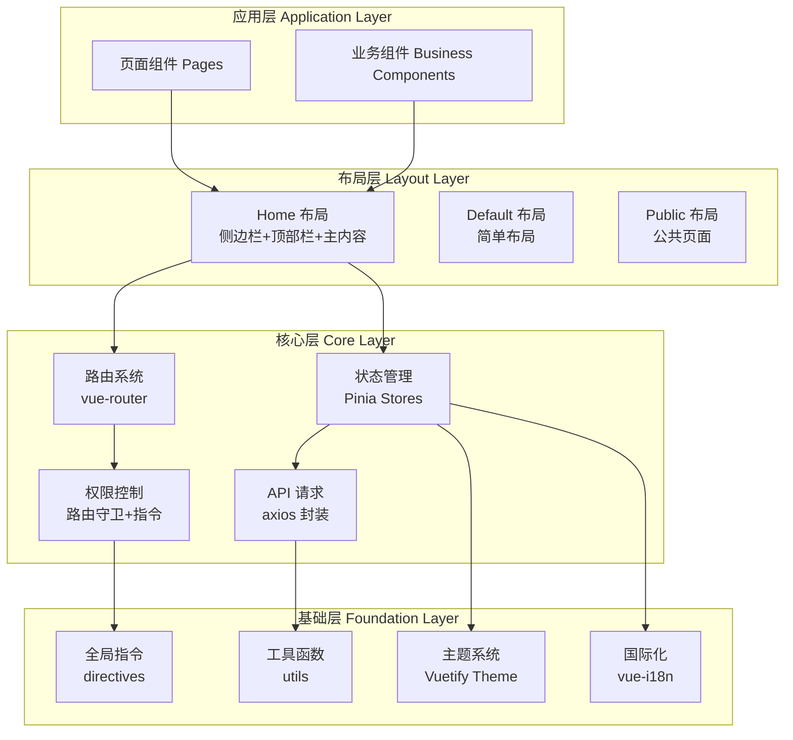
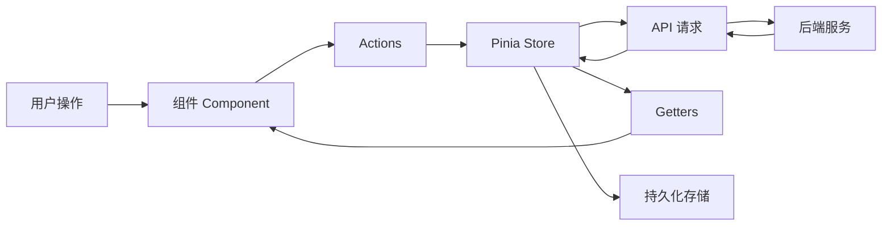
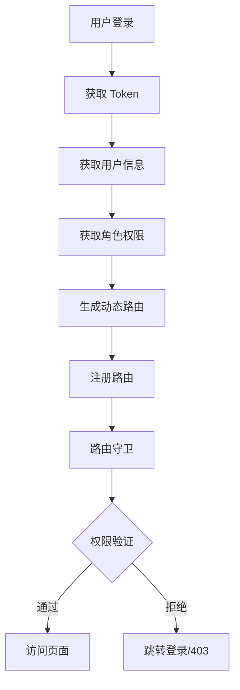

# Vuetify3 Admin 框架设计文档

## 📋 目录

- [项目概述](#项目概述)
- [技术栈](#技术栈)
- [项目结构](#项目结构)
- [架构设计](#架构设计)
- [功能模块](#功能模块)
- [实现计划](#实现计划)

---

## 项目概述

基于 Vue3 + Vuetify3 + Vite + UnoCSS 构建的企业级中后台管理系统解决方案。

### 设计目标

- 🚀 高性能：基于 Vite 构建，快速启动和热更新
- 🎨 美观：基于 Vuetify3 Material Design 3 设计规范
- 🔧 可扩展：模块化设计，易于扩展和维护
- 📱 响应式：完美适配各种屏幕尺寸
- 🌍 国际化：支持多语言切换
- 🔐 权限控制：完善的 RBAC 权限管理系统

---

## 技术栈

### 核心框架

| 技术 | 版本 | 说明 |
|------|------|------|
| Vue | 3.5.26 | 渐进式 JavaScript 框架 |
| Vuetify | 3.11.5 | Material Design 组件库 |
| Vite | 7.2.2 | 下一代前端构建工具 |
| TypeScript | 5.4.2 | JavaScript 的超集 |
| Pinia | 3.0.0 | Vue 状态管理库 |
| Vue Router | 4.6.3 | Vue 官方路由管理器 |

### UI & 样式

| 技术 | 版本 | 说明 |
|------|------|------|
| UnoCSS | 66.4.2 | 原子化 CSS 引擎 |
| Sass | 1.93.3 | CSS 预处理器 |
| @mdi/font | 7.4.47 | Material Design Icons |

### 开发工具

| 技术 | 版本 | 说明 |
|------|------|------|
| unplugin-auto-import | 20.3.0 | 自动导入 API |
| unplugin-vue-components | 29.0.0 | 自动导入组件 |
| unplugin-vue-router | 0.19.0 | 基于文件的路由 |
| unplugin-icons | 22.5.0 | 图标按需加载 |
| vite-plugin-vue-layouts-next | 1.3.0 | 布局系统 |
| ESLint | 8.57.0 | 代码检查工具 |
| Prettier | 3.3.3 | 代码格式化工具 |

---

## 项目结构

```
study-vuetify-pro/
├── src/
│   ├── api/                    # API 请求模块
│   │   └── modules/            # API 模块分类
│   ├── assets/                 # 静态资源
│   │   ├── fonts/              # 字体文件
│   │   ├── logo.png            # Logo
│   │   └── logo.svg            # Logo
│   ├── components/             # 全局组件
│   │   ├── business/           # 业务组件
│   │   │   ├── ProTable/       # 高级表格组件
│   │   │   ├── ProForm/        # 高级表单组件
│   │   │   ├── SearchBar/      # 搜索栏组件
│   │   │   ├── Upload/         # 上传组件
│   │   │   └── Editor/         # 富文本编辑器
│   │   └── common/             # 通用组件
│   │       ├── AppFooter/      # 页脚组件
│   │       ├── AppHeader/      # 顶部栏组件
│   │       ├── AppSidebar/     # 侧边栏组件
│   │       ├── Breadcrumb/     # 面包屑组件
│   │       ├── TagsView/       # 标签页视图
│   │       └── IconPicker/     # 图标选择器
│   ├── composables/            # 组合式函数
│   ├── directives/             # 自定义指令
│   │   ├── permission.ts       # 权限指令
│   │   ├── debounce.ts         # 防抖指令
│   │   ├── throttle.ts         # 节流指令
│   │   └── copy.ts             # 复制指令
│   ├── hooks/                  # 自定义 Hooks
│   ├── layouts/                # 布局组件
│   │   ├── default.vue         # 默认布局
│   │   ├── home.vue            # 主布局（侧边栏+顶部栏）
│   │   └── public.vue          # 公共布局
│   ├── locales/                # 国际化语言包
│   │   ├── zh-CN.ts            # 中文
│   │   └── en-US.ts            # 英文
│   ├── middleware/             # 路由中间件
│   │   ├── auth.ts             # 认证中间件
│   │   └── permission.ts       # 权限中间件
│   ├── pages/                  # 页面组件
│   │   ├── index.vue           # 首页
│   │   ├── login/              # 登录页
│   │   ├── dashboard/          # 仪表盘
│   │   ├── system/             # 系统管理
│   │   │   ├── user/           # 用户管理
│   │   │   ├── role/           # 角色管理
│   │   │   └── permission/     # 权限管理
│   │   └── profile/            # 个人中心
│   ├── platform/               # 平台页面
│   ├── plugins/                # 插件配置
│   │   ├── index.ts            # 插件入口
│   │   ├── vuetify.ts          # Vuetify 配置
│   │   ├── vuetify/            # Vuetify 子配置
│   │   │   └── theme.ts        # 主题配置
│   │   └── grid/               # AG Grid 配置
│   ├── router/                 # 路由配置
│   │   └── index.ts            # 路由入口
│   ├── stores/                 # Pinia 状态管理
│   │   ├── app.ts              # 应用状态
│   │   ├── auth/               # 认证状态
│   │   ├── permission/         # 权限状态
│   │   ├── settings/           # 设置状态
│   │   ├── tagsView/           # 标签页状态
│   │   ├── menu.ts             # 菜单状态
│   │   └── router.ts           # 路由状态
│   ├── styles/                 # 全局样式
│   │   ├── font.scss           # 字体样式
│   │   ├── settings.scss       # 设置样式
│   │   └── variables.scss      # 样式变量
│   ├── types/                  # TypeScript 类型定义
│   ├── utils/                  # 工具函数
│   │   ├── request.ts          # 请求封装
│   │   ├── auth.ts             # 认证工具
│   │   ├── permission.ts       # 权限工具
│   │   ├── storage.ts         # 存储工具
│   │   ├── date.ts             # 日期工具
│   │   ├── string.ts           # 字符串工具
│   │   ├── array.ts            # 数组工具
│   │   └── validate.ts         # 验证工具
│   ├── App.vue                 # 根组件
│   └── main.ts                 # 应用入口
├── env/                        # 环境变量
├── plans/                      # 计划文档
├── test/                       # 测试文件
├── .browserslistrc             # 浏览器兼容配置
├── .editorconfig               # 编辑器配置
├── .eslintrc.js                # ESLint 配置
├── .gitignore                  # Git 忽略配置
├── .prettierrc.json            # Prettier 配置
├── index.html                  # HTML 模板
├── package.json                # 项目依赖
├── tsconfig.json               # TypeScript 配置
├── tsconfig.node.json          # Node TypeScript 配置
├── uno.config.ts               # UnoCSS 配置
└── vite.config.mts             # Vite 配置
```

---

## 架构设计

### 整体架构



### 数据流架构



### 权限控制架构



---

## 功能模块

### 1. 核心基础设施

#### 1.1 API 请求封装

**文件位置**: `src/utils/request.ts`

**功能特性**:
- 基于 axios 封装
- 请求/响应拦截器
- 自动添加 Token
- 统一错误处理
- 请求取消
- 请求重试
- 请求缓存

**核心代码结构**:
```typescript
// 创建 axios 实例
const service = axios.create({
  baseURL: import.meta.env.VITE_API_BASE_URL,
  timeout: 15000
})

// 请求拦截器
service.interceptors.request.use(
  config => {
    // 添加 Token
    const token = getToken()
    if (token) {
      config.headers.Authorization = `Bearer ${token}`
    }
    return config
  },
  error => Promise.reject(error)
)

// 响应拦截器
service.interceptors.response.use(
  response => {
    // 统一处理响应数据
    return response.data
  },
  error => {
    // 统一错误处理
    handleError(error)
    return Promise.reject(error)
  }
)
```

#### 1.2 用户认证 Store

**文件位置**: `src/stores/auth/index.ts`

**功能特性**:
- 登录/登出
- Token 管理
- 用户信息管理
- 角色信息管理
- 权限列表管理

**核心状态**:
```typescript
interface AuthState {
  token: string
  userInfo: UserInfo | null
  roles: string[]
  permissions: string[]
}
```

#### 1.3 权限 Store

**文件位置**: `src/stores/permission/index.ts`

**功能特性**:
- 动态路由生成
- 路由权限过滤
- 菜单权限过滤
- 按钮权限控制

#### 1.4 路由守卫

**文件位置**: `src/middleware/auth.ts`, `src/middleware/permission.ts`

**功能特性**:
- 登录验证
- 权限验证
- 页面标题设置
- 进度条显示
- 页面缓存控制

#### 1.5 全局加载状态

**文件位置**: `src/stores/app.ts`

**功能特性**:
- 全局加载状态管理
- 页面级加载状态
- 组件级加载状态

#### 1.6 消息通知系统

**文件位置**: `src/composables/useMessage.ts`

**功能特性**:
- 成功提示
- 错误提示
- 警告提示
- 信息提示
- 确认对话框

### 2. 布局系统

#### 2.1 Home 布局

**文件位置**: `src/layouts/home.vue`

**组件结构**:
```
Home Layout
├── AppSidebar (侧边栏)
│   ├── Logo
│   ├── Menu (动态菜单)
│   └── Settings (底部设置)
├── AppHeader (顶部栏)
│   ├── Toggle Sidebar
│   ├── Breadcrumb
│   ├── Actions (全屏、刷新、主题切换)
│   └── User Menu
├── TagsView (标签页视图)
└── Main Content (主内容区)
    └── Router View
```

#### 2.2 动态菜单组件

**文件位置**: `src/components/common/AppSidebar/Menu.vue`

**功能特性**:
- 从路由自动生成菜单
- 支持多级嵌套
- 支持图标显示
- 支持外链
- 支持权限控制

#### 2.3 面包屑导航

**文件位置**: `src/components/common/Breadcrumb/index.vue`

**功能特性**:
- 自动生成面包屑
- 支持点击跳转
- 支持自定义分隔符

#### 2.4 标签页视图

**文件位置**: `src/components/common/TagsView/index.vue`

**功能特性**:
- 标签页管理
- 标签页切换
- 标签页关闭
- 标签页右键菜单
- 标签页持久化

#### 2.5 设置面板

**文件位置**: `src/components/common/SettingsPanel/index.vue`

**功能特性**:
- 主题切换（亮色/暗色）
- 布局切换
- 侧边栏折叠
- 标签页显示/隐藏
- 面包屑显示/隐藏

### 3. 业务组件

#### 3.1 ProTable 高级表格

**文件位置**: `src/components/business/ProTable/index.vue`

**功能特性**:
- 列配置
- 数据加载
- 分页
- 排序
- 筛选
- 多选
- 行操作
- 工具栏
- 刷新
- 列设置
- 导出

**使用示例**:
```vue
<ProTable
  :columns="columns"
  :request="fetchData"
  :pagination="pagination"
  @selection-change="handleSelectionChange"
/>
```

#### 3.2 ProForm 高级表单

**文件位置**: `src/components/business/ProForm/index.vue`

**功能特性**:
- 表单项配置
- 表单验证
- 动态表单
- 联动表单
- 表单布局
- 提交/重置

**使用示例**:
```vue
<ProForm
  :schema="formSchema"
  :model="formData"
  @submit="handleSubmit"
/>
```

#### 3.3 搜索组件

**文件位置**: `src/components/business/SearchBar/index.vue`

**功能特性**:
- 搜索表单
- 展开/收起
- 重置
- 搜索

#### 3.4 上传组件

**文件位置**: `src/components/business/Upload/index.vue`

**功能特性**:
- 图片预览
- 文件类型限制
- 文件大小限制
- 拖拽上传
- 批量上传
- 上传进度

#### 3.5 富文本编辑器

**文件位置**: `src/components/business/Editor/index.vue`

**功能特性**:
- 富文本编辑
- 图片上传
- 代码高亮
- 表格编辑
- 全屏编辑

### 4. 工具函数和指令

#### 4.1 工具函数库

**文件位置**: `src/utils/`

| 文件 | 功能 |
|------|------|
| `date.ts` | 日期格式化、计算、比较 |
| `string.ts` | 字符串处理、截断、脱敏 |
| `array.ts` | 数组去重、排序、分组 |
| `validate.ts` | 表单验证规则 |
| `storage.ts` | 本地存储封装 |
| `auth.ts` | Token 操作 |
| `permission.ts` | 权限判断 |

#### 4.2 自定义指令

**文件位置**: `src/directives/`

| 指令 | 功能 | 使用 |
|------|------|------|
| `v-permission` | 权限控制 | `v-permission="'user:add'"` |
| `v-debounce` | 防抖 | `v-debounce:click="handleClick"` |
| `v-throttle` | 节流 | `v-throttle:click="handleClick"` |
| `v-copy` | 复制 | `v-copy="text"` |
| `v-loading` | 加载 | `v-loading="loading"` |

### 5. 页面模块

#### 5.1 登录页面

**文件位置**: `src/pages/login/index.vue`

**功能特性**:
- 用户名/密码登录
- 记住密码
- 表单验证
- 登录加载
- 错误提示

#### 5.2 仪表盘

**文件位置**: `src/pages/dashboard/index.vue`

**功能特性**:
- 统计卡片
- 数据图表
- 快捷操作
- 待办事项
- 系统公告

#### 5.3 用户管理

**文件位置**: `src/pages/system/user/index.vue`

**功能特性**:
- 用户列表
- 用户搜索
- 用户添加
- 用户编辑
- 用户删除
- 角色分配
- 密码重置

#### 5.4 角色管理

**文件位置**: `src/pages/system/role/index.vue`

**功能特性**:
- 角色列表
- 角色添加
- 角色编辑
- 角色删除
- 权限分配

#### 5.5 权限管理

**文件位置**: `src/pages/system/permission/index.vue`

**功能特性**:
- 权限树
- 权限添加
- 权限编辑
- 权限删除

#### 5.6 个人中心

**文件位置**: `src/pages/profile/index.vue`

**功能特性**:
- 个人信息
- 修改密码
- 头像上传

#### 5.7 404 页面

**文件位置**: `src/pages/error/404.vue`

**功能特性**:
- 404 提示
- 返回首页

### 6. 国际化支持

**文件位置**: `src/locales/`

**功能特性**:
- 多语言切换
- 语言包管理
- 动态加载

**语言包结构**:
```typescript
export default {
  common: {
    confirm: '确认',
    cancel: '取消',
    submit: '提交',
    reset: '重置'
  },
  menu: {
    dashboard: '仪表盘',
    system: '系统管理',
    user: '用户管理'
  },
  // ...
}
```

### 7. 其他功能

#### 7.1 全屏功能

**文件位置**: `src/composables/useFullscreen.ts`

**功能特性**:
- 进入/退出全屏
- 全屏状态监听

#### 7.2 主题切换

**文件位置**: `src/stores/framework/theme.ts`

**功能特性**:
- 亮色/暗色主题切换
- 主题持久化

#### 7.3 布局切换

**功能特性**:
- 侧边栏折叠/展开
- 标签页显示/隐藏
- 面包屑显示/隐藏

#### 7.4 打印功能

**文件位置**: `src/composables/usePrint.ts`

**功能特性**:
- 页面打印
- 区域打印

---

## 实现计划

### 阶段一：核心基础设施

- [ ] 实现 API 请求封装
- [ ] 实现用户认证 Store
- [ ] 实现权限 Store
- [ ] 实现路由守卫
- [ ] 实现全局加载状态
- [ ] 实现消息通知系统

### 阶段二：布局系统

- [ ] 优化 home 布局
- [ ] 实现动态菜单组件
- [ ] 实现面包屑导航组件
- [ ] 实现标签页视图组件
- [ ] 实现设置面板

### 阶段三：业务组件

- [ ] 封装 ProTable 表格组件
- [ ] 封装 ProForm 表单组件
- [ ] 封装搜索组件
- [ ] 封装上传组件
- [ ] 封装富文本编辑器

### 阶段四：工具函数和指令

- [ ] 创建工具函数库
- [ ] 实现权限指令
- [ ] 实现防抖/节流指令
- [ ] 实现复制指令

### 阶段五：页面模块

- [ ] 实现登录页面
- [ ] 实现仪表盘页面
- [ ] 实现用户管理页面
- [ ] 实现角色管理页面
- [ ] 实现权限管理页面
- [ ] 实现个人中心页面
- [ ] 实现 404 页面

### 阶段六：国际化支持

- [ ] 配置 vue-i18n
- [ ] 创建中文语言包
- [ ] 创建英文语言包

### 阶段七：其他功能

- [ ] 实现全屏功能
- [ ] 实现主题切换功能
- [ ] 实现布局切换功能
- [ ] 实现打印功能

---

## 开发规范

### 命名规范

- **文件名**: kebab-case (如: `user-list.vue`)
- **组件名**: PascalCase (如: `UserList`)
- **变量名**: camelCase (如: `userName`)
- **常量名**: UPPER_SNAKE_CASE (如: `API_BASE_URL`)
- **类型名**: PascalCase (如: `UserInfo`)

### 代码风格

- 使用 ESLint + Prettier 进行代码检查和格式化
- 遵循 Vue 3 Composition API 最佳实践
- 使用 TypeScript 进行类型检查

### Git 提交规范

```
feat: 新功能
fix: 修复 bug
docs: 文档更新
style: 代码格式调整
refactor: 重构
perf: 性能优化
test: 测试相关
chore: 构建/工具链相关
```

---

## 总结

本框架基于 Vue3 + Vuetify3 构建，采用模块化设计，具有良好的可扩展性和可维护性。通过完善的权限控制、动态路由、国际化等功能，为企业级中后台管理系统提供了完整的解决方案。

---

**文档版本**: v1.0  
**最后更新**: 2026-02-13
