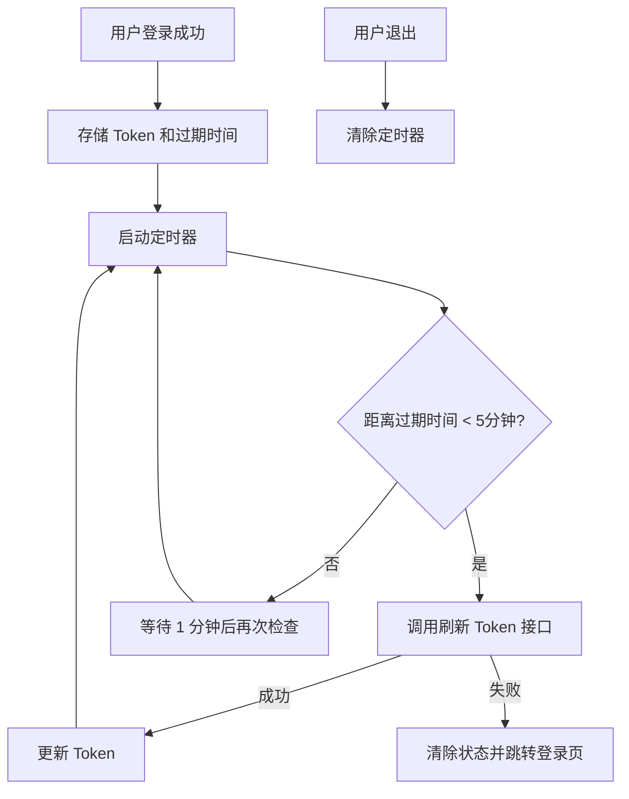
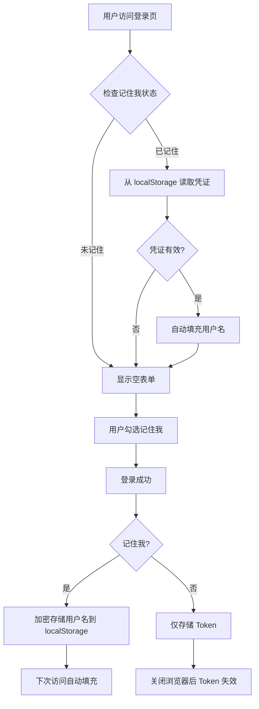
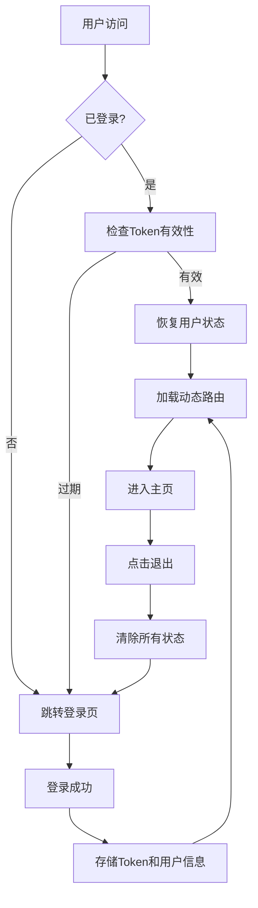
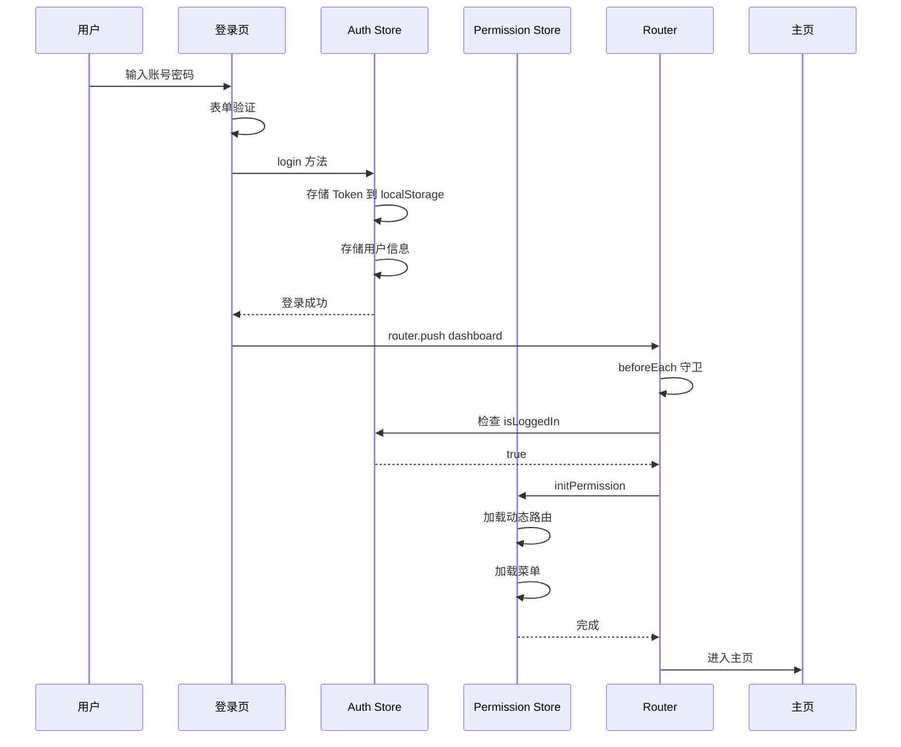
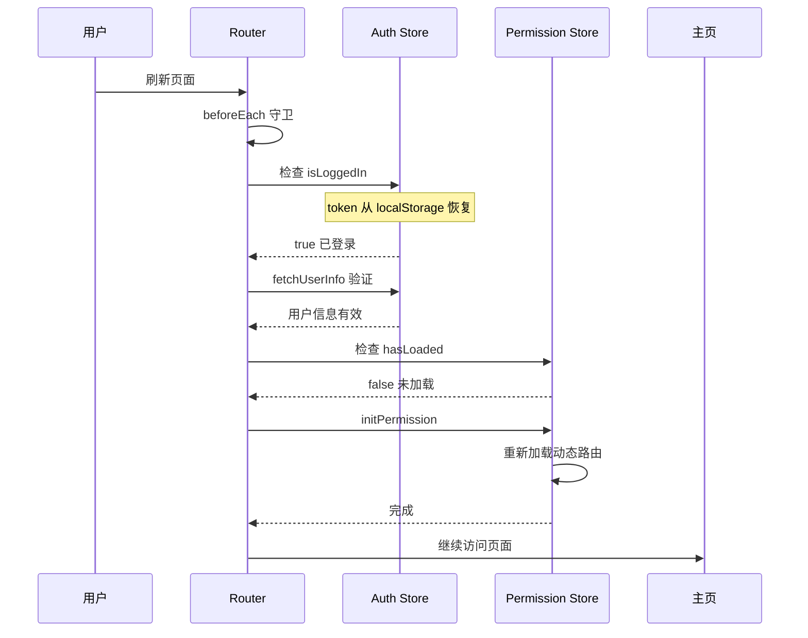
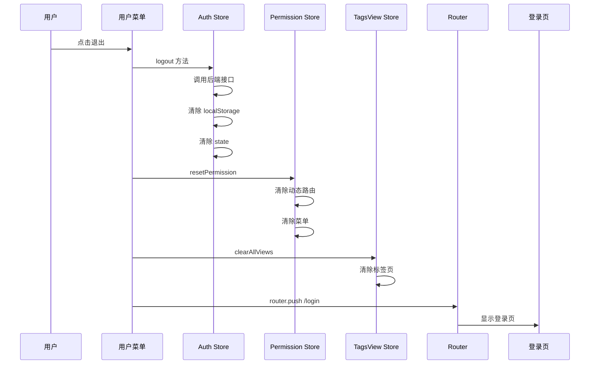

# 登录认证流程优化计划

## 🆕 新增功能 1：Token 自动刷新

### 功能说明

Token 自动刷新机制确保用户在 Token 即将过期时无感知地刷新 Token，避免用户在使用过程中突然被登出。

### 实现方案



### 核心代码设计

**文件**: `src/stores/auth/index.ts`

```typescript
// Token 刷新相关
let refreshTimer: ReturnType<typeof setTimeout> | null = null;
const REFRESH_THRESHOLD = 5 * 60 * 1000; // 5分钟前刷新
const CHECK_INTERVAL = 60 * 1000; // 每分钟检查一次

// Token 过期时间存储
const TOKEN_EXPIRES_KEY = 'token_expires';
let tokenExpiresAt: number | null = null;

// 启动 Token 刷新定时器
function startRefreshTimer(): void {
  stopRefreshTimer();
  
  const expiresAt = localStorage.getItem(TOKEN_EXPIRES_KEY);
  if (!expiresAt) return;
  
  tokenExpiresAt = parseInt(expiresAt, 10);
  
  const checkAndRefresh = async () => {
    if (!tokenExpiresAt) return;
    
    const now = Date.now();
    const timeUntilExpiry = tokenExpiresAt - now;
    
    if (timeUntilExpiry <= REFRESH_THRESHOLD && timeUntilExpiry > 0) {
      // 即将过期，刷新 Token
      try {
        await refreshAccessToken();
        // 刷新成功后，定时器会在 setToken 中重新启动
      } catch (error) {
        console.error('Token 刷新失败:', error);
        clearAuthState();
        // 跳转到登录页
        window.location.href = '/login';
      }
    } else if (timeUntilExpiry <= 0) {
      // Token 已过期
      clearAuthState();
      window.location.href = '/login';
    }
  };
  
  // 立即检查一次
  checkAndRefresh();
  
  // 设置定时检查
  refreshTimer = setInterval(checkAndRefresh, CHECK_INTERVAL);
}

// 停止刷新定时器
function stopRefreshTimer(): void {
  if (refreshTimer) {
    clearInterval(refreshTimer);
    refreshTimer = null;
  }
}

// 修改 setToken 方法
function setToken(accessToken: string, refresh?: string, expiresIn?: number): void {
  token.value = accessToken;
  localStorage.setItem(TOKEN_KEY, accessToken);
  
  if (refresh) {
    refreshTokenValue.value = refresh;
    localStorage.setItem(REFRESH_TOKEN_KEY, refresh);
  }
  
  // 存储过期时间
  if (expiresIn) {
    const expiresAt = Date.now() + expiresIn * 1000;
    localStorage.setItem(TOKEN_EXPIRES_KEY, expiresAt.toString());
    tokenExpiresAt = expiresAt;
  }
  
  // 启动刷新定时器
  startRefreshTimer();
}

// 修改 clearAuthState 方法
function clearAuthState(): void {
  stopRefreshTimer();
  token.value = null;
  refreshTokenValue.value = null;
  userInfo.value = null;
  tokenExpiresAt = null;
  
  localStorage.removeItem(TOKEN_KEY);
  localStorage.removeItem(REFRESH_TOKEN_KEY);
  localStorage.removeItem(USER_INFO_KEY);
  localStorage.removeItem(TOKEN_EXPIRES_KEY);
}
```

### API 拦截器配合

**文件**: `src/api/index.ts`

```typescript
// 401 响应时自动刷新 Token 并重试
let isRefreshing = false;
let refreshSubscribers: ((token: string) => void)[] = [];

instance.interceptors.response.use(
  (response) => response,
  async (error) => {
    const originalRequest = error.config;
    
    if (error.response?.status === 401 && !originalRequest._retry) {
      if (isRefreshing) {
        // 正在刷新，等待刷新完成
        return new Promise((resolve) => {
          refreshSubscribers.push((token) => {
            originalRequest.headers.Authorization = `Bearer ${token}`;
            resolve(instance(originalRequest));
          });
        });
      }
      
      originalRequest._retry = true;
      isRefreshing = true;
      
      try {
        const authStore = useAuthStore();
        const newToken = await authStore.refreshAccessToken();
        
        // 通知所有等待的请求
        refreshSubscribers.forEach((callback) => callback(newToken!));
        refreshSubscribers = [];
        
        originalRequest.headers.Authorization = `Bearer ${newToken}`;
        return instance(originalRequest);
      } catch (refreshError) {
        authStore.clearAuthState();
        window.location.href = '/login';
        return Promise.reject(refreshError);
      } finally {
        isRefreshing = false;
      }
    }
    
    return Promise.reject(error);
  }
);
```

---

## 🆕 新增功能 2：记住我和自动登录

### 功能说明

"记住我"功能允许用户在关闭浏览器后仍然保持登录状态，下次访问时自动登录。

### 实现方案



### 存储策略

| 场景 | 存储位置 | Token 有效期 | 说明 |
|------|----------|-------------|------|
| 记住我 | localStorage | 7-30天 | 长期有效，关闭浏览器后仍保留 |
| 不记住我 | sessionStorage | 2小时 | 短期有效，关闭浏览器后清除 |

### 核心代码设计

**文件**: `src/stores/auth/index.ts`

```typescript
// 记住我相关常量
const REMEMBER_ME_KEY = 'remember_me';
const REMEMBERED_USERNAME_KEY = 'remembered_username';

// 登录方法修改
async function login(params: LoginParams, rememberMe: boolean = false): Promise<void> {
  try {
    const result = await authApi.login(params);
    
    // 处理记住我
    if (rememberMe) {
      localStorage.setItem(REMEMBER_ME_KEY, 'true');
      localStorage.setItem(REMEMBERED_USERNAME_KEY, params.username);
      // 使用 localStorage 存储 Token（长期有效）
      setToken(result.accessToken, result.refreshToken, result.expiresIn);
    } else {
      localStorage.setItem(REMEMBER_ME_KEY, 'false');
      localStorage.removeItem(REMEMBERED_USERNAME_KEY);
      // 使用 sessionStorage 存储 Token（会话有效）
      sessionStorage.setItem(TOKEN_KEY, result.accessToken);
      sessionStorage.setItem(REFRESH_TOKEN_KEY, result.refreshToken || '');
      sessionStorage.setItem(USER_INFO_KEY, JSON.stringify(result.userInfo));
      token.value = result.accessToken;
      refreshTokenValue.value = result.refreshToken || null;
      userInfo.value = result.userInfo;
    }
    
    // 启动 Token 刷新定时器
    if (rememberMe) {
      startRefreshTimer();
    }
  } catch (error) {
    clearAuthState();
    throw error;
  }
}

// 初始化方法修改
function initialize(): boolean {
  const rememberMe = localStorage.getItem(REMEMBER_ME_KEY) === 'true';
  
  let savedToken: string | null;
  let savedUserInfo: string | null;
  
  if (rememberMe) {
    // 从 localStorage 读取
    savedToken = localStorage.getItem(TOKEN_KEY);
    savedUserInfo = localStorage.getItem(USER_INFO_KEY);
  } else {
    // 从 sessionStorage 读取
    savedToken = sessionStorage.getItem(TOKEN_KEY);
    savedUserInfo = sessionStorage.getItem(USER_INFO_KEY);
  }
  
  if (savedToken) {
    token.value = savedToken;
    if (savedUserInfo) {
      try {
        userInfo.value = JSON.parse(savedUserInfo);
      } catch {
        clearAuthState();
        return false;
      }
    }
    return true;
  }
  return false;
}

// 获取记住的用户名
function getRememberedUsername(): string | null {
  if (localStorage.getItem(REMEMBER_ME_KEY) === 'true') {
    return localStorage.getItem(REMEMBERED_USERNAME_KEY);
  }
  return null;
}

// 清除认证状态修改
function clearAuthState(): void {
  stopRefreshTimer();
  token.value = null;
  refreshTokenValue.value = null;
  userInfo.value = null;
  
  // 清除 localStorage
  localStorage.removeItem(TOKEN_KEY);
  localStorage.removeItem(REFRESH_TOKEN_KEY);
  localStorage.removeItem(USER_INFO_KEY);
  localStorage.removeItem(TOKEN_EXPIRES_KEY);
  
  // 清除 sessionStorage
  sessionStorage.removeItem(TOKEN_KEY);
  sessionStorage.removeItem(REFRESH_TOKEN_KEY);
  sessionStorage.removeItem(USER_INFO_KEY);
}
```

### 登录页面修改

**文件**: `src/pages/login/index.vue`

```vue
<template>
  <v-container fluid class="login-container fill-height">
    <!-- ... 其他内容 ... -->
    
    <v-card-text class="px-8 py-6">
      <v-form ref="formRef" v-model="isValid" @submit.prevent="handleLogin">
        <!-- 用户名输入框 -->
        <v-text-field
          v-model="formData.username"
          label="用户名"
          prepend-inner-icon="mdi-account"
          variant="outlined"
          :rules="usernameRules"
          :disabled="loading"
          class="mb-3"
          autocomplete="username"
        />
        
        <!-- 密码输入框 -->
        <v-text-field
          v-model="formData.password"
          label="密码"
          prepend-inner-icon="mdi-lock"
          variant="outlined"
          :type="showPassword ? 'text' : 'password'"
          :append-inner-icon="showPassword ? 'mdi-eye-off' : 'mdi-eye'"
          :rules="passwordRules"
          :disabled="loading"
          class="mb-2"
          autocomplete="current-password"
          @click:append-inner="showPassword = !showPassword"
        />
        
        <!-- 记住我复选框 -->
        <v-checkbox
          v-model="formData.rememberMe"
          label="记住我"
          density="compact"
          hide-details
          class="mb-4"
        />
        
        <!-- 登录按钮 -->
        <v-btn
          type="submit"
          color="primary"
          size="large"
          block
          :loading="loading"
          :disabled="!isValid || loading"
        >
          <v-icon icon="mdi-login" class="mr-2" />
          登 录
        </v-btn>
      </v-form>
    </v-card-text>
  </v-container>
</template>

<script lang="ts" setup>
// 表单数据
const formData = reactive({
  username: '',
  password: '',
  rememberMe: false
});

// 初始化时获取记住的用户名
onMounted(() => {
  const rememberedUsername = useAuthStore().getRememberedUsername();
  if (rememberedUsername) {
    formData.username = rememberedUsername;
    formData.rememberMe = true;
  }
});

// 登录处理
async function handleLogin() {
  const { valid } = await formRef.value?.validate();
  if (!valid) return;
  
  loading.value = true;
  
  try {
    await authStore.login(
      {
        username: formData.username,
        password: formData.password
      },
      formData.rememberMe
    );
    
    snackbar.success('登录成功，正在跳转...');
    
    const redirect = (route.query.redirect as string) || '/dashboard';
    setTimeout(() => {
      router.push(redirect);
    }, 500);
  } catch (error: any) {
    snackbar.error(error.message || '登录失败，请重试');
  } finally {
    loading.value = false;
  }
}
</script>
```

---

## 📋 当前状态分析

### 现有实现

| 模块 | 文件 | 状态 | 说明 |
|------|------|------|------|
| Auth Store | [`src/stores/auth/index.ts`](src/stores/auth/index.ts) | ✅ 已实现 | Token 和用户信息存储在 localStorage |
| Permission Store | [`src/stores/permission/index.ts`](src/stores/permission/index.ts) | ⚠️ 需优化 | 缺少重置方法和状态持久化 |
| Router Guards | [`src/router/index.ts`](src/router/index.ts) | ⚠️ 需优化 | 刷新页面时动态路由丢失 |
| Login Page | [`src/pages/login/index.vue`](src/pages/login/index.vue) | ✅ 基本完成 | 可优化用户体验 |
| Logout | - | ❌ 缺失 | 需要添加退出功能入口 |

### 当前问题

1. **刷新页面后动态路由丢失**
   - Permission Store 的 `isLoaded` 状态在刷新后重置为 false
   - 导致需要重新加载动态路由

2. **退出登录入口缺失**
   - 没有用户下拉菜单
   - 无法从 UI 上执行退出操作

3. **登录状态恢复不完整**
   - 刷新页面后需要重新验证 Token 有效性
   - 用户信息可能过期

---

## 🎯 优化目标



---

## 📝 详细优化方案

### 1. 优化 Auth Store

**文件**: [`src/stores/auth/index.ts`](src/stores/auth/index.ts)

**优化内容**:

```typescript
// 添加初始化方法
function initialize(): boolean {
  // 从 localStorage 恢复状态
  const savedToken = localStorage.getItem(TOKEN_KEY);
  const savedUserInfo = localStorage.getItem(USER_INFO_KEY);
  
  if (savedToken) {
    token.value = savedToken;
    if (savedUserInfo) {
      try {
        userInfo.value = JSON.parse(savedUserInfo);
      } catch {
        clearAuthState();
        return false;
      }
    }
    return true;
  }
  return false;
}

// 添加验证Token有效性的方法
async function validateToken(): Promise<boolean> {
  if (!token.value) return false;
  
  try {
    await fetchUserInfo();
    return true;
  } catch {
    clearAuthState();
    return false;
  }
}
```

### 2. 优化 Permission Store

**文件**: [`src/stores/permission/index.ts`](src/stores/permission/index.ts)

**优化内容**:

```typescript
// 添加重置方法
function resetPermission(): void {
  isLoaded.value = false;
  dynamicRoutes.value = [];
  menus.value = [];
}

// 添加持久化key
const PERMISSION_KEY = 'permission_loaded';

// 修改 initPermission 方法
async function initPermission(): Promise<void> {
  if (isLoaded.value) return;
  
  try {
    const routes = await generateRoutes();
    routes.forEach(route => {
      router.addRoute('Layout', route);
    });
    await generateMenus();
    isLoaded.value = true;
    sessionStorage.setItem(PERMISSION_KEY, 'true');
  } catch (error) {
    console.error('初始化权限失败:', error);
    throw error;
  }
}
```

### 3. 优化路由守卫

**文件**: [`src/router/index.ts`](src/router/index.ts)

**优化内容**:

```typescript
router.beforeEach(async (to, from, next) => {
  // 1. 设置页面标题
  setPageTitle(to);

  // 2. 白名单路由直接放行
  if (isWhiteListRoute(to.path)) {
    next();
    return;
  }

  // 3. 检查路由是否需要认证
  if (to.meta?.requireAuth === false) {
    next();
    return;
  }

  // 4. 获取认证 Store
  const authStore = useAuthStore();

  // 5. 初始化/恢复登录状态
  if (!authStore.isLoggedIn) {
    // 尝试从 localStorage 恢复
    const restored = authStore.initialize();
    if (!restored) {
      next({ path: '/login', query: { redirect: to.fullPath } });
      return;
    }
  }

  // 6. 验证 Token 有效性（可选，首次加载时）
  if (!authStore.hasUserInfo) {
    try {
      await authStore.fetchUserInfo();
    } catch {
      authStore.clearAuthState();
      next({ path: '/login', query: { redirect: to.fullPath } });
      return;
    }
  }

  // 7. 加载动态路由
  const permissionStore = usePermissionStore();
  if (!permissionStore.hasLoaded) {
    try {
      await permissionStore.initPermission();
      next({ ...to, replace: true });
      return;
    } catch (error) {
      console.error('加载动态路由失败:', error);
      authStore.clearAuthState();
      permissionStore.resetPermission();
      next({ path: '/login', query: { redirect: to.fullPath } });
      return;
    }
  }

  // 8. 检查路由是否存在
  if (!to.matched.length) {
    next('/404');
    return;
  }

  // 9. 检查权限
  if (!checkRoutePermission(to.meta)) {
    next('/403');
    return;
  }

  // 10. 添加标签页
  const tagsViewStore = useTagsViewStore();
  tagsViewStore.addView(to);

  next();
});
```

### 4. 优化登录页面

**文件**: [`src/pages/login/index.vue`](src/pages/login/index.vue)

**优化内容**:

- 添加"记住我"功能
- 优化加载状态显示
- 添加登录失败重试机制
- 改进表单验证反馈

### 5. 添加退出登录功能

**新建文件**: `src/components/common/UserMenu/index.vue`

**功能**:

- 显示用户头像和名称
- 下拉菜单包含：
  - 个人中心
  - 系统设置
  - 退出登录

**退出登录逻辑**:

```typescript
async function handleLogout() {
  try {
    loading.value = true;
    const authStore = useAuthStore();
    const permissionStore = usePermissionStore();
    const tagsViewStore = useTagsViewStore();
    
    // 1. 调用后端登出接口
    await authStore.logout();
    
    // 2. 清除权限状态
    permissionStore.resetPermission();
    
    // 3. 清除标签页状态
    tagsViewStore.clearAllViews();
    
    // 4. 跳转到登录页
    router.push('/login');
    
    snackbar.success('已安全退出');
  } catch (error) {
    console.error('退出失败:', error);
    // 即使失败也清除本地状态并跳转
    router.push('/login');
  } finally {
    loading.value = false;
  }
}
```

### 6. 创建用户菜单组件

**文件结构**:

```
src/components/common/UserMenu/
├── index.vue          # 用户菜单主组件
└── UserAvatar.vue     # 用户头像组件（可选）
```

---

## 🔄 完整流程图

### 登录流程



### 刷新页面流程



### 退出登录流程



---

## 📁 文件变更清单

| 操作 | 文件路径 | 说明 |
|------|----------|------|
| 修改 | `src/stores/auth/index.ts` | 添加 initialize、validateToken 方法 |
| 修改 | `src/stores/permission/index.ts` | 添加 resetPermission 方法 |
| 修改 | `src/router/index.ts` | 优化导航守卫逻辑 |
| 修改 | `src/pages/login/index.vue` | 优化用户体验 |
| 新建 | `src/components/common/UserMenu/index.vue` | 用户下拉菜单组件 |
| 修改 | `src/layouts/default.vue` | 集成用户菜单组件 |

---

## ✅ 验收标准

1. **登录功能**
   - [ ] 输入正确账号密码可成功登录
   - [ ] 登录成功后跳转到主页或重定向页面
   - [ ] 登录失败显示错误提示

2. **刷新页面**
   - [ ] 刷新页面后保持登录状态
   - [ ] 动态路由正确加载
   - [ ] 用户信息正确显示

3. **退出登录**
   - [ ] 点击退出按钮可退出登录
   - [ ] 清除所有本地状态
   - [ ] 跳转到登录页面
   - [ ] 退出后无法访问需认证的页面

4. **安全验证**
   - [ ] Token 过期后自动跳转登录页
   - [ ] 未登录访问受保护页面跳转登录页

---

## 🚀 实施顺序

1. **Phase 1**: 优化 Store 层
   - Auth Store 添加初始化方法
   - Permission Store 添加重置方法

2. **Phase 2**: 优化路由守卫
   - 完善状态恢复逻辑
   - 添加 Token 验证

3. **Phase 3**: 添加退出功能
   - 创建用户菜单组件
   - 集成到布局组件

4. **Phase 4**: 优化登录页面
   - 改进用户体验
   - 添加记住我功能

5. **Phase 5**: 测试验证
   - 完整流程测试
   - 边界情况测试
