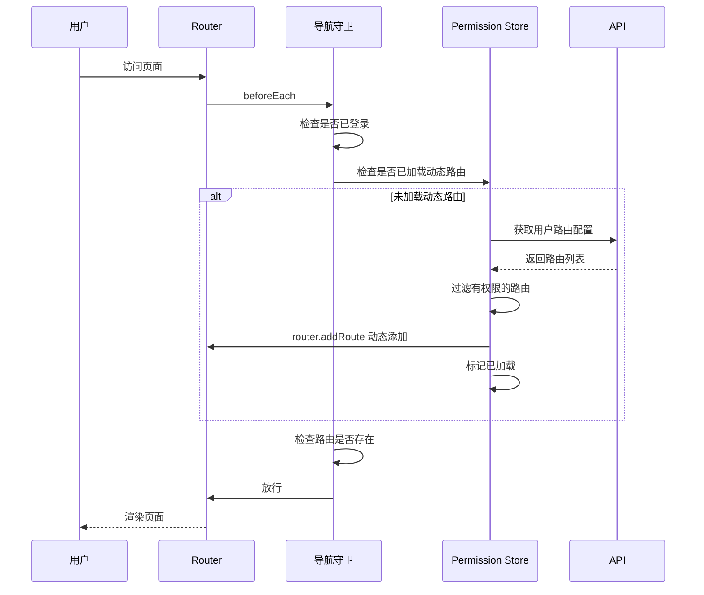
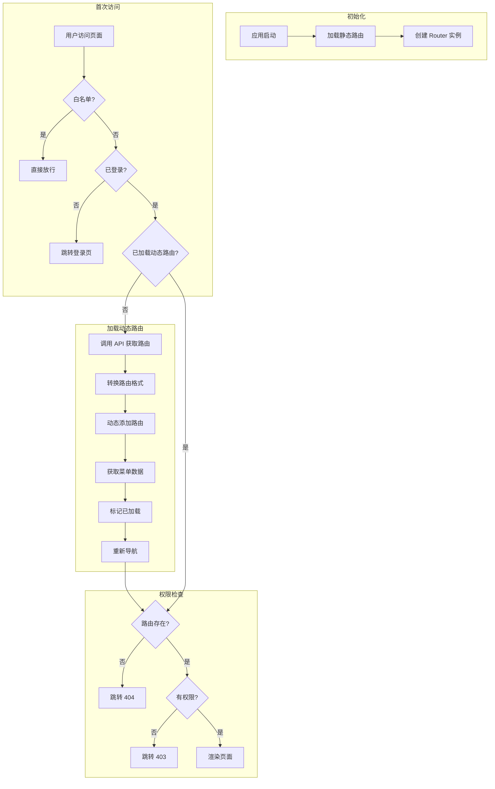

# 动态路由设计

## 📋 概述

动态路由是指根据用户权限从后端获取路由配置，动态添加到路由表中。这样可以实现：
- 不同角色看到不同的菜单
- 细粒度的页面级权限控制
- 路由配置的动态管理

---

## 🔄 动态路由流程



---

## 📁 文件结构

```
src/
├── api/
│   └── modules/
│       └── permission.ts      # 权限相关 API
├── stores/
│   └── permission/
│       ├── index.ts           # Permission Store
│       └── types.ts           # 类型定义
├── router/
│   ├── index.ts               # 路由入口
│   ├── static.ts              # 静态路由
│   └── dynamic.ts             # 动态路由工具函数
└── utils/
    └── route-transform.ts     # 路由转换工具
```

---

## 1️⃣ 类型定义

### 1.1 后端路由数据结构

**文件**: `src/stores/permission/types.ts`

```typescript
import type { RouteComponent, RouteMeta } from 'vue-router'

/**
 * 后端返回的路由配置
 */
export interface ApiRouteConfig {
  /** 路由路径 */
  path: string
  /** 路由名称 */
  name: string
  /** 路由重定向 */
  redirect?: string
  /** 组件路径（相对于 src/pages） */
  component?: string
  /** 路由元信息 */
  meta?: ApiRouteMeta
  /** 子路由 */
  children?: ApiRouteConfig[]
  /** 是否隐藏菜单 */
  hidden?: boolean
  /** 是否缓存 */
  keepAlive?: boolean
}

/**
 * 后端路由元信息
 */
export interface ApiRouteMeta {
  /** 页面标题 */
  title: string
  /** 菜单图标 */
  icon?: string
  /** 是否隐藏菜单 */
  hidden?: boolean
  /** 是否缓存页面 */
  keepAlive?: boolean
  /** 是否固定在 tab 上 */
  affix?: boolean
  /** 外链地址 */
  link?: string
  /** 所需权限 */
  permissions?: string[]
  /** 所需角色 */
  roles?: string[]
  /** 面包屑 */
  breadcrumb?: boolean
}

/**
 * 前端路由配置（转换后）
 */
export interface AppRouteConfig {
  path: string
  name: string
  redirect?: string
  component?: RouteComponent
  meta?: RouteMeta
  children?: AppRouteConfig[]
}

/**
 * 菜单项
 */
export interface MenuItem {
  /** 菜单 ID */
  id: string | number
  /** 父级 ID */
  parentId?: string | number | null
  /** 路由路径 */
  path: string
  /** 路由名称 */
  name: string
  /** 菜单标题 */
  title: string
  /** 菜单图标 */
  icon?: string
  /** 排序 */
  sort?: number
  /** 是否隐藏 */
  hidden?: boolean
  /** 外链 */
  link?: string
  /** 子菜单 */
  children?: MenuItem[]
}

/**
 * Permission Store 状态
 */
export interface PermissionState {
  /** 是否已加载动态路由 */
  isLoaded: boolean
  /** 动态路由列表 */
  dynamicRoutes: AppRouteConfig[]
  /** 菜单列表 */
  menus: MenuItem[]
  /** 所有路由（静态 + 动态） */
  allRoutes: AppRouteConfig[]
}
```

---

## 2️⃣ API 接口

**文件**: `src/api/modules/permission.ts`

```typescript
import { get } from '../index'
import type { ApiRouteConfig, MenuItem } from '@/stores/permission/types'

/**
 * 获取用户路由配置
 */
export function getUserRoutes(): Promise<ApiRouteConfig[]> {
  return get<ApiRouteConfig[]>('/system/permission/routes')
}

/**
 * 获取用户菜单
 */
export function getUserMenus(): Promise<MenuItem[]> {
  return get<MenuItem[]>('/system/permission/menus')
}

/**
 * 获取用户权限列表
 */
export function getUserPermissions(): Promise<string[]> {
  return get<string[]>('/system/permission/permissions')
}
```

---

## 3️⃣ 路由转换工具

**文件**: `src/utils/route-transform.ts`

```typescript
import type { RouteComponent } from 'vue-router'
import type { ApiRouteConfig, AppRouteConfig } from '@/stores/permission/types'

// 组件映射表（用于动态导入）
const modules = import.meta.glob('../pages/**/*.vue')

/**
 * 将后端路由配置转换为前端路由配置
 */
export function transformRoutes(routes: ApiRouteConfig[]): AppRouteConfig[] {
  return routes.map(route => transformRoute(route)).filter(Boolean) as AppRouteConfig[]
}

/**
 * 转换单个路由
 */
function transformRoute(route: ApiRouteConfig): AppRouteConfig | null {
  // 过滤隐藏的路由
  if (route.hidden) {
    return null
  }

  const result: AppRouteConfig = {
    path: route.path,
    name: route.name,
    meta: {
      title: route.meta?.title,
      icon: route.meta?.icon,
      hidden: route.meta?.hidden,
      keepAlive: route.meta?.keepAlive ?? route.keepAlive,
      affix: route.meta?.affix,
      link: route.meta?.link,
      permissions: route.meta?.permissions,
      roles: route.meta?.roles,
      breadcrumb: route.meta?.breadcrumb
    }
  }

  // 处理重定向
  if (route.redirect) {
    result.redirect = route.redirect
  }

  // 处理组件
  if (route.component) {
    result.component = loadComponent(route.component)
  }

  // 处理子路由
  if (route.children && route.children.length > 0) {
    result.children = transformRoutes(route.children)
  }

  return result
}

/**
 * 动态加载组件
 */
function loadComponent(component: string): RouteComponent | undefined {
  // 构建组件路径
  const componentPath = `../pages/${component}.vue`
  
  // 检查组件是否存在
  if (modules[componentPath]) {
    return modules[componentPath] as RouteComponent
  }
  
  console.warn(`组件不存在: ${componentPath}`)
  return undefined
}

/**
 * 将扁平路由列表转换为树形结构
 */
export function buildRouteTree(
  routes: ApiRouteConfig[],
  parentId: string | number | null = null
): ApiRouteConfig[] {
  return routes
    .filter(route => (route as any).parentId === parentId)
    .map(route => ({
      ...route,
      children: buildRouteTree(routes, (route as any).id)
    }))
}

/**
 * 将菜单列表转换为树形结构
 */
export function buildMenuTree<T extends { id: string | number; parentId?: string | number | null }>(
  items: T[],
  parentId: string | number | null = null
): T[] {
  return items
    .filter(item => item.parentId === parentId)
    .sort((a, b) => ((a as any).sort ?? 0) - ((b as any).sort ?? 0))
    .map(item => ({
      ...item,
      children: buildMenuTree(items, item.id)
    })) as T[]
}
```

---

## 4️⃣ Permission Store

**文件**: `src/stores/permission/index.ts`

```typescript
import { defineStore } from 'pinia'
import { ref, computed } from 'vue'
import type { AppRouteConfig, MenuItem, PermissionState } from './types'
import * as permissionApi from '@/api/modules/permission'
import { transformRoutes, buildMenuTree } from '@/utils/route-transform'
import { staticRoutes } from '@/router/static'
import router from '@/router'

export const usePermissionStore = defineStore('permission', () => {
  // ==================== State ====================
  
  /** 是否已加载动态路由 */
  const isLoaded = ref(false)
  
  /** 动态路由列表 */
  const dynamicRoutes = ref<AppRouteConfig[]>([])
  
  /** 菜单列表 */
  const menus = ref<MenuItem[]>([])
  
  /** 所有路由 */
  const allRoutes = ref<AppRouteConfig[]>([...staticRoutes])

  // ==================== Getters ====================
  
  /** 是否已加载 */
  const hasLoaded = computed(() => isLoaded.value)
  
  /** 获取菜单 */
  const getMenuList = computed(() => menus.value)
  
  /** 获取动态路由 */
  const getDynamicRoutes = computed(() => dynamicRoutes.value)

  // ==================== Actions ====================
  
  /**
   * 生成路由
   */
  async function generateRoutes(): Promise<AppRouteConfig[]> {
    try {
      // 从后端获取路由配置
      const apiRoutes = await permissionApi.getUserRoutes()
      
      // 转换为前端路由格式
      const routes = transformRoutes(apiRoutes)
      
      // 保存动态路由
      dynamicRoutes.value = routes
      
      return routes
    } catch (error) {
      console.error('获取动态路由失败:', error)
      // 失败时返回空数组，使用静态路由
      return []
    }
  }

  /**
   * 生成菜单
   */
  async function generateMenus(): Promise<MenuItem[]> {
    try {
      // 从后端获取菜单
      const apiMenus = await permissionApi.getUserMenus()
      
      // 转换为树形结构
      const menuTree = buildMenuTree(apiMenus)
      
      // 保存菜单
      menus.value = menuTree
      
      return menuTree
    } catch (error) {
      console.error('获取菜单失败:', error)
      return []
    }
  }

  /**
   * 初始化权限（加载动态路由和菜单）
   */
  async function initPermission(): Promise<void> {
    if (isLoaded.value) {
      return
    }

    try {
      // 1. 生成动态路由
      const routes = await generateRoutes()
      
      // 2. 动态添加路由
      routes.forEach(route => {
        // 添加到 layout 下
        router.addRoute('Layout', route)
      })
      
      // 3. 生成菜单
      await generateMenus()
      
      // 4. 更新所有路由
      allRoutes.value = [...staticRoutes, ...routes]
      
      // 5. 标记已加载
      isLoaded.value = true
    } catch (error) {
      console.error('初始化权限失败:', error)
      throw error
    }
  }

  /**
   * 重置权限（登出时调用）
   */
  function resetPermission(): void {
    isLoaded.value = false
    dynamicRoutes.value = []
    menus.value = []
    allRoutes.value = [...staticRoutes]
    
    // 移除动态添加的路由
    dynamicRoutes.value.forEach(route => {
      if (route.name) {
        router.removeRoute(route.name)
      }
    })
  }

  /**
   * 检查路由是否存在
   */
  function hasRoute(name: string): boolean {
    return router.hasRoute(name) || allRoutes.value.some(r => r.name === name)
  }

  return {
    // State
    isLoaded,
    dynamicRoutes,
    menus,
    allRoutes,
    
    // Getters
    hasLoaded,
    getMenuList,
    getDynamicRoutes,
    
    // Actions
    generateRoutes,
    generateMenus,
    initPermission,
    resetPermission,
    hasRoute
  }
})
```

---

## 5️⃣ 静态路由配置

**文件**: `src/router/static.ts`

```typescript
import type { RouteRecordRaw } from 'vue-router'

/**
 * 静态路由（不需要权限验证的路由）
 */
export const staticRoutes: RouteRecordRaw[] = [
  // 登录页
  {
    path: '/login',
    name: 'Login',
    component: () => import('@/pages/login/index.vue'),
    meta: {
      title: '登录',
      layout: 'public',
      requireAuth: false
    }
  },
  
  // 注册页
  {
    path: '/register',
    name: 'Register',
    component: () => import('@/pages/register/index.vue'),
    meta: {
      title: '注册',
      layout: 'public',
      requireAuth: false
    }
  },
  
  // 忘记密码
  {
    path: '/forgot-password',
    name: 'ForgotPassword',
    component: () => import('@/pages/forgot-password/index.vue'),
    meta: {
      title: '忘记密码',
      layout: 'public',
      requireAuth: false
    }
  },
  
  // 404 页面
  {
    path: '/404',
    name: 'NotFound',
    component: () => import('@/pages/404.vue'),
    meta: {
      title: '页面未找到',
      layout: 'public',
      requireAuth: false
    }
  },
  
  // 403 页面
  {
    path: '/403',
    name: 'Forbidden',
    component: () => import('@/pages/403.vue'),
    meta: {
      title: '无访问权限',
      layout: 'public',
      requireAuth: false
    }
  }
]

/**
 * 布局路由（动态路由的父级）
 */
export const layoutRoutes: RouteRecordRaw = {
  path: '/',
  name: 'Layout',
  component: () => import('@/layouts/home.vue'),
  redirect: '/dashboard',
  children: [
    // 首页/仪表盘
    {
      path: 'dashboard',
      name: 'Dashboard',
      component: () => import('@/pages/dashboard/index.vue'),
      meta: {
        title: '仪表盘',
        icon: 'mdi-view-dashboard',
        affix: true
      }
    }
  ]
}

/**
 * 通配路由（必须放在最后）
 */
export const catchAllRoute: RouteRecordRaw = {
  path: '/:pathMatch(.*)*',
  name: 'CatchAll',
  redirect: '/404'
}
```

---

## 6️⃣ 更新导航守卫

**文件**: `src/router/index.ts`（更新版）

```typescript
/**
 * router/index.ts
 * 路由配置 - 支持动态路由
 */

import { createRouter, createWebHistory, type RouteLocationNormalized } from 'vue-router'
import { staticRoutes, layoutRoutes, catchAllRoute } from './static'

import { useAuthStore } from '@/stores/auth'
import { usePermissionStore } from '@/stores/permission'
import { checkRoutePermission } from '@/utils/permission'

// ==================== 常量配置 ====================

const TITLE_PREFIX = 'W3-'
const WHITE_LIST = ['/login', '/register', '/forgot-password', '/404', '/403']
const DEFAULT_HOME = '/dashboard'

// ==================== 创建路由实例 ====================

const router = createRouter({
  history: createWebHistory(import.meta.env.BASE_URL),
  routes: [
    ...staticRoutes,
    layoutRoutes,
    // 注意：catchAllRoute 在动态路由加载后添加
  ],
  scrollBehavior(to, from, savedPosition) {
    if (savedPosition) return savedPosition
    if (to.hash) return { el: to.hash, behavior: 'smooth' }
    return { top: 0, behavior: 'smooth' }
  }
})

// ==================== 导航守卫 ====================

router.beforeEach(async (to, from, next) => {
  // 1. 设置页面标题
  setPageTitle(to)
  
  // 2. 白名单直接放行
  if (WHITE_LIST.includes(to.path)) {
    next()
    return
  }
  
  // 3. 检查是否需要认证
  if (to.meta?.requireAuth === false) {
    next()
    return
  }
  
  // 4. 获取认证 Store
  const authStore = useAuthStore()
  
  // 5. 检查登录状态
  if (!authStore.isLoggedIn) {
    next({
      path: '/login',
      query: { redirect: to.fullPath }
    })
    return
  }
  
  // 6. 获取权限 Store
  const permissionStore = usePermissionStore()
  
  // 7. 检查是否已加载动态路由
  if (!permissionStore.hasLoaded) {
    try {
      // 初始化权限（加载动态路由）
      await permissionStore.initPermission()
      
      // 添加通配路由（确保只添加一次）
      if (!router.hasRoute('CatchAll')) {
        router.addRoute(catchAllRoute)
      }
      
      // 重新导航到目标路由
      next({ ...to, replace: true })
      return
    } catch (error) {
      console.error('加载动态路由失败:', error)
      authStore.clearAuthState()
      next({
        path: '/login',
        query: { redirect: to.fullPath }
      })
      return
    }
  }
  
  // 8. 检查路由是否存在
  if (!to.matched.length) {
    next('/404')
    return
  }
  
  // 9. 检查权限
  if (!checkRoutePermission(to.meta)) {
    next('/403')
    return
  }
  
  // 10. 放行
  next()
})

/**
 * 设置页面标题
 */
function setPageTitle(to: RouteLocationNormalized): void {
  const title = to.meta?.title
  if (typeof title === 'string') {
    document.title = `${TITLE_PREFIX}${title}`
  } else if (!to.matched.length) {
    document.title = `${TITLE_PREFIX}页面未找到`
  }
}

export default router
```

---

## 7️⃣ 后端路由数据示例

```json
{
  "code": 200,
  "message": "success",
  "data": [
    {
      "id": 1,
      "parentId": null,
      "path": "/system",
      "name": "System",
      "redirect": "/system/user",
      "meta": {
        "title": "系统管理",
        "icon": "mdi-cog"
      },
      "children": [
        {
          "id": 2,
          "parentId": 1,
          "path": "user",
          "name": "SystemUser",
          "component": "system/user/index",
          "meta": {
            "title": "用户管理",
            "icon": "mdi-account",
            "permissions": ["system:user:list"]
          }
        },
        {
          "id": 3,
          "parentId": 1,
          "path": "role",
          "name": "SystemRole",
          "component": "system/role/index",
          "meta": {
            "title": "角色管理",
            "icon": "mdi-account-group",
            "permissions": ["system:role:list"]
          }
        },
        {
          "id": 4,
          "parentId": 1,
          "path": "permission",
          "name": "SystemPermission",
          "component": "system/permission/index",
          "meta": {
            "title": "权限管理",
            "icon": "mdi-lock",
            "permissions": ["system:permission:list"]
          }
        }
      ]
    },
    {
      "id": 5,
      "parentId": null,
      "path": "/monitor",
      "name": "Monitor",
      "meta": {
        "title": "系统监控",
        "icon": "mdi-monitor"
      },
      "children": [
        {
          "id": 6,
          "parentId": 5,
          "path": "online",
          "name": "MonitorOnline",
          "component": "monitor/online/index",
          "meta": {
            "title": "在线用户",
            "icon": "mdi-account-clock",
            "permissions": ["monitor:online:list"]
          }
        },
        {
          "id": 7,
          "parentId": 5,
          "path": "log",
          "name": "MonitorLog",
          "component": "monitor/log/index",
          "meta": {
            "title": "操作日志",
            "icon": "mdi-file-document",
            "permissions": ["monitor:log:list"]
          }
        }
      ]
    }
  ]
}
```

---

## 8️⃣ 菜单组件集成

**文件**: `src/components/common/AppSidebar/index.vue`（示例）

```vue
<template>
  <v-navigation-drawer v-model="drawer" :rail="rail" permanent>
    <!-- Logo -->
    <v-list-item class="logo-item">
      <v-img :src="logo" height="40" contain />
    </v-list-item>
    
    <v-divider />
    
    <!-- 菜单列表 -->
    <v-list nav density="compact">
      <template v-for="item in menuList" :key="item.id">
        <!-- 有子菜单 -->
        <v-list-group v-if="item.children?.length" :value="item.name">
          <template #activator="{ props }">
            <v-list-item
              v-bind="props"
              :prepend-icon="item.icon"
              :title="item.title"
            />
          </template>
          
          <!-- 子菜单项 -->
          <v-list-item
            v-for="child in item.children"
            :key="child.id"
            :to="child.path"
            :prepend-icon="child.icon"
            :title="child.title"
            :value="child.name"
            nav
          />
        </v-list-group>
        
        <!-- 无子菜单 -->
        <v-list-item
          v-else
          :to="item.path"
          :prepend-icon="item.icon"
          :title="item.title"
          :value="item.name"
          nav
        />
      </template>
    </v-list>
  </v-navigation-drawer>
</template>

<script lang="ts" setup>
import { computed } from 'vue'
import { usePermissionStore } from '@/stores/permission'

const permissionStore = usePermissionStore()

const drawer = defineModel<boolean>('drawer', { default: true })
const rail = defineModel<boolean>('rail', { default: false })

const logo = 'https://cdn.vuetifyjs.com/docs/images/one/logos/vuetify-logo-light.png'

// 从 Permission Store 获取菜单
const menuList = computed(() => permissionStore.getMenuList)
</script>
```

---

## 📊 完整流程图



---

## ✅ 验收清单

### 动态路由
- [ ] API 接口正确获取路由配置
- [ ] 路由转换工具正确转换格式
- [ ] 动态添加路由成功
- [ ] 通配路由正确处理 404

### 菜单系统
- [ ] 菜单数据正确获取
- [ ] 菜单树形结构正确
- [ ] 菜单与路由同步
- [ ] 不同角色看到不同菜单

### 权限控制
- [ ] 无权限用户看不到菜单项
- [ ] 无权限用户无法直接访问 URL
- [ ] 权限变更后菜单实时更新

### 性能优化
- [ ] 动态路由只加载一次
- [ ] 组件按需加载
- [ ] 登出时正确清理路由

---

*文档创建时间: 2026-02-18*
