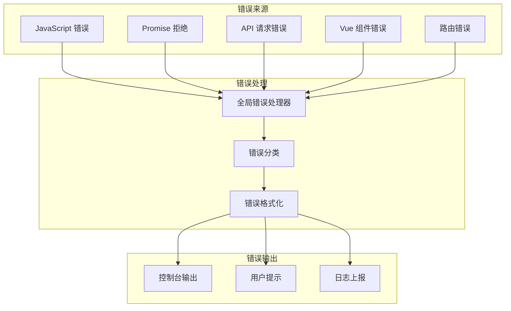
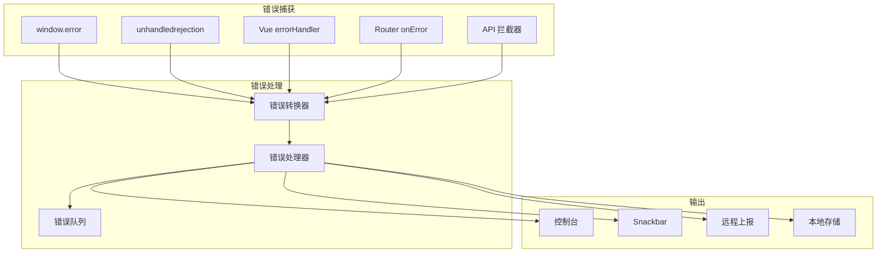

# 错误处理与日志系统设计

## 📋 概述

本文档包含两个核心系统设计：
1. **全局错误处理** - 统一的错误捕获、处理和展示
2. **日志系统** - 前端日志记录、上报和分析

---

# Part 1: 全局错误处理

## 🔄 错误处理流程



---

## 📁 文件结构

```
src/
├── utils/
│   ├── error/
│   │   ├── index.ts           # 错误处理入口
│   │   ├── types.ts           # 错误类型定义
│   │   ├── handler.ts         # 错误处理器
│   │   └── transform.ts       # 错误转换
│   └── logger/
│       ├── index.ts           # 日志系统入口
│       ├── types.ts           # 日志类型定义
│       └── transport.ts       # 日志传输
├── composables/
│   └── useError.ts            # 错误处理组合式函数
└── plugins/
    └── error-handler.ts       # 错误处理插件
```

---

## 1️⃣ 错误类型定义

**文件**: `src/utils/error/types.ts`

```typescript
/**
 * 错误类型枚举
 */
export enum ErrorType {
  /** JavaScript 运行时错误 */
  RUNTIME = 'RUNTIME',
  /** Promise 未捕获错误 */
  PROMISE = 'PROMISE',
  /** API 请求错误 */
  API = 'API',
  /** Vue 组件错误 */
  VUE = 'VUE',
  /** 路由错误 */
  ROUTER = 'ROUTER',
  /** 资源加载错误 */
  RESOURCE = 'RESOURCE',
  /** 业务错误 */
  BUSINESS = 'BUSINESS'
}

/**
 * 错误级别
 */
export enum ErrorLevel {
  /** 调试信息 */
  DEBUG = 'DEBUG',
  /** 普通信息 */
  INFO = 'INFO',
  /** 警告 */
  WARNING = 'WARNING',
  /** 错误 */
  ERROR = 'ERROR',
  /** 严重错误 */
  FATAL = 'FATAL'
}

/**
 * 标准化错误信息
 */
export interface AppError {
  /** 错误类型 */
  type: ErrorType
  /** 错误级别 */
  level: ErrorLevel
  /** 错误代码 */
  code?: string | number
  /** 错误消息 */
  message: string
  /** 详细信息 */
  detail?: string
  /** 堆栈信息 */
  stack?: string
  /** 发生时间 */
  timestamp: number
  /** 用户信息 */
  user?: {
    id?: string | number
    username?: string
  }
  /** 环境信息 */
  environment?: {
    url: string
    userAgent: string
    viewport: string
  }
  /** 附加数据 */
  extra?: Record<string, any>
  /** 原始错误 */
  raw?: unknown
}

/**
 * API 错误响应
 */
export interface ApiErrorResponse {
  code: number
  message: string
  data?: any
  stack?: string
}

/**
 * 错误处理配置
 */
export interface ErrorHandlerConfig {
  /** 是否启用 */
  enabled: boolean
  /** 是否在控制台输出 */
  console: boolean
  /** 是否显示用户提示 */
  notify: boolean
  /** 是否上报日志 */
  report: boolean
  /** 忽略的错误类型 */
  ignoreTypes: ErrorType[]
  /** 忽略的错误消息正则 */
  ignoreMessages: RegExp[]
  /** 用户提示配置 */
  notifyConfig: {
    duration: number
    position: 'top' | 'bottom' | 'top-left' | 'top-right' | 'bottom-left' | 'bottom-right'
  }
}
```

---

## 2️⃣ 错误转换器

**文件**: `src/utils/error/transform.ts`

```typescript
import type { AppError, ErrorType, ErrorLevel, ApiErrorResponse } from './types'
import { ErrorType as EType, ErrorLevel as ELevel } from './types'

/**
 * 获取环境信息
 */
function getEnvironment(): AppError['environment'] {
  return {
    url: window.location.href,
    userAgent: navigator.userAgent,
    viewport: `${window.innerWidth}x${window.innerHeight}`
  }
}

/**
 * 获取用户信息
 */
function getUserInfo(): AppError['user'] {
  try {
    const authData = localStorage.getItem('user_info')
    if (authData) {
      const user = JSON.parse(authData)
      return {
        id: user.id,
        username: user.username
      }
    }
  } catch (e) {
    // ignore
  }
  return undefined
}

/**
 * 转换 JavaScript 错误
 */
export function transformJsError(error: Error, type: ErrorType = EType.RUNTIME): AppError {
  return {
    type,
    level: ELevel.ERROR,
    message: error.message || 'Unknown Error',
    detail: error.name,
    stack: error.stack,
    timestamp: Date.now(),
    user: getUserInfo(),
    environment: getEnvironment(),
    raw: error
  }
}

/**
 * 转换 Promise 拒绝错误
 */
export function transformPromiseError(
  reason: any,
  promise?: Promise<unknown>
): AppError {
  const error = reason instanceof Error ? reason : new Error(String(reason))
  
  return {
    type: EType.PROMISE,
    level: ELevel.ERROR,
    message: error.message || 'Unhandled Promise Rejection',
    detail: 'Promise was rejected but no handler was attached',
    stack: error.stack,
    timestamp: Date.now(),
    user: getUserInfo(),
    environment: getEnvironment(),
    extra: { promise },
    raw: reason
  }
}

/**
 * 转换 API 错误
 */
export function transformApiError(
  error: any,
  config?: { url?: string; method?: string; params?: any }
): AppError {
  const response = error.response?.data as ApiErrorResponse | undefined
  const status = error.response?.status
  
  let level = ELevel.ERROR
  let message = '请求失败'
  
  // 根据状态码判断错误级别
  if (status === 401) {
    level = ELevel.WARNING
    message = '登录已过期，请重新登录'
  } else if (status === 403) {
    level = ELevel.WARNING
    message = '没有权限访问该资源'
  } else if (status === 404) {
    level = ELevel.WARNING
    message = '请求的资源不存在'
  } else if (status >= 500) {
    level = ELevel.ERROR
    message = '服务器内部错误'
  }
  
  return {
    type: EType.API,
    level,
    code: response?.code || status,
    message: response?.message || message,
    detail: error.message,
    stack: error.stack,
    timestamp: Date.now(),
    user: getUserInfo(),
    environment: getEnvironment(),
    extra: {
      url: config?.url,
      method: config?.method,
      params: config?.params,
      status,
      responseData: response?.data
    },
    raw: error
  }
}

/**
 * 转换 Vue 组件错误
 */
export function transformVueError(
  error: Error,
  vm: any,
  info: string
): AppError {
  return {
    type: EType.VUE,
    level: ELevel.ERROR,
    message: error.message || 'Vue Component Error',
    detail: `Component: ${vm?.$options?.name || 'Anonymous'}\nInfo: ${info}`,
    stack: error.stack,
    timestamp: Date.now(),
    user: getUserInfo(),
    environment: getEnvironment(),
    extra: {
      componentName: vm?.$options?.name,
      componentProps: vm?.$props,
      lifecycleHook: info
    },
    raw: error
  }
}

/**
 * 转换路由错误
 */
export function transformRouterError(error: Error, to: any, from: any): AppError {
  return {
    type: EType.ROUTER,
    level: ELevel.ERROR,
    message: error.message || 'Router Navigation Error',
    detail: `Navigation failed from ${from?.path} to ${to?.path}`,
    stack: error.stack,
    timestamp: Date.now(),
    user: getUserInfo(),
    environment: getEnvironment(),
    extra: {
      to: to?.path,
      from: from?.path,
      toParams: to?.params,
      toQuery: to?.query
    },
    raw: error
  }
}

/**
 * 转换资源加载错误
 */
export function transformResourceError(event: Event): AppError {
  const target = event.target as HTMLElement
  
  return {
    type: EType.RESOURCE,
    level: ELevel.WARNING,
    message: 'Resource Loading Failed',
    detail: `Failed to load resource: ${target?.tagName}`,
    timestamp: Date.now(),
    user: getUserInfo(),
    environment: getEnvironment(),
    extra: {
      tagName: target?.tagName,
      src: (target as HTMLImageElement)?.src || (target as HTMLScriptElement)?.src,
      href: (target as HTMLLinkElement)?.href
    },
    raw: event
  }
}

/**
 * 创建业务错误
 */
export function createBusinessError(
  message: string,
  code?: string | number,
  extra?: Record<string, any>
): AppError {
  return {
    type: EType.BUSINESS,
    level: ELevel.WARNING,
    code,
    message,
    timestamp: Date.now(),
    user: getUserInfo(),
    environment: getEnvironment(),
    extra,
    raw: null
  }
}
```

---

## 3️⃣ 错误处理器

**文件**: `src/utils/error/handler.ts`

```typescript
import type { AppError, ErrorHandlerConfig } from './types'
import { ErrorLevel } from './types'
import { useLogger } from '@/utils/logger'
import { useSnackbar } from '@/composables/useSnackbar'

// 默认配置
const defaultConfig: ErrorHandlerConfig = {
  enabled: true,
  console: import.meta.env.DEV,
  notify: true,
  report: import.meta.env.PROD,
  ignoreTypes: [],
  ignoreMessages: [
    /ResizeObserver loop/,
    /Network Error/,
    /NavigationDuplicated/
  ],
  notifyConfig: {
    duration: 5000,
    position: 'top-right'
  }
}

class ErrorHandler {
  private config: ErrorHandlerConfig
  private logger = useLogger('ErrorHandler')
  private errorQueue: AppError[] = []
  private maxQueueSize = 100

  constructor(config: Partial<ErrorHandlerConfig> = {}) {
    this.config = { ...defaultConfig, ...config }
  }

  /**
   * 处理错误
   */
  handle(error: AppError): void {
    if (!this.config.enabled) return
    
    // 检查是否忽略
    if (this.shouldIgnore(error)) return
    
    // 添加到队列
    this.addToQueue(error)
    
    // 控制台输出
    if (this.config.console) {
      this.logToConsole(error)
    }
    
    // 用户提示
    if (this.config.notify && error.level !== ErrorLevel.DEBUG) {
      this.notifyUser(error)
    }
    
    // 上报日志
    if (this.config.report) {
      this.reportError(error)
    }
  }

  /**
   * 检查是否应该忽略
   */
  private shouldIgnore(error: AppError): boolean {
    // 检查类型
    if (this.config.ignoreTypes.includes(error.type)) {
      return true
    }
    
    // 检查消息
    if (this.config.ignoreMessages.some(regex => regex.test(error.message))) {
      return true
    }
    
    return false
  }

  /**
   * 添加到队列
   */
  private addToQueue(error: AppError): void {
    this.errorQueue.push(error)
    
    // 超过最大数量时移除最早的
    if (this.errorQueue.length > this.maxQueueSize) {
      this.errorQueue.shift()
    }
  }

  /**
   * 控制台输出
   */
  private logToConsole(error: AppError): void {
    const style = this.getConsoleStyle(error.level)
    
    console.group(`%c[${error.type}] ${error.message}`, style)
    console.log('Time:', new Date(error.timestamp).toISOString())
    console.log('Level:', error.level)
    if (error.code) console.log('Code:', error.code)
    if (error.detail) console.log('Detail:', error.detail)
    if (error.stack) console.log('Stack:', error.stack)
    if (error.extra) console.log('Extra:', error.extra)
    console.groupEnd()
  }

  /**
   * 获取控制台样式
   */
  private getConsoleStyle(level: ErrorLevel): string {
    const styles: Record<ErrorLevel, string> = {
      [ErrorLevel.DEBUG]: 'color: #999',
      [ErrorLevel.INFO]: 'color: #2196F3',
      [ErrorLevel.WARNING]: 'color: #FF9800; font-weight: bold',
      [ErrorLevel.ERROR]: 'color: #F44336; font-weight: bold',
      [ErrorLevel.FATAL]: 'color: #FFF; background: #F44336; font-weight: bold'
    }
    return styles[level]
  }

  /**
   * 用户提示
   */
  private notifyUser(error: AppError): void {
    const snackbar = useSnackbar()
    
    // 根据错误级别选择提示类型
    switch (error.level) {
      case ErrorLevel.FATAL:
      case ErrorLevel.ERROR:
        snackbar.error(error.message)
        break
      case ErrorLevel.WARNING:
        snackbar.warning(error.message)
        break
      case ErrorLevel.INFO:
        snackbar.info(error.message)
        break
      default:
        break
    }
  }

  /**
   * 上报错误
   */
  private reportError(error: AppError): void {
    // 使用 sendBeacon 确保页面关闭时也能发送
    if (navigator.sendBeacon) {
      const data = JSON.stringify(error)
      navigator.sendBeacon('/api/log/error', data)
    } else {
      // 降级使用 fetch
      fetch('/api/log/error', {
        method: 'POST',
        headers: { 'Content-Type': 'application/json' },
        body: JSON.stringify(error),
        keepalive: true
      }).catch(() => {
        // 上报失败，静默处理
      })
    }
  }

  /**
   * 获取错误队列
   */
  getErrorQueue(): AppError[] {
    return [...this.errorQueue]
  }

  /**
   * 清空错误队列
   */
  clearErrorQueue(): void {
    this.errorQueue = []
  }

  /**
   * 更新配置
   */
  updateConfig(config: Partial<ErrorHandlerConfig>): void {
    this.config = { ...this.config, ...config }
  }
}

// 导出单例
export const errorHandler = new ErrorHandler()
```

---

## 4️⃣ 错误处理插件

**文件**: `src/plugins/error-handler.ts`

```typescript
import type { App } from 'vue'
import type { Router } from 'vue-router'
import { errorHandler } from '@/utils/error/handler'
import {
  transformJsError,
  transformPromiseError,
  transformVueError,
  transformRouterError,
  transformResourceError
} from '@/utils/error/transform'

/**
 * 初始化全局错误处理
 */
export function setupErrorHandler(app: App, router?: Router) {
  // 1. JavaScript 运行时错误
  window.addEventListener('error', (event) => {
    // 区分资源加载错误和 JS 错误
    if (event.target && (event.target as HTMLElement).tagName) {
      errorHandler.handle(transformResourceError(event))
    } else {
      errorHandler.handle(transformJsError(event.error))
    }
    return false
  }, true)

  // 2. Promise 未捕获错误
  window.addEventListener('unhandledrejection', (event) => {
    errorHandler.handle(transformPromiseError(event.reason, event.promise))
    return false
  })

  // 3. Vue 组件错误
  app.config.errorHandler = (error, instance, info) => {
    errorHandler.handle(transformVueError(error as Error, instance, info))
  }

  // 4. Vue 警告（仅开发环境）
  if (import.meta.env.DEV) {
    app.config.warnHandler = (msg, instance, trace) => {
      console.warn(`[Vue Warning]: ${msg}\nComponent: ${instance?.$options?.name || 'Anonymous'}\nTrace: ${trace}`)
    }
  }

  // 5. 路由错误
  if (router) {
    router.onError((error, to, from) => {
      errorHandler.handle(transformRouterError(error, to, from))
    })
  }
}

/**
 * Vue 插件
 */
export const ErrorHandlerPlugin = {
  install(app: App, options?: { router?: Router }) {
    setupErrorHandler(app, options?.router)
    
    // 全局属性
    app.config.globalProperties.$errorHandler = errorHandler
    
    // 提供 error handler
    app.provide('errorHandler', errorHandler)
  }
}
```

---

## 5️⃣ 错误处理组合式函数

**文件**: `src/composables/useError.ts`

```typescript
import { getCurrentInstance, onUnmounted } from 'vue'
import { errorHandler } from '@/utils/error/handler'
import { createBusinessError } from '@/utils/error/transform'
import type { AppError, ErrorLevel } from '@/utils/error/types'

/**
 * 错误处理组合式函数
 */
export function useError() {
  /**
   * 处理错误
   */
  function handleError(error: unknown, context?: string): void {
    if (error instanceof Error) {
      const appError = createBusinessError(
        error.message,
        undefined,
        { context, stack: error.stack }
      )
      errorHandler.handle(appError)
    } else if (typeof error === 'string') {
      const appError = createBusinessError(error, undefined, { context })
      errorHandler.handle(appError)
    } else {
      const appError = createBusinessError('Unknown error', undefined, { context, raw: error })
      errorHandler.handle(appError)
    }
  }

  /**
   * 包装异步函数，自动捕获错误
   */
  function wrapAsync<T extends (...args: any[]) => Promise<any>>(
    fn: T,
    context?: string
  ): T {
    return (async (...args: Parameters<T>) => {
      try {
        return await fn(...args)
      } catch (error) {
        handleError(error, context)
        throw error
      }
    }) as T
  }

  /**
   * 创建错误边界
   */
  function useErrorBoundary() {
    const error = ref<AppError | null>(null)
    
    const captureError = (err: unknown) => {
      if (err instanceof Error) {
        error.value = createBusinessError(err.message, undefined, { stack: err.stack })
      } else {
        error.value = createBusinessError(String(err))
      }
      errorHandler.handle(error.value)
    }
    
    const resetError = () => {
      error.value = null
    }
    
    return {
      error,
      captureError,
      resetError
    }
  }

  return {
    handleError,
    wrapAsync,
    useErrorBoundary,
    errorHandler
  }
}

// 需要导入 ref
import { ref } from 'vue'
```

---

# Part 2: 日志系统

## 📁 文件结构

```
src/
└── utils/
    └── logger/
        ├── index.ts           # 日志系统入口
        ├── types.ts           # 日志类型定义
        └── transport.ts       # 日志传输
```

---

## 1️⃣ 日志类型定义

**文件**: `src/utils/logger/types.ts`

```typescript
/**
 * 日志级别
 */
export enum LogLevel {
  DEBUG = 0,
  INFO = 1,
  WARN = 2,
  ERROR = 3,
  NONE = 4
}

/**
 * 日志条目
 */
export interface LogEntry {
  /** 日志级别 */
  level: LogLevel
  /** 日志标签 */
  tag: string
  /** 日志消息 */
  message: string
  /** 附加数据 */
  data?: any[]
  /** 时间戳 */
  timestamp: number
  /** 位置信息 */
  location?: {
    file?: string
    line?: number
    column?: number
  }
}

/**
 * 日志配置
 */
export interface LoggerConfig {
  /** 最小日志级别 */
  minLevel: LogLevel
  /** 是否启用控制台输出 */
  console: boolean
  /** 是否启用远程上报 */
  remote: boolean
  /** 远程上报 URL */
  remoteUrl?: string
  /** 是否启用本地存储 */
  storage: boolean
  /** 本地存储 Key */
  storageKey: string
  /** 最大存储条数 */
  maxStorageSize: number
  /** 日志格式化函数 */
  formatter?: (entry: LogEntry) => string
}
```

---

## 2️⃣ 日志传输

**文件**: `src/utils/logger/transport.ts`

```typescript
import type { LogEntry, LoggerConfig } from './types'
import { LogLevel } from './types'

/**
 * 控制台传输
 */
export function consoleTransport(entry: LogEntry): void {
  const methods: Record<LogLevel, (...args: any[]) => void> = {
    [LogLevel.DEBUG]: console.debug,
    [LogLevel.INFO]: console.info,
    [LogLevel.WARN]: console.warn,
    [LogLevel.ERROR]: console.error,
    [LogLevel.NONE]: () => {}
  }
  
  const method = methods[entry.level]
  const prefix = `[${entry.tag}] ${new Date(entry.timestamp).toISOString()}`
  
  if (entry.data?.length) {
    method(prefix, entry.message, ...entry.data)
  } else {
    method(prefix, entry.message)
  }
}

/**
 * 本地存储传输
 */
export function storageTransport(entry: LogEntry, config: LoggerConfig): void {
  if (!config.storage) return
  
  try {
    const key = config.storageKey
    const stored = localStorage.getItem(key)
    const logs: LogEntry[] = stored ? JSON.parse(stored) : []
    
    logs.push(entry)
    
    // 超过最大数量时移除最早的
    while (logs.length > config.maxStorageSize) {
      logs.shift()
    }
    
    localStorage.setItem(key, JSON.stringify(logs))
  } catch (e) {
    console.warn('Failed to save log to storage:', e)
  }
}

/**
 * 远程传输
 */
export function remoteTransport(entry: LogEntry, config: LoggerConfig): void {
  if (!config.remote || !config.remoteUrl) return
  
  // 只上报 WARN 和 ERROR 级别
  if (entry.level < LogLevel.WARN) return
  
  try {
    // 使用 sendBeacon 确保页面关闭时也能发送
    if (navigator.sendBeacon) {
      navigator.sendBeacon(config.remoteUrl, JSON.stringify(entry))
    } else {
      fetch(config.remoteUrl, {
        method: 'POST',
        headers: { 'Content-Type': 'application/json' },
        body: JSON.stringify(entry),
        keepalive: true
      }).catch(() => {
        // 发送失败，静默处理
      })
    }
  } catch (e) {
    // 发送失败，静默处理
  }
}
```

---

## 3️⃣ 日志系统

**文件**: `src/utils/logger/index.ts`

```typescript
import type { LogEntry, LoggerConfig } from './types'
import { LogLevel } from './types'
import { consoleTransport, storageTransport, remoteTransport } from './transport'

// 默认配置
const defaultConfig: LoggerConfig = {
  minLevel: import.meta.env.DEV ? LogLevel.DEBUG : LogLevel.INFO,
  console: import.meta.env.DEV,
  remote: import.meta.env.PROD,
  remoteUrl: '/api/log/collect',
  storage: true,
  storageKey: 'app_logs',
  maxStorageSize: 100
}

/**
 * 创建 Logger 实例
 */
export function useLogger(tag: string, config: Partial<LoggerConfig> = {}) {
  const finalConfig = { ...defaultConfig, ...config }

  /**
   * 创建日志条目
   */
  function createEntry(level: LogLevel, message: string, data?: any[]): LogEntry {
    return {
      level,
      tag,
      message,
      data,
      timestamp: Date.now()
    }
  }

  /**
   * 处理日志
   */
  function processLog(entry: LogEntry): void {
    // 检查日志级别
    if (entry.level < finalConfig.minLevel) return
    
    // 控制台输出
    if (finalConfig.console) {
      consoleTransport(entry)
    }
    
    // 本地存储
    storageTransport(entry, finalConfig)
    
    // 远程上报
    remoteTransport(entry, finalConfig)
  }

  /**
   * 调试日志
   */
  function debug(message: string, ...data: any[]): void {
    processLog(createEntry(LogLevel.DEBUG, message, data))
  }

  /**
   * 信息日志
   */
  function info(message: string, ...data: any[]): void {
    processLog(createEntry(LogLevel.INFO, message, data))
  }

  /**
   * 警告日志
   */
  function warn(message: string, ...data: any[]): void {
    processLog(createEntry(LogLevel.WARN, message, data))
  }

  /**
   * 错误日志
   */
  function error(message: string, ...data: any[]): void {
    processLog(createEntry(LogLevel.ERROR, message, data))
  }

  /**
   * 分组日志
   */
  function group(label: string, fn: () => void): void {
    if (finalConfig.console) {
      console.group(label)
    }
    try {
      fn()
    } finally {
      if (finalConfig.console) {
        console.groupEnd()
      }
    }
  }

  /**
   * 计时日志
   */
  function time(label: string): { end: () => number } {
    const start = performance.now()
    
    return {
      end: () => {
        const duration = performance.now() - start
        debug(`${label}: ${duration.toFixed(2)}ms`)
        return duration
      }
    }
  }

  /**
   * 获取存储的日志
   */
  function getStoredLogs(): LogEntry[] {
    try {
      const stored = localStorage.getItem(finalConfig.storageKey)
      return stored ? JSON.parse(stored) : []
    } catch (e) {
      return []
    }
  }

  /**
   * 清除存储的日志
   */
  function clearStoredLogs(): void {
    localStorage.removeItem(finalConfig.storageKey)
  }

  return {
    debug,
    info,
    warn,
    error,
    group,
    time,
    getStoredLogs,
    clearStoredLogs
  }
}

// 全局 Logger
export const logger = useLogger('App')
```

---

## 4️⃣ Snackbar 组合式函数

**文件**: `src/composables/useSnackbar.ts`

```typescript
import { ref } from 'vue'

interface SnackbarState {
  show: boolean
  message: string
  color: string
  timeout: number
  location: 'top' | 'bottom' | 'top-left' | 'top-right' | 'bottom-left' | 'bottom-right'
}

const snackbarState = ref<SnackbarState>({
  show: false,
  message: '',
  color: 'info',
  timeout: 3000,
  location: 'top-right'
})

export function useSnackbar() {
  function show(
    message: string,
    options?: Partial<Omit<SnackbarState, 'show' | 'message'>>
  ) {
    snackbarState.value = {
      show: true,
      message,
      color: options?.color || 'info',
      timeout: options?.timeout || 3000,
      location: options?.location || 'top-right'
    }
  }

  function success(message: string, timeout?: number) {
    show(message, { color: 'success', timeout })
  }

  function error(message: string, timeout?: number) {
    show(message, { color: 'error', timeout: timeout || 5000 })
  }

  function warning(message: string, timeout?: number) {
    show(message, { color: 'warning', timeout })
  }

  function info(message: string, timeout?: number) {
    show(message, { color: 'info', timeout })
  }

  function close() {
    snackbarState.value.show = false
  }

  return {
    state: snackbarState,
    show,
    success,
    error,
    warning,
    info,
    close
  }
}
```

---

## 5️⃣ 全局 Snackbar 组件

**文件**: `src/components/common/AppSnackbar/index.vue`

```vue
<template>
  <v-snackbar
    v-model="state.show"
    :color="state.color"
    :timeout="state.timeout"
    :location="state.location"
    @update:model-value="close"
  >
    {{ state.message }}
    
    <template #actions>
      <v-btn
        variant="text"
        @click="close"
      >
        关闭
      </v-btn>
    </template>
  </v-snackbar>
</template>

<script lang="ts" setup>
import { useSnackbar } from '@/composables/useSnackbar'

const { state, close } = useSnackbar()
</script>
```

---

## 6️⃣ 注册插件

**文件**: `src/plugins/index.ts`（更新）

```typescript
import type { App } from 'vue'
import router from '../router'
import pinia from '../stores'
import vuetify from './vuetify'
import i18n from '@/locales'
import { ErrorHandlerPlugin } from './error-handler'

export function registerPlugins(app: App) {
  app
    .use(vuetify)
    .use(router)
    .use(pinia)
    .use(i18n)
    .use(ErrorHandlerPlugin, { router }) // 添加错误处理
}
```

---

## 📊 完整流程图



---

## ✅ 验收清单

### 错误处理
- [ ] JavaScript 错误捕获正常
- [ ] Promise 拒绝捕获正常
- [ ] Vue 组件错误捕获正常
- [ ] 路由错误捕获正常
- [ ] API 错误捕获正常
- [ ] 错误分类正确
- [ ] 用户提示正常
- [ ] 错误上报正常

### 日志系统
- [ ] 日志级别控制正常
- [ ] 控制台输出正常
- [ ] 本地存储正常
- [ ] 远程上报正常
- [ ] 日志格式正确

### 用户提示
- [ ] Snackbar 显示正常
- [ ] 不同类型提示颜色正确
- [ ] 自动关闭正常
- [ ] 手动关闭正常

---

*文档创建时间: 2026-02-18*
