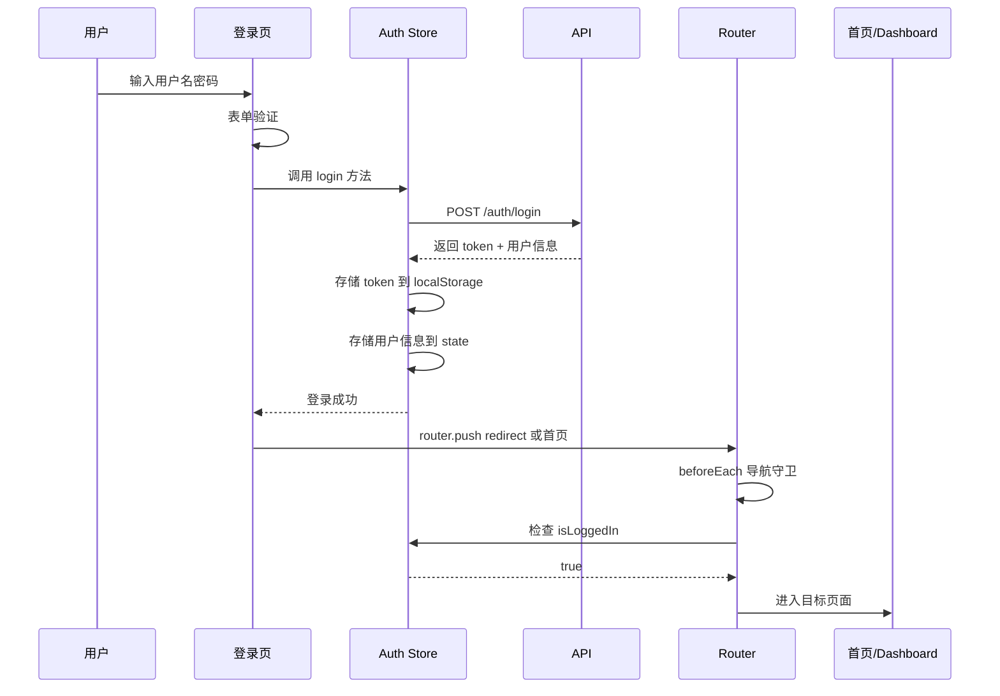
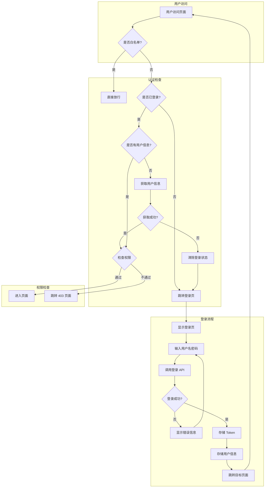

# 登录流程与认证系统详细设计

## 🔄 完整登录流程



---

## 📁 文件结构

```
src/
├── api/
│   ├── index.ts              # Axios 实例配置
│   ├── interceptors.ts       # 请求/响应拦截器
│   └── modules/
│       └── auth.ts           # 认证相关 API
├── stores/
│   └── auth/
│       ├── index.ts          # Auth Store 主文件
│       └── types.ts          # 类型定义
├── pages/
│   └── login/
│       └── index.vue         # 登录页面
├── utils/
│   ├── permission.ts         # 权限检查工具
│   └── token.ts              # Token 管理工具
└── types/
    ├── router.d.ts           # 路由类型扩展
    └── api.d.ts              # API 响应类型
```

---

## 1️⃣ API 层设计

### 1.1 Axios 实例配置

**文件**: `src/api/index.ts`

```typescript
import axios from 'axios'
import type { AxiosInstance, AxiosRequestConfig, AxiosResponse } from 'axios'
import { setupInterceptors } from './interceptors'

// 创建 Axios 实例
const service: AxiosInstance = axios.create({
  baseURL: import.meta.env.VITE_API_BASE_URL || '/api',
  timeout: 15000,
  headers: {
    'Content-Type': 'application/json;charset=UTF-8'
  }
})

// 设置拦截器
setupInterceptors(service)

// 通用请求方法
export interface ApiResponse<T = any> {
  code: number
  message: string
  data: T
}

export function request<T = any>(config: AxiosRequestConfig): Promise<T> {
  return service.request<any, AxiosResponse<ApiResponse<T>>>(config).then(res => res.data.data)
}

export function get<T = any>(url: string, params?: object): Promise<T> {
  return request<T>({ method: 'GET', url, params })
}

export function post<T = any>(url: string, data?: object): Promise<T> {
  return request<T>({ method: 'POST', url, data })
}

export function put<T = any>(url: string, data?: object): Promise<T> {
  return request<T>({ method: 'PUT', url, data })
}

export function del<T = any>(url: string, params?: object): Promise<T> {
  return request<T>({ method: 'DELETE', url, params })
}

export default service
```

### 1.2 请求/响应拦截器

**文件**: `src/api/interceptors.ts`

```typescript
import type { AxiosInstance, AxiosError, InternalAxiosRequestConfig } from 'axios'
import { useAuthStore } from '@/stores/auth'

// Token 刷新状态
let isRefreshing = false
let refreshSubscribers: ((token: string) => void)[] = []

// 订阅 Token 刷新
function subscribeTokenRefresh(callback: (token: string) => void) {
  refreshSubscribers.push(callback)
}

// 通知所有订阅者
function onTokenRefreshed(token: string) {
  refreshSubscribers.forEach(callback => callback(token))
  refreshSubscribers = []
}

export function setupInterceptors(instance: AxiosInstance) {
  // 请求拦截器
  instance.interceptors.request.use(
    (config: InternalAxiosRequestConfig) => {
      const authStore = useAuthStore()
      
      // 添加 Token
      if (authStore.token) {
        config.headers.Authorization = `Bearer ${authStore.token}`
      }
      
      // 添加租户 ID（如需要）
      const tenantId = localStorage.getItem('tenant_id')
      if (tenantId) {
        config.headers['X-Tenant-Id'] = tenantId
      }
      
      return config
    },
    (error: AxiosError) => {
      return Promise.reject(error)
    }
  )

  // 响应拦截器
  instance.interceptors.response.use(
    (response) => {
      const { data } = response
      
      // 业务状态码判断
      if (data.code === 0 || data.code === 200) {
        return response
      }
      
      // 业务错误处理
      handleBusinessError(data.code, data.message)
      return Promise.reject(new Error(data.message || '请求失败'))
    },
    async (error: AxiosError) => {
      const { response, config } = error
      
      if (!response) {
        // 网络错误
        return Promise.reject(new Error('网络连接失败，请检查网络'))
      }
      
      const { status, data } = response as any
      
      switch (status) {
        case 401:
          // Token 过期，尝试刷新
          return handleTokenExpired(instance, config as InternalAxiosRequestConfig)
        
        case 403:
          // 无权限
          return Promise.reject(new Error('没有权限访问该资源'))
        
        case 404:
          return Promise.reject(new Error('请求的资源不存在'))
        
        case 500:
          return Promise.reject(new Error('服务器内部错误'))
        
        default:
          return Promise.reject(error)
      }
    }
  )
}

// 处理 Token 过期
async function handleTokenExpired(instance: AxiosInstance, config: InternalAxiosRequestConfig) {
  const authStore = useAuthStore()
  
  if (!isRefreshing) {
    isRefreshing = true
    
    try {
      // 尝试刷新 Token
      const newToken = await authStore.refreshAccessToken()
      
      if (newToken) {
        onTokenRefreshed(newToken)
        
        // 重试原请求
        if (config) {
          config.headers.Authorization = `Bearer ${newToken}`
          return instance.request(config)
        }
      }
    } catch (error) {
      // 刷新失败，清除登录状态
      authStore.logout()
      window.location.href = '/login'
      return Promise.reject(error)
    } finally {
      isRefreshing = false
    }
  } else {
    // 正在刷新，将请求加入队列
    return new Promise((resolve) => {
      subscribeTokenRefresh((token) => {
        config.headers.Authorization = `Bearer ${token}`
        resolve(instance.request(config))
      })
    })
  }
}

// 业务错误处理
function handleBusinessError(code: number, message: string) {
  // 可以根据业务错误码进行不同处理
  console.error(`业务错误 [${code}]: ${message}`)
}
```

### 1.3 认证 API

**文件**: `src/api/modules/auth.ts`

```typescript
import { post, get } from '../index'

export interface LoginParams {
  username: string
  password: string
  captcha?: string
  captchaKey?: string
}

export interface LoginResult {
  accessToken: string
  refreshToken: string
  expiresIn: number
  userInfo: UserInfo
}

export interface UserInfo {
  id: string | number
  username: string
  nickname: string
  avatar?: string
  email?: string
  phone?: string
  roles: string[]
  permissions: string[]
  deptId?: string | number
  postId?: string | number
}

export interface RefreshTokenResult {
  accessToken: string
  refreshToken: string
  expiresIn: number
}

export interface CaptchaResult {
  captchaKey: string
  captchaImage: string
}

/**
 * 用户登录
 */
export function login(data: LoginParams): Promise<LoginResult> {
  return post<LoginResult>('/auth/login', data)
}

/**
 * 用户登出
 */
export function logout(): Promise<void> {
  return post<void>('/auth/logout')
}

/**
 * 刷新 Token
 */
export function refreshToken(refreshToken: string): Promise<RefreshTokenResult> {
  return post<RefreshTokenResult>('/auth/refresh', { refreshToken })
}

/**
 * 获取当前用户信息
 */
export function getUserInfo(): Promise<UserInfo> {
  return get<UserInfo>('/auth/user-info')
}

/**
 * 获取验证码
 */
export function getCaptcha(): Promise<CaptchaResult> {
  return get<CaptchaResult>('/auth/captcha')
}

/**
 * 修改密码
 */
export function changePassword(data: { oldPassword: string; newPassword: string }): Promise<void> {
  return post<void>('/auth/change-password', data)
}
```

---

## 2️⃣ 认证 Store 设计

### 2.1 类型定义

**文件**: `src/stores/auth/types.ts`

```typescript
export interface UserInfo {
  id: string | number
  username: string
  nickname: string
  avatar?: string
  email?: string
  phone?: string
  roles: string[]
  permissions: string[]
  deptId?: string | number
  postId?: string | number
}

export interface AuthState {
  token: string | null
  refreshToken: string | null
  userInfo: UserInfo | null
  tokenExpireTime: number | null
}

export interface LoginParams {
  username: string
  password: string
  captcha?: string
  captchaKey?: string
}
```

### 2.2 Auth Store 实现

**文件**: `src/stores/auth/index.ts`

```typescript
import { defineStore } from 'pinia'
import { ref, computed } from 'vue'
import type { UserInfo, LoginParams } from './types'
import * as authApi from '@/api/modules/auth'

// Token 存储 Key
const TOKEN_KEY = 'access_token'
const REFRESH_TOKEN_KEY = 'refresh_token'
const USER_INFO_KEY = 'user_info'

export const useAuthStore = defineStore('auth', () => {
  // ==================== State ====================
  
  /** 访问令牌 */
  const token = ref<string | null>(localStorage.getItem(TOKEN_KEY))
  
  /** 刷新令牌 */
  const refreshTokenValue = ref<string | null>(localStorage.getItem(REFRESH_TOKEN_KEY))
  
  /** 用户信息 */
  const userInfo = ref<UserInfo | null>(
    JSON.parse(localStorage.getItem(USER_INFO_KEY) || 'null')
  )
  
  /** Token 过期时间（时间戳） */
  const tokenExpireTime = ref<number | null>(null)

  // ==================== Getters ====================
  
  /** 是否已登录 */
  const isLoggedIn = computed(() => !!token.value)
  
  /** 是否有用户信息 */
  const hasUserInfo = computed(() => !!userInfo.value)
  
  /** 用户角色列表 */
  const roles = computed(() => userInfo.value?.roles || [])
  
  /** 用户权限列表 */
  const permissions = computed(() => userInfo.value?.permissions || [])
  
  /** 用户显示名称 */
  const displayName = computed(() => {
    return userInfo.value?.nickname || userInfo.value?.username || '未知用户'
  })
  
  /** 用户头像 */
  const avatar = computed(() => {
    return userInfo.value?.avatar || '/default-avatar.png'
  })

  // ==================== Actions ====================
  
  /**
   * 用户登录
   */
  async function login(params: LoginParams): Promise<void> {
    try {
      const result = await authApi.login(params)
      
      // 存储 Token
      setToken(result.accessToken, result.refreshToken)
      
      // 存储用户信息
      setUserInfo(result.userInfo)
      
      // 设置过期时间
      tokenExpireTime.value = Date.now() + result.expiresIn * 1000
    } catch (error) {
      clearAuthState()
      throw error
    }
  }
  
  /**
   * 用户登出
   */
  async function logout(): Promise<void> {
    try {
      // 调用后端登出接口
      await authApi.logout()
    } catch (error) {
      console.warn('登出接口调用失败:', error)
    } finally {
      clearAuthState()
    }
  }
  
  /**
   * 刷新访问令牌
   */
  async function refreshAccessToken(): Promise<string | null> {
    if (!refreshTokenValue.value) {
      return null
    }
    
    try {
      const result = await authApi.refreshToken(refreshTokenValue.value)
      setToken(result.accessToken, result.refreshToken)
      tokenExpireTime.value = Date.now() + result.expiresIn * 1000
      return result.accessToken
    } catch (error) {
      clearAuthState()
      throw error
    }
  }
  
  /**
   * 获取用户信息
   */
  async function fetchUserInfo(): Promise<UserInfo> {
    const info = await authApi.getUserInfo()
    setUserInfo(info)
    return info
  }
  
  /**
   * 检查是否拥有指定权限
   */
  function hasPermission(permission: string | string[]): boolean {
    if (!permission) return true
    const perms = Array.isArray(permission) ? permission : [permission]
    return perms.some(p => permissions.value.includes(p))
  }
  
  /**
   * 检查是否拥有指定角色
   */
  function hasRole(role: string | string[]): boolean {
    if (!role) return true
    const roleList = Array.isArray(role) ? role : [role]
    return roleList.some(r => roles.value.includes(r))
  }
  
  /**
   * 检查是否拥有所有指定权限
   */
  function hasAllPermissions(permissionList: string[]): boolean {
    return permissionList.every(p => permissions.value.includes(p))
  }
  
  /**
   * 检查是否拥有所有指定角色
   */
  function hasAllRoles(roleList: string[]): boolean {
    return roleList.every(r => roles.value.includes(r))
  }

  // ==================== Helper Functions ====================
  
  /**
   * 设置 Token
   */
  function setToken(accessToken: string, refresh?: string): void {
    token.value = accessToken
    localStorage.setItem(TOKEN_KEY, accessToken)
    
    if (refresh) {
      refreshTokenValue.value = refresh
      localStorage.setItem(REFRESH_TOKEN_KEY, refresh)
    }
  }
  
  /**
   * 设置用户信息
   */
  function setUserInfo(info: UserInfo): void {
    userInfo.value = info
    localStorage.setItem(USER_INFO_KEY, JSON.stringify(info))
  }
  
  /**
   * 清除认证状态
   */
  function clearAuthState(): void {
    token.value = null
    refreshTokenValue.value = null
    userInfo.value = null
    tokenExpireTime.value = null
    
    localStorage.removeItem(TOKEN_KEY)
    localStorage.removeItem(REFRESH_TOKEN_KEY)
    localStorage.removeItem(USER_INFO_KEY)
  }

  return {
    // State
    token,
    refreshTokenValue,
    userInfo,
    tokenExpireTime,
    
    // Getters
    isLoggedIn,
    hasUserInfo,
    roles,
    permissions,
    displayName,
    avatar,
    
    // Actions
    login,
    logout,
    refreshAccessToken,
    fetchUserInfo,
    hasPermission,
    hasRole,
    hasAllPermissions,
    hasAllRoles,
    
    // Helper
    setToken,
    setUserInfo,
    clearAuthState
  }
})
```

---

## 3️⃣ 登录页面设计

**文件**: `src/pages/login/index.vue`

```vue
<template>
  <v-container fluid class="login-container fill-height">
    <v-row justify="center" align="center">
      <v-col cols="12" sm="8" md="5" lg="4">
        <v-card class="login-card" elevation="8">
          <!-- Logo 和标题 -->
          <v-card-title class="text-center pt-8 pb-4">
            <v-img
              :src="logo"
              height="48"
              contain
              class="mb-4"
            />
            <h1 class="text-h5 font-weight-bold">欢迎登录</h1>
            <p class="text-body-2 text-medium-emphasis mt-2">
              study-vuetify-pro 管理系统
            </p>
          </v-card-title>

          <v-card-text class="px-8 pb-8">
            <v-form ref="formRef" v-model="formValid" @submit.prevent="handleLogin">
              <!-- 用户名 -->
              <v-text-field
                v-model="loginForm.username"
                :rules="usernameRules"
                label="用户名"
                prepend-inner-icon="mdi-account"
                variant="outlined"
                density="comfortable"
                class="mb-3"
                autocomplete="username"
              />

              <!-- 密码 -->
              <v-text-field
                v-model="loginForm.password"
                :rules="passwordRules"
                :type="showPassword ? 'text' : 'password'"
                label="密码"
                prepend-inner-icon="mdi-lock"
                :append-inner-icon="showPassword ? 'mdi-eye-off' : 'mdi-eye'"
                variant="outlined"
                density="comfortable"
                class="mb-3"
                autocomplete="current-password"
                @click:append-inner="showPassword = !showPassword"
              />

              <!-- 验证码（如需要） -->
              <v-row v-if="captchaEnabled" no-gutters class="mb-3">
                <v-col cols="7">
                  <v-text-field
                    v-model="loginForm.captcha"
                    :rules="captchaRules"
                    label="验证码"
                    prepend-inner-icon="mdi-shield-check"
                    variant="outlined"
                    density="comfortable"
                    autocomplete="off"
                  />
                </v-col>
                <v-col cols="5" class="pl-2">
                  <v-img
                    :src="captchaImage"
                    height="48"
                    cover
                    class="captcha-image cursor-pointer"
                    @click="refreshCaptcha"
                  />
                </v-col>
              </v-row>

              <!-- 记住我 & 忘记密码 -->
              <v-row no-gutters class="mb-4" align="center">
                <v-col cols="6">
                  <v-checkbox
                    v-model="loginForm.rememberMe"
                    label="记住我"
                    density="compact"
                    hide-details
                  />
                </v-col>
                <v-col cols="6" class="text-right">
                  <v-btn
                    variant="text"
                    size="small"
                    color="primary"
                    to="/forgot-password"
                  >
                    忘记密码？
                  </v-btn>
                </v-col>
              </v-row>

              <!-- 登录按钮 -->
              <v-btn
                type="submit"
                color="primary"
                size="large"
                block
                :loading="loading"
                :disabled="!formValid"
              >
                登 录
              </v-btn>
            </v-form>

            <!-- 其他登录方式 -->
            <v-divider class="my-6">
              <span class="text-medium-emphasis text-caption">其他登录方式</span>
            </v-divider>

            <v-row justify="center" no-gutters>
              <v-btn icon variant="outlined" class="mx-2" size="small">
                <v-icon>mdi-wechat</v-icon>
              </v-btn>
              <v-btn icon variant="outlined" class="mx-2" size="small">
                <v-icon>mdi-qqchat</v-icon>
              </v-btn>
              <v-btn icon variant="outlined" class="mx-2" size="small">
                <v-icon>mdi-github</v-icon>
              </v-btn>
            </v-row>

            <!-- 注册链接 -->
            <p class="text-center mt-6 text-body-2">
              还没有账号？
              <v-btn variant="text" size="small" color="primary" to="/register">
                立即注册
              </v-btn>
            </p>
          </v-card-text>
        </v-card>

        <!-- 版权信息 -->
        <p class="text-center mt-4 text-caption text-medium-emphasis">
          © 2024 study-vuetify-pro. All rights reserved.
        </p>
      </v-col>
    </v-row>
  </v-container>
</template>

<script lang="ts" setup>
import { ref, reactive, onMounted } from 'vue'
import { useRouter, useRoute } from 'vue-router'
import { useAuthStore } from '@/stores/auth'
import * as authApi from '@/api/modules/auth'

definePage({
  meta: {
    title: '登录',
    layout: 'public',
    requireAuth: false
  }
})

const router = useRouter()
const route = useRoute()
const authStore = useAuthStore()

// Logo
const logo = 'https://cdn.vuetifyjs.com/docs/images/one/logos/vuetify-logo-light.png'

// 表单引用
const formRef = ref()
const formValid = ref(false)
const loading = ref(false)
const showPassword = ref(false)

// 验证码相关
const captchaEnabled = ref(false)
const captchaImage = ref('')
const captchaKey = ref('')

// 登录表单
const loginForm = reactive({
  username: '',
  password: '',
  captcha: '',
  captchaKey: '',
  rememberMe: false
})

// 表单验证规则
const usernameRules = [
  (v: string) => !!v || '请输入用户名',
  (v: string) => v.length >= 3 || '用户名至少 3 个字符'
]

const passwordRules = [
  (v: string) => !!v || '请输入密码',
  (v: string) => v.length >= 6 || '密码至少 6 个字符'
]

const captchaRules = [
  (v: string) => !!v || '请输入验证码'
]

// 获取验证码
async function refreshCaptcha() {
  try {
    const result = await authApi.getCaptcha()
    captchaImage.value = result.captchaImage
    captchaKey.value = result.captchaKey
    loginForm.captchaKey = result.captchaKey
  } catch (error) {
    console.error('获取验证码失败:', error)
  }
}

// 处理登录
async function handleLogin() {
  if (!formValid.value) return
  
  loading.value = true
  
  try {
    await authStore.login({
      username: loginForm.username,
      password: loginForm.password,
      captcha: loginForm.captcha || undefined,
      captchaKey: loginForm.captchaKey || undefined
    })
    
    // 登录成功，跳转到目标页面或首页
    const redirect = route.query.redirect as string || '/'
    await router.replace(redirect)
  } catch (error: any) {
    // 登录失败
    console.error('登录失败:', error)
    
    // 刷新验证码
    if (captchaEnabled.value) {
      refreshCaptcha()
    }
  } finally {
    loading.value = false
  }
}

// 初始化
onMounted(() => {
  // 如果已登录，直接跳转
  if (authStore.isLoggedIn) {
    router.replace('/')
    return
  }
  
  // 获取验证码
  if (captchaEnabled.value) {
    refreshCaptcha()
  }
})
</script>

<style lang="scss" scoped>
.login-container {
  background: linear-gradient(135deg, #667eea 0%, #764ba2 100%);
}

.login-card {
  border-radius: 16px;
}

.captcha-image {
  border-radius: 8px;
  border: 1px solid rgba(0, 0, 0, 0.12);
}

.cursor-pointer {
  cursor: pointer;
}
</style>
```

---

## 4️⃣ 导航守卫完整实现

**文件**: `src/router/index.ts`（更新版）

```typescript
/**
 * router/index.ts
 * 路由配置 - 基于文件的路由自动生成
 */

import { setupLayouts } from 'virtual:generated-layouts'
import { createRouter, createWebHistory, type RouteLocationNormalized } from 'vue-router'
import { handleHotUpdate, routes } from 'vue-router/auto-routes'

import { useAuthStore } from '@/stores/auth'
import { checkRoutePermission } from '@/utils/permission'

// ==================== 常量配置 ====================

/** 页面标题前缀 */
const TITLE_PREFIX = 'W3-'

/** 白名单路由（无需认证） */
const WHITE_LIST = ['/login', '/register', '/forgot-password', '/404', '/403']

/** 默认首页 */
const DEFAULT_HOME = '/dashboard'

// ==================== 创建路由实例 ====================

const router = createRouter({
  history: createWebHistory(import.meta.env.BASE_URL),
  routes: [...setupLayouts(routes)],
  scrollBehavior(to, from, savedPosition) {
    if (savedPosition) {
      return savedPosition
    }
    if (to.hash) {
      return { el: to.hash, behavior: 'smooth' }
    }
    return { top: 0, behavior: 'smooth' }
  }
})

// 热更新支持
if (import.meta.hot) {
  handleHotUpdate(router)
}

// ==================== 辅助函数 ====================

/**
 * 设置页面标题
 */
function setPageTitle(to: RouteLocationNormalized): void {
  const title = to.meta?.title
  
  if (typeof title === 'string') {
    document.title = `${TITLE_PREFIX}${title}`
  } else if (to.name === '/[...path]') {
    document.title = `${TITLE_PREFIX}页面未找到`
  } else {
    document.title = TITLE_PREFIX.replace(/-$/, '') // 移除末尾的 -
  }
}

/**
 * 检查是否为白名单路由
 */
function isWhiteListRoute(path: string): boolean {
  return WHITE_LIST.includes(path)
}

// ==================== 导航守卫 ====================

/**
 * 全局前置守卫
 * 
 * 执行顺序：
 * 1. 设置页面标题
 * 2. 白名单检查
 * 3. 登录状态检查
 * 4. 用户信息获取
 * 5. 权限检查
 */
router.beforeEach(async (to, from, next) => {
  // 开始加载进度条（如使用 NProgress）
  // NProgress.start()
  
  // 1. 设置页面标题
  setPageTitle(to)
  
  // 2. 白名单路由直接放行
  if (isWhiteListRoute(to.path)) {
    next()
    return
  }
  
  // 3. 检查路由是否需要认证
  if (to.meta?.requireAuth === false) {
    next()
    return
  }
  
  // 4. 获取认证 Store
  const authStore = useAuthStore()
  
  // 5. 检查登录状态
  if (!authStore.isLoggedIn) {
    // 未登录，跳转到登录页
    next({
      path: '/login',
      query: { redirect: to.fullPath }
    })
    return
  }
  
  // 6. 检查是否已获取用户信息
  if (!authStore.hasUserInfo) {
    try {
      // 获取用户信息
      await authStore.fetchUserInfo()
    } catch (error) {
      // 获取失败，清除登录状态并跳转登录页
      console.error('获取用户信息失败:', error)
      authStore.clearAuthState()
      next({
        path: '/login',
        query: { redirect: to.fullPath }
      })
      return
    }
  }
  
  // 7. 检查路由权限
  if (!checkRoutePermission(to.meta)) {
    next('/403')
    return
  }
  
  // 8. 放行
  next()
})

/**
 * 全局解析守卫
 * 
 * 在导航被确认之前、所有组件内守卫和异步路由组件被解析之后调用
 */
router.beforeResolve(async (to) => {
  // 可在此处处理：
  // - 数据预加载
  // - Token 有效性验证
  // - 页面访问日志记录
})

/**
 * 全局后置钩子
 */
router.afterEach((to, from) => {
  // 结束加载进度条
  // NProgress.done()
  
  // 页面访问统计
  // trackPageView(to)
})

/**
 * 路由错误处理
 */
router.onError((error, to) => {
  console.error('路由错误:', error)
  
  // 结束加载进度条
  // NProgress.done()
  
  // 处理动态导入失败
  if (error.message.includes('Failed to fetch dynamically imported module')) {
    if (!localStorage.getItem('vuetify:dynamic-reload')) {
      console.log('正在重新加载页面以修复动态导入错误')
      localStorage.setItem('vuetify:dynamic-reload', 'true')
      location.assign(to.fullPath)
    } else {
      console.error('动态导入错误，重新加载页面未能修复', error)
    }
  }
})

export default router
```

---

## 5️⃣ 权限工具函数

**文件**: `src/utils/permission.ts`

```typescript
import { useAuthStore } from '@/stores/auth'
import type { RouteMeta } from 'vue-router'

/**
 * 检查用户是否拥有指定权限
 * @param value 权限标识或权限列表
 * @returns 是否拥有权限
 */
export function checkPermission(value: string | string[]): boolean {
  const authStore = useAuthStore()
  return authStore.hasPermission(value)
}

/**
 * 检查用户是否拥有指定角色
 * @param value 角色标识或角色列表
 * @returns 是否拥有角色
 */
export function checkRole(value: string | string[]): boolean {
  const authStore = useAuthStore()
  return authStore.hasRole(value)
}

/**
 * 检查路由权限
 * @param meta 路由元信息
 * @returns 是否有权限访问
 */
export function checkRoutePermission(meta?: RouteMeta): boolean {
  if (!meta) return true
  
  const authStore = useAuthStore()
  
  // 无权限要求
  if (!meta.permissions?.length && !meta.roles?.length) {
    return true
  }
  
  // 检查权限
  if (meta.permissions?.length && !authStore.hasPermission(meta.permissions)) {
    return false
  }
  
  // 检查角色
  if (meta.roles?.length && !authStore.hasRole(meta.roles)) {
    return false
  }
  
  return true
}

/**
 * 权限指令值类型
 */
export type PermissionValue = string | string[] | { permission?: string | string[]; role?: string | string[] }

/**
 * 解析权限指令值
 */
export function parsePermissionValue(value: PermissionValue): {
  permissions?: string[]
  roles?: string[]
} {
  if (typeof value === 'string') {
    return { permissions: [value] }
  }
  
  if (Array.isArray(value)) {
    return { permissions: value }
  }
  
  return {
    permissions: value.permission ? (Array.isArray(value.permission) ? value.permission : [value.permission]) : undefined,
    roles: value.role ? (Array.isArray(value.role) ? value.role : [value.role]) : undefined
  }
}
```

---

## 6️⃣ 权限指令

**文件**: `src/directives/permission.ts`

```typescript
import type { Directive, DirectiveBinding } from 'vue'
import { useAuthStore } from '@/stores/auth'
import type { PermissionValue, parsePermissionValue } from '@/utils/permission'

/**
 * 权限指令
 * 
 * 使用方式：
 * - v-permission="'user:add'"
 * - v-permission="['user:add', 'user:edit']"
 * - v-permission="{ role: 'admin' }"
 * - v-permission="{ permission: 'user:add', role: 'admin' }"
 */
export const permissionDirective: Directive<HTMLElement, PermissionValue> = {
  mounted(el: HTMLElement, binding: DirectiveBinding<PermissionValue>) {
    const { value } = binding
    const authStore = useAuthStore()
    
    if (!value) return
    
    let hasPermission = true
    
    if (typeof value === 'string') {
      hasPermission = authStore.hasPermission(value)
    } else if (Array.isArray(value)) {
      hasPermission = authStore.hasPermission(value)
    } else {
      if (value.permission) {
        hasPermission = authStore.hasPermission(value.permission)
      }
      if (hasPermission && value.role) {
        hasPermission = authStore.hasRole(value.role)
      }
    }
    
    if (!hasPermission) {
      el.parentNode?.removeChild(el)
    }
  }
}

/**
 * 角色指令
 * 
 * 使用方式：
 * - v-role="'admin'"
 * - v-role="['admin', 'super-admin']"
 */
export const roleDirective: Directive<HTMLElement, string | string[]> = {
  mounted(el: HTMLElement, binding: DirectiveBinding<string | string[]>) {
    const { value } = binding
    const authStore = useAuthStore()
    
    if (!value) return
    
    if (!authStore.hasRole(value)) {
      el.parentNode?.removeChild(el)
    }
  }
}

// 注册指令
export function setupPermissionDirectives(app: App) {
  app.directive('permission', permissionDirective)
  app.directive('role', roleDirective)
}
```

---

## 📊 完整流程图



---

## ✅ 验收清单

### API 层
- [ ] Axios 实例正确配置
- [ ] 请求拦截器添加 Token
- [ ] 响应拦截器处理错误
- [ ] Token 过期自动刷新

### 认证 Store
- [ ] 登录功能正常
- [ ] 登出功能正常
- [ ] Token 存储正确
- [ ] 用户信息存储正确
- [ ] 权限检查方法正常

### 登录页面
- [ ] 表单验证正常
- [ ] 登录成功跳转正确
- [ ] 登录失败提示正确
- [ ] 验证码功能正常（如启用）

### 导航守卫
- [ ] 白名单路由正常放行
- [ ] 未登录跳转登录页
- [ ] 已登录获取用户信息
- [ ] 权限检查正常
- [ ] 页面标题设置正确

### 权限系统
- [ ] 权限检查函数正常
- [ ] 角色检查函数正常
- [ ] 权限指令正常工作
- [ ] 角色指令正常工作

---

*文档创建时间: 2026-02-18*
