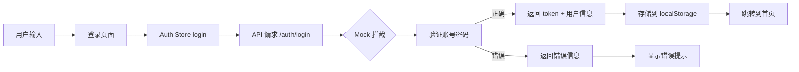
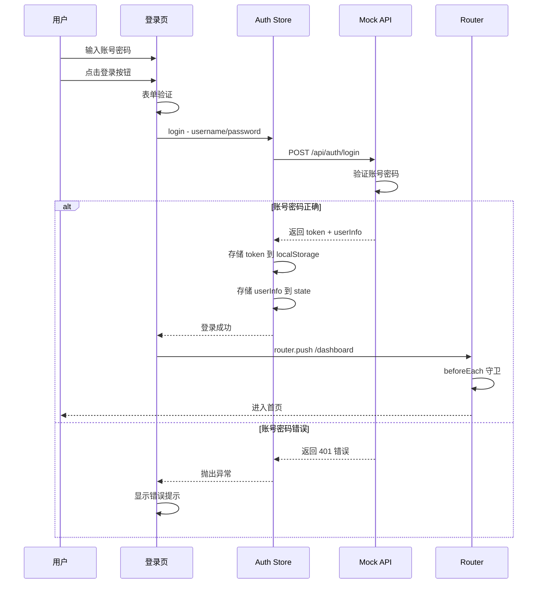

# 本地模拟登录实现方案

## 📋 需求概述

实现一个本地模拟登录功能，用户输入正确的账号密码登录成功，输入错误则登录失败。

## 🔍 现有项目分析

### 已有基础设施

| 模块 | 文件 | 状态 |
|------|------|------|
| Auth Store | [`src/stores/auth/index.ts`](src/stores/auth/index.ts) | ✅ 已实现完整的登录状态管理 |
| Auth API | [`src/api/modules/auth.ts`](src/api/modules/auth.ts) | ✅ 已定义登录接口类型和方法 |
| 登录页面 | [`src/pages/login/index.vue`](src/pages/login/index.vue) | ⚠️ 仅有基础框架，需要完善 UI |
| 路由守卫 | [`src/router/index.ts`](src/router/index.ts) | ✅ 已实现完整的认证守卫 |
| Mock 依赖 | `mockjs-extend` | ✅ 已安装，但未配置 |

### 需要新增的内容

1. **Mock 服务配置** - 使用 `vite-plugin-mock` 或 `mockjs-extend`
2. **登录页面 UI** - 使用 Vuetify 3 组件构建表单
3. **Mock API 实现** - 模拟后端登录验证逻辑

---

## 🏗️ 技术方案

### 方案选择

项目已安装 `mockjs-extend`，推荐使用 **vite-plugin-mock** 插件，它提供了更好的 Vite 集成：



---

## 📁 文件结构

```
src/
├── mock/                          # 新增 Mock 目录
│   ├── index.ts                   # Mock 入口配置
│   ├── modules/
│   │   └── auth.ts                # 认证相关 Mock API
│   └── types.ts                   # Mock 类型定义
├── pages/
│   └── login/
│       └── index.vue              # 完善 UI
└── ...
```

---

## 📝 实现步骤

### 步骤 1: 安装依赖

需要安装 `vite-plugin-mock`：

```bash
npm install vite-plugin-mock -D
```

### 步骤 2: 创建 Mock 配置

**文件**: `src/mock/modules/auth.ts`

```typescript
import { MockMethod } from 'vite-plugin-mock'
import Mock from 'mockjs'

// 模拟用户数据库
const mockUsers = [
  {
    id: '1',
    username: 'admin',
    password: 'admin123',
    nickname: '管理员',
    avatar: 'https://api.dicebear.com/7.x/avataaars/svg?seed=admin',
    email: 'admin@example.com',
    roles: ['admin'],
    permissions: ['*']
  },
  {
    id: '2',
    username: 'user',
    password: 'user123',
    nickname: '普通用户',
    avatar: 'https://api.dicebear.com/7.x/avataaars/svg?seed=user',
    email: 'user@example.com',
    roles: ['user'],
    permissions: ['dashboard:view', 'profile:edit']
  }
]

export default [
  // 登录接口
  {
    url: '/api/auth/login',
    method: 'post',
    response: ({ body }) => {
      const { username, password } = body
      
      const user = mockUsers.find(
        u => u.username === username && u.password === password
      )
      
      if (!user) {
        return {
          code: 401,
          message: '用户名或密码错误',
          data: null
        }
      }
      
      // 生成 mock token
      const accessToken = Mock.Random.guid()
      const refreshToken = Mock.Random.guid()
      
      // 返回用户信息（不包含密码）
      const { password: _, ...userInfo } = user
      
      return {
        code: 200,
        message: '登录成功',
        data: {
          accessToken,
          refreshToken,
          expiresIn: 7200,
          userInfo
        }
      }
    }
  },
  
  // 登出接口
  {
    url: '/api/auth/logout',
    method: 'post',
    response: () => {
      return {
        code: 200,
        message: '登出成功',
        data: null
      }
    }
  },
  
  // 获取用户信息
  {
    url: '/api/auth/user-info',
    method: 'get',
    response: () => {
      // 从 localStorage 获取已登录用户
      const storedUser = localStorage.getItem('user_info')
      if (storedUser) {
        return {
          code: 200,
          message: '成功',
          data: JSON.parse(storedUser)
        }
      }
      return {
        code: 401,
        message: '未登录',
        data: null
      }
    }
  }
] as MockMethod[]
```

**文件**: `src/mock/index.ts`

```typescript
import { createMockServer } from 'vite-plugin-mock/es/createMockServer'

export function setupMock() {
  createMockServer({
    mockList: [
      import('./modules/auth')
    ]
  })
}
```

### 步骤 3: 配置 Vite 插件

**文件**: `vite.config.mts` 添加：

```typescript
import { viteMockServe } from 'vite-plugin-mock'

export default defineConfig(({ command, mode }) => {
  return {
    plugins: [
      // ... 其他插件
      viteMockServe({
        mockPath: 'src/mock/modules',
        localEnabled: command === 'serve', // 开发环境启用
        prodEnabled: false, // 生产环境禁用
        watchFiles: true, // 监听文件变化
        logger: true // 显示日志
      })
    ]
  }
})
```

### 步骤 4: 完善登录页面 UI

**文件**: `src/pages/login/index.vue`

```vue
<!-- 登录页面 -->
<template>
  <v-container fluid class="fill-height bg-gradient">
    <v-row align="center" justify="center">
      <v-col cols="12" sm="8" md="4" lg="3">
        <v-card class="elevation-12 rounded-lg">
          <v-card-title class="text-center py-6">
            <h2 class="text-h4 font-weight-bold">用户登录</h2>
            <p class="text-body-2 text-medium-emphasis mt-2">
              请输入您的账号密码
            </p>
          </v-card-title>

          <v-card-text class="px-8 pb-6">
            <v-form ref="formRef" v-model="isValid" @submit.prevent="handleLogin">
              <v-text-field
                v-model="formData.username"
                label="用户名"
                prepend-inner-icon="mdi-account"
                variant="outlined"
                :rules="usernameRules"
                :disabled="loading"
                class="mb-3"
              />

              <v-text-field
                v-model="formData.password"
                label="密码"
                prepend-inner-icon="mdi-lock"
                variant="outlined"
                :type="showPassword ? 'text' : 'password'"
                :append-inner-icon="showPassword ? 'mdi-eye-off' : 'mdi-eye'"
                :rules="passwordRules"
                :disabled="loading"
                class="mb-4"
                @click:append-inner="showPassword = !showPassword"
              />

              <v-btn
                type="submit"
                color="primary"
                size="large"
                block
                :loading="loading"
                :disabled="!isValid"
              >
                登 录
              </v-btn>
            </v-form>

            <!-- 测试账号提示 -->
            <v-alert
              type="info"
              variant="tonal"
              class="mt-6"
              density="compact"
            >
              <template #prepend>
                <v-icon icon="mdi-information" />
              </template>
              <div class="text-body-2">
                <strong>测试账号：</strong><br />
                管理员: admin / admin123<br />
                用户: user / user123
              </div>
            </v-alert>
          </v-card-text>
        </v-card>
      </v-col>
    </v-row>
  </v-container>
</template>

<script lang="ts" setup>
import { useSnackbar } from '@/composables/useSnackbar'

definePage({
  meta: {
    title: '登录',
    requireAuth: false,
    layout: 'public'
  }
})

const router = useRouter()
const authStore = useAuthStore()
const { showSnackbar } = useSnackbar()

// 表单引用
const formRef = ref()
const isValid = ref(false)
const loading = ref(false)
const showPassword = ref(false)

// 表单数据
const formData = reactive({
  username: '',
  password: ''
})

// 验证规则
const usernameRules = [
  (v: string) => !!v || '请输入用户名',
  (v: string) => v.length >= 2 || '用户名至少 2 个字符'
]

const passwordRules = [
  (v: string) => !!v || '请输入密码',
  (v: string) => v.length >= 5 || '密码至少 5 个字符'
]

// 登录处理
async function handleLogin() {
  const { valid } = await formRef.value?.validate()
  if (!valid) return

  loading.value = true
  
  try {
    await authStore.login({
      username: formData.username,
      password: formData.password
    })
    
    showSnackbar({
      message: '登录成功，正在跳转...',
      color: 'success'
    })
    
    // 跳转到首页或重定向页面
    const redirect = router.currentRoute.value.query.redirect as string
    router.push(redirect || '/dashboard')
  } catch (error: any) {
    showSnackbar({
      message: error.message || '登录失败，请重试',
      color: 'error'
    })
  } finally {
    loading.value = false
  }
}
</script>

<style scoped>
.bg-gradient {
  background: linear-gradient(135deg, #667eea 0%, #764ba2 100%);
}
</style>
```

---

## 🧪 测试账号

| 角色 | 用户名 | 密码 | 权限 |
|------|--------|------|------|
| 管理员 | admin | admin123 | 所有权限 |
| 普通用户 | user | user123 | 部分权限 |

---

## 🔄 登录流程图



---

## ✅ 验收标准

1. **登录成功场景**
   - 输入正确账号密码（admin/admin123 或 user/user123）
   - 显示登录成功提示
   - 自动跳转到 Dashboard 页面
   - localStorage 中存储了 token 和用户信息

2. **登录失败场景**
   - 输入错误的账号或密码
   - 显示"用户名或密码错误"提示
   - 停留在登录页面
   - 表单可以重新输入

3. **表单验证**
   - 用户名和密码为必填项
   - 用户名至少 2 个字符
   - 密码至少 5 个字符
   - 验证不通过时禁用登录按钮

---

## 📦 涉及文件清单

| 操作 | 文件路径 | 说明 |
|------|----------|------|
| 新增 | `src/mock/modules/auth.ts` | Mock 登录 API |
| 新增 | `src/mock/index.ts` | Mock 入口配置 |
| 修改 | `vite.config.mts` | 添加 mock 插件配置 |
| 修改 | `src/pages/login/index.vue` | 完善登录页面 UI |
| 修改 | `src/layouts/public.vue` | 优化公共布局样式（可选） |
