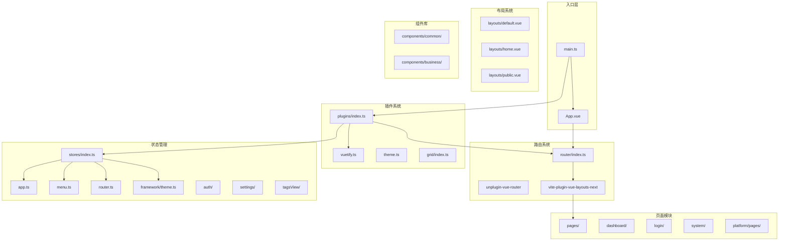
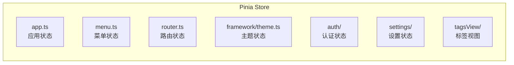
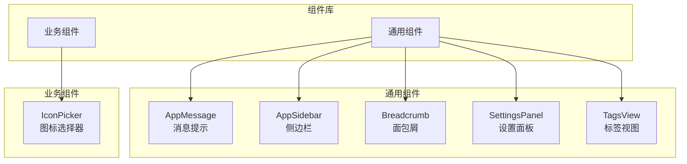

# study-vuetify-pro 项目架构分析

## 📋 项目概述

**项目名称**: study-vuetify-pro  
**版本**: 0.0.1  
**技术栈**: Vue 3 + Vuetify 3 + TypeScript + Vite

---

## 🏗️ 整体架构图



---

## 📁 目录结构

```
src/
├── main.ts                 # 应用入口
├── App.vue                 # 根组件
├── plugins/                # 插件配置
│   ├── index.ts           # 插件注册中心
│   ├── vuetify.ts         # Vuetify 配置
│   ├── vuetify/theme.ts   # 主题配置
│   └── grid/              # Grid 系统配置
├── router/                 # 路由配置
│   └── index.ts           # 路由入口 + 导航守卫
├── stores/                 # Pinia 状态管理
│   ├── index.ts           # Pinia 实例
│   ├── app.ts             # 应用状态
│   ├── menu.ts            # 菜单状态
│   ├── router.ts          # 路由状态
│   ├── auth/              # 认证状态
│   ├── framework/         # 框架状态（主题等）
│   ├── settings/          # 设置状态
│   └── tagsView/          # 标签视图状态
├── layouts/                # 布局组件
│   ├── default.vue        # 默认布局
│   ├── home.vue           # 主页布局（带侧边栏）
│   └── public.vue         # 公共页面布局
├── pages/                  # 页面组件（自动路由）
│   ├── index.vue          # 首页
│   ├── dashboard/         # 仪表盘
│   ├── login/             # 登录页
│   ├── system/            # 系统管理
│   │   ├── permission/    # 权限管理
│   │   ├── role/          # 角色管理
│   │   └── user/          # 用户管理
│   ├── test/              # 测试页面
│   └── icon/              # 图标选择器
├── platform/pages/         # 平台页面（独立路由模块）
│   ├── portal/            # 门户页
│   └── farmework/         # 框架相关页面
├── components/             # 公共组件
│   ├── common/            # 通用组件
│   │   ├── AppMessage/    # 消息组件
│   │   ├── AppSidebar/    # 侧边栏
│   │   ├── Breadcrumb/    # 面包屑
│   │   ├── SettingsPanel/ # 设置面板
│   │   └── TagsView/      # 标签视图
│   └── business/          # 业务组件
├── composables/            # 组合式函数
├── hooks/                  # 自定义 Hooks
├── directives/             # 自定义指令
├── api/                    # API 接口
│   └── modules/           # API 模块
├── locales/                # 国际化
├── middleware/             # 中间件
├── styles/                 # 全局样式
├── types/                  # TypeScript 类型定义
└── utils/                  # 工具函数
```

---

## 🔧 核心技术栈

### 前端框架
| 技术 | 版本 | 用途 |
|------|------|------|
| Vue | ^3.5.26 | 核心框架 |
| Vuetify | ^3.11.5 | UI 组件库 |
| Vue Router | ^4.6.3 | 路由管理 |
| Pinia | ^3.0.0 | 状态管理 |
| TypeScript | ^5.4.2 | 类型支持 |

### 构建工具
| 技术 | 版本 | 用途 |
|------|------|------|
| Vite | ^7.2.2 | 构建工具 |
| Sass | 1.93.3 | CSS 预处理器 |
| UnoCSS | ^66.4.2 | 原子化 CSS |

### 插件系统
| 插件 | 用途 |
|------|------|
| unplugin-vue-router | 基于文件的路由自动生成 |
| vite-plugin-vue-layouts-next | 布局系统 |
| unplugin-auto-import | 自动导入 API |
| unplugin-vue-components | 组件自动导入 |
| unplugin-icons | 图标自动导入 |
| vite-plugin-compression2 | 构建压缩 |

---

## 🔄 路由系统

### 路由模式
项目采用 **基于文件的路由** 模式，通过 `unplugin-vue-router` 自动生成路由配置。

### 路由源目录
```typescript
// vite.config.mts
routesFolder: [
  { src: 'src/pages' },        // 主页面路由
  { src: 'src/platform/pages', path: 'platform/' }  // 平台页面路由
]
```

### 路由元信息
```typescript
interface RouteMeta {
  layout: 'default' | 'home' | 'public';  // 布局类型
  name: string;                            // 路由名称
  title: string;                           // 页面标题
  requireAuth: boolean;                    // 是否需要认证
  keepAlive: boolean;                      // 是否缓存
  isLayout?: boolean;                      // 是否使用布局
}
```

### 导航守卫
当前配置了全局前置守卫 `beforeEach`，默认重定向到登录页。

---

## 🎨 主题系统

### 主题配置
- **默认主题**: light
- **支持主题**: light / dark
- **设计规范**: Material Design 3 (MD3)

### 颜色系统
```typescript
// 主要颜色
primary: '#007BFF'      // 主色
secondary: '#FF965D'    // 次要色
success: '#28C76F'      // 成功
info: '#00CFE8'         // 信息
warning: '#FF9F43'      // 警告
error: '#EA5455'        // 错误

// 背景色
background: '#F8F7FA'   // light 模式
background: '#25293C'   // dark 模式
```

### 灰度色阶
项目定义了从 `grey-50` 到 `grey-900` 的完整灰度色阶。

---

## 📦 状态管理

### Store 结构



### 主要 Store 说明

| Store | 文件 | 职责 |
|-------|------|------|
| app | `app.ts` | 全局应用状态 |
| menu | `menu.ts` | 侧边栏菜单数据 |
| router | `router.ts` | 路由数据存储 |
| theme | `framework/theme.ts` | 主题配置（侧边栏折叠等） |
| auth | `auth/` | 用户认证状态 |
| settings | `settings/` | 用户偏好设置 |
| tagsView | `tagsView/` | 多标签页状态 |

---

## 📐 布局系统

### 布局类型

| 布局 | 文件 | 适用场景 |
|------|------|----------|
| home | `home.vue` | 主应用页面（带侧边栏+顶栏） |
| default | `default.vue` | 简单布局（仅内容区+底部） |
| public | `public.vue` | 公共页面（登录/注册等） |

### home 布局结构
```
┌────────────────────────────────────────────┐
│  v-app-bar（顶部导航栏）                     │
├──────────┬─────────────────────────────────┤
│          │                                 │
│  v-nav   │                                 │
│  侧边栏   │         router-view            │
│          │         （内容区域）             │
│          │                                 │
├──────────┴─────────────────────────────────┤
│  AppFooter（页脚）                          │
└────────────────────────────────────────────┘
```

---

## 🧩 组件系统

### 组件分类



---

## 🔌 插件注册流程

```typescript
// src/plugins/index.ts
export function registerPlugins(app: App) {
  app
    .use(vuetify)    // Vuetify UI 框架
    .use(router)     // Vue Router 路由
    .use(pinia);     // Pinia 状态管理
}
```

---

## 🚀 构建配置亮点

### 1. 自动导入
- **API 自动导入**: Vue、Pinia、Vue Router API 无需手动 import
- **组件自动导入**: Vuetify 组件和自定义组件自动注册

### 2. 图标系统
- **MDI 图标**: @mdi/font
- **Iconify 支持**: 通过 unplugin-icons 支持多种图标库
- **UnoCSS 图标**: 原子化图标类名

### 3. 性能优化
- **代码压缩**: vite-plugin-compression2
- **ES Toolkit**: 轻量级工具库替代 lodash
- **Tree Shaking**: 自动移除 console 和 debugger

---

## 📝 开发建议

### 当前状态
项目处于 **开发初期阶段** (v0.0.1)，基础架构已搭建完成。

### 待完善功能
1. **认证系统**: 导航守卫当前强制重定向到登录页
2. **API 层**: api/modules 目录结构已建立，需实现具体接口
3. **国际化**: locales 目录已创建，需配置语言包
4. **中间件**: middleware 目录已创建，待实现具体逻辑

### 推荐开发流程
1. 在 `src/pages/` 或 `src/platform/pages/` 添加页面组件
2. 通过 route meta 配置布局和权限
3. 在 `src/stores/` 添加页面状态
4. 在 `src/components/` 封装可复用组件
5. 在 `src/api/modules/` 定义接口

---

## 📊 技术债务

| 项目 | 状态 | 建议 |
|------|------|------|
| 导航守卫 | 硬编码重定向 | 实现完整的认证逻辑 |
| 菜单数据 | 静态配置 | 改为动态加载 |
| 类型定义 | 部分 any | 完善类型定义 |
| 单元测试 | 未配置 | 添加测试用例 |

---

*文档生成时间: 2026-02-18*
