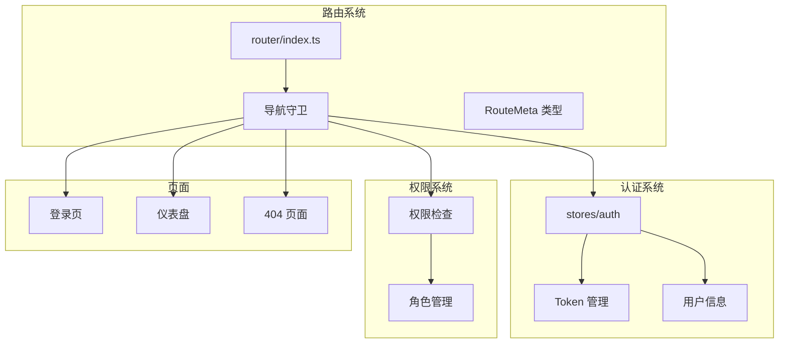
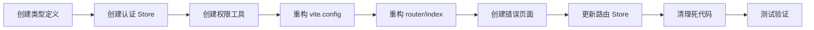

# 路由系统优化计划（完整版）

> 包含登录流程、API 层设计、Token 管理等完整细节

## 📋 问题总结

| 优先级 | 问题 | 影响 |
|--------|------|------|
| 🔴 严重 | 导航守卫硬编码 `if (true)` | 应用无法正常访问 |
| 🔴 严重 | 路由元信息重复配置 | 配置冲突、维护困难 |
| 🟡 中等 | 类型定义不完善 | 类型安全性差 |
| 🟡 中等 | 缺少认证 Store | 无法实现真实认证 |
| 🟡 中等 | 死代码和 console.log | 代码质量差 |
| 🟢 优化 | 缺少 404 页面 | 用户体验差 |
| 🟢 优化 | 路由守卫逻辑不完整 | 缺少权限控制 |

---

## 🏗️ 优化架构



---

## 📝 实施步骤

### 步骤 1: 创建类型定义文件

**文件**: `src/types/router.d.ts`

```typescript
import 'vue-router'

declare module 'vue-router' {
  interface RouteMeta {
    /** 页面标题 */
    title?: string
    /** 布局名称 */
    layout?: 'default' | 'home' | 'public'
    /** 是否需要认证 */
    requireAuth?: boolean
    /** 是否缓存页面 */
    keepAlive?: boolean
    /** 是否隐藏侧边栏 */
    hideSidebar?: boolean
    /** 所需权限列表 */
    permissions?: string[]
    /** 所需角色列表 */
    roles?: string[]
    /** 路由名称 */
    name?: string
    /** 是否使用布局 */
    isLayout?: boolean
    /** 面包屑 */
    breadcrumb?: boolean
    /** 图标 */
    icon?: string
  }
}
```

---

### 步骤 2: 创建认证 Store

**文件**: `src/stores/auth/index.ts`

```typescript
import { defineStore } from 'pinia'
import { ref, computed } from 'vue'

export const useAuthStore = defineStore('auth', () => {
  // State
  const token = ref<string | null>(localStorage.getItem('access_token'))
  const refreshToken = ref<string | null>(localStorage.getItem('refresh_token'))
  const userInfo = ref<UserInfo | null>(null)
  const roles = ref<string[]>([])
  const permissions = ref<string[]>([])

  // Getters
  const isLoggedIn = computed(() => !!token.value)
  const hasUserInfo = computed(() => !!userInfo.value)

  // Actions
  function setToken(accessToken: string, refresh?: string) {
    token.value = accessToken
    localStorage.setItem('access_token', accessToken)
    if (refresh) {
      refreshToken.value = refresh
      localStorage.setItem('refresh_token', refresh)
    }
  }

  function clearToken() {
    token.value = null
    refreshToken.value = null
    userInfo.value = null
    roles.value = []
    permissions.value = []
    localStorage.removeItem('access_token')
    localStorage.removeItem('refresh_token')
  }

  function setUserInfo(info: UserInfo) {
    userInfo.value = info
    roles.value = info.roles || []
    permissions.value = info.permissions || []
  }

  function hasPermission(permission: string | string[]): boolean {
    if (!permission) return true
    const perms = Array.isArray(permission) ? permission : [permission]
    return perms.some(p => permissions.value.includes(p))
  }

  function hasRole(role: string | string[]): boolean {
    if (!role) return true
    const roleList = Array.isArray(role) ? role : [role]
    return roleList.some(r => roles.value.includes(r))
  }

  async function logout() {
    clearToken()
    // 可在此处调用登出 API
  }

  return {
    token,
    refreshToken,
    userInfo,
    roles,
    permissions,
    isLoggedIn,
    hasUserInfo,
    setToken,
    clearToken,
    setUserInfo,
    hasPermission,
    hasRole,
    logout
  }
})

interface UserInfo {
  id?: string | number
  username?: string
  nickname?: string
  avatar?: string
  email?: string
  roles?: string[]
  permissions?: string[]
}
```

---

### 步骤 3: 创建权限工具函数

**文件**: `src/utils/permission.ts`

```typescript
import { useAuthStore } from '@/stores/auth'

/**
 * 检查用户是否拥有指定权限
 */
export function checkPermission(value: string | string[]): boolean {
  const authStore = useAuthStore()
  return authStore.hasPermission(value)
}

/**
 * 检查用户是否拥有指定角色
 */
export function checkRole(value: string | string[]): boolean {
  const authStore = useAuthStore()
  return authStore.hasRole(value)
}

/**
 * 检查路由权限
 */
export function checkRoutePermission(meta: {
  permissions?: string[]
  roles?: string[]
}): boolean {
  const authStore = useAuthStore()
  
  // 无权限要求
  if (!meta.permissions && !meta.roles) {
    return true
  }
  
  // 检查权限
  if (meta.permissions && !authStore.hasPermission(meta.permissions)) {
    return false
  }
  
  // 检查角色
  if (meta.roles && !authStore.hasRole(meta.roles)) {
    return false
  }
  
  return true
}
```

---

### 步骤 4: 重构 vite.config.mts

**修改**: 移除 `extendRoute` 中的路由元信息配置

```typescript
// vite.config.mts
VueRouter({
  routesFolder: [
    { src: 'src/pages' },
    { src: 'src/platform/pages', path: 'platform/' }
  ],
  dts: 'src/typed-router.d.ts',
  exclude: [],
  getRouteName: (route) => getFileBasedRouteName(route),
  
  // 简化 extendRoute，只处理必要的默认值
  async extendRoute(route) {
    // 设置默认布局
    if (!route.meta) {
      route.meta = {}
    }
    
    // 根据路径设置默认布局
    if (route.path.startsWith('/platform')) {
      route.meta.layout = 'default'
    } else if (route.path === '/login') {
      route.meta.layout = 'public'
      route.meta.requireAuth = false
    } else {
      route.meta.layout = 'home'
    }
    
    // 设置默认值
    route.meta.requireAuth ??= true
    route.meta.keepAlive ??= false
  },
  
  importMode: 'sync'
})
```

---

### 步骤 5: 重构 router/index.ts

**文件**: `src/router/index.ts`

```typescript
/**
 * router/index.ts
 * 路由配置 - 基于文件的路由自动生成
 */

import { setupLayouts } from 'virtual:generated-layouts'
import { createRouter, createWebHistory, type RouteLocationNormalized } from 'vue-router'
import { handleHotUpdate, routes } from 'vue-router/auto-routes'

import { useAuthStore } from '@/stores/auth'
import { checkRoutePermission } from '@/utils/permission'

// 标题前缀
const TITLE_PREFIX = 'W3-'

// 白名单路由（无需认证）
const WHITE_LIST = ['/login', '/register', '/forgot-password', '/404']

// 创建路由实例
const router = createRouter({
  history: createWebHistory(import.meta.env.BASE_URL),
  routes: [...setupLayouts(routes)],
  scrollBehavior(to, from, savedPosition) {
    if (savedPosition) {
      return savedPosition
    }
    if (to.hash) {
      return { el: to.hash, behavior: 'smooth' }
    }
    return { top: 0, behavior: 'smooth' }
  }
})

// 热更新支持
if (import.meta.hot) {
  handleHotUpdate(router)
}

/**
 * 处理页面标题
 */
function setupTitle(to: RouteLocationNormalized) {
  const title = to.meta?.title
  if (typeof title === 'string') {
    document.title = `${TITLE_PREFIX}${title}`
  } else if (to.name === '/[...path]') {
    document.title = `${TITLE_PREFIX}404`
  } else {
    document.title = TITLE_PREFIX.slice(0, -1) // 移除末尾的 -
  }
}

/**
 * 全局前置守卫
 */
router.beforeEach(async (to, from, next) => {
  // 1. 设置页面标题
  setupTitle(to)
  
  // 2. 白名单路由直接放行
  if (WHITE_LIST.includes(to.path)) {
    next()
    return
  }
  
  // 3. 检查是否需要认证
  const authStore = useAuthStore()
  
  if (to.meta?.requireAuth === false) {
    next()
    return
  }
  
  // 4. 检查登录状态
  if (!authStore.isLoggedIn) {
    next({
      path: '/login',
      query: { redirect: to.fullPath }
    })
    return
  }
  
  // 5. 检查是否已获取用户信息
  if (!authStore.hasUserInfo) {
    try {
      // TODO: 调用获取用户信息 API
      // await authStore.fetchUserInfo()
      next()
    } catch (error) {
      // 获取用户信息失败，清除 token 并跳转登录
      authStore.clearToken()
      next({
        path: '/login',
        query: { redirect: to.fullPath }
      })
    }
    return
  }
  
  // 6. 检查路由权限
  if (!checkRoutePermission(to.meta)) {
    next('/403')
    return
  }
  
  next()
})

/**
 * 全局解析守卫
 */
router.beforeResolve(async (to) => {
  // 可在此处处理路由进入前的数据预加载
  if (to.meta?.requireAuth) {
    // 验证 token 有效性等
  }
})

/**
 * 全局后置钩子
 */
router.afterEach((to, from) => {
  // 可在此处添加页面访问统计等
})

/**
 * 路由错误处理
 */
router.onError((error, to) => {
  console.error('路由错误:', error)
  
  // 处理动态导入失败
  if (error.message.includes('Failed to fetch dynamically imported module')) {
    if (!localStorage.getItem('vuetify:dynamic-reload')) {
      localStorage.setItem('vuetify:dynamic-reload', 'true')
      location.assign(to.fullPath)
    }
  }
})

export default router
```

---

### 步骤 6: 创建 404 页面

**文件**: `src/pages/404.vue`

```vue
<template>
  <v-container fluid class="fill-height bg-background">
    <v-row align="center" justify="center">
      <v-col cols="12" md="6" class="text-center">
        <h1 class="text-h1 font-weight-bold text-primary mb-4">404</h1>
        <h2 class="text-h5 text-medium-emphasis mb-8">
          抱歉，您访问的页面不存在
        </h2>
        <v-btn
          color="primary"
          size="large"
          prepend-icon="mdi-home"
          to="/"
        >
          返回首页
        </v-btn>
      </v-col>
    </v-row>
  </v-container>
</template>

<script lang="ts" setup>
definePage({
  meta: {
    title: '页面未找到',
    requireAuth: false,
    layout: 'public'
  }
})
</script>
```

---

### 步骤 7: 创建 403 页面

**文件**: `src/pages/403.vue`

```vue
<template>
  <v-container fluid class="fill-height bg-background">
    <v-row align="center" justify="center">
      <v-col cols="12" md="6" class="text-center">
        <v-icon size="120" color="error" class="mb-4">mdi-lock-outline</v-icon>
        <h1 class="text-h4 font-weight-bold text-error mb-4">403</h1>
        <h2 class="text-h5 text-medium-emphasis mb-8">
          抱歉，您没有权限访问此页面
        </h2>
        <v-btn
          color="primary"
          size="large"
          prepend-icon="mdi-arrow-left"
          @click="goBack"
        >
          返回上一页
        </v-btn>
      </v-col>
    </v-row>
  </v-container>
</template>

<script lang="ts" setup>
import { useRouter } from 'vue-router'

const router = useRouter()

function goBack() {
  router.go(-1)
}

definePage({
  meta: {
    title: '无访问权限',
    requireAuth: false,
    layout: 'public'
  }
})
</script>
```

---

### 步骤 8: 更新路由 Store 类型

**文件**: `src/stores/router.ts`

```typescript
import { defineStore } from 'pinia'
import type { RouteRecordRaw } from 'vue-router'

interface RouterState {
  routes: RouteRecordRaw[]
  addRoutes: RouteRecordRaw[]
}

export const useRouterStore = defineStore('router', {
  state: (): RouterState => ({
    routes: [],
    addRoutes: []
  }),
  
  getters: {
    getRoutes: (state) => state.routes,
    getAddRoutes: (state) => state.addRoutes
  },
  
  actions: {
    setRoutes(routes: RouteRecordRaw[]) {
      this.routes = routes
    },
    
    addDynamicRoutes(routes: RouteRecordRaw[]) {
      this.addRoutes = routes
      this.routes = [...this.routes, ...routes]
    },
    
    clearRoutes() {
      this.routes = []
      this.addRoutes = []
    }
  }
})
```

---

## 📊 优化前后对比

| 方面 | 优化前 | 优化后 |
|------|--------|--------|
| 导航守卫 | 硬编码 `if (true)` | 完整的认证流程 |
| 类型安全 | `any` 类型 | 完整的 TypeScript 类型 |
| 权限控制 | 无 | 支持角色和权限检查 |
| 错误处理 | 仅 console | 完整的错误处理机制 |
| 代码质量 | 大量死代码 | 清晰、可维护 |
| 用户体验 | 无 404 页面 | 友好的错误页面 |

---

## 🔄 迁移流程



---

## ✅ 验收标准

1. [ ] 未登录用户访问受保护页面时跳转到登录页
2. [ ] 登录后能正常访问所有页面
3. [ ] 无权限用户访问受限页面时跳转到 403 页面
4. [ ] 访问不存在的路由时显示 404 页面
5. [ ] 页面标题正确显示
6. [ ] 无 console.log 和死代码
7. [ ] TypeScript 类型检查通过

---

*计划创建时间: 2026-02-18*
