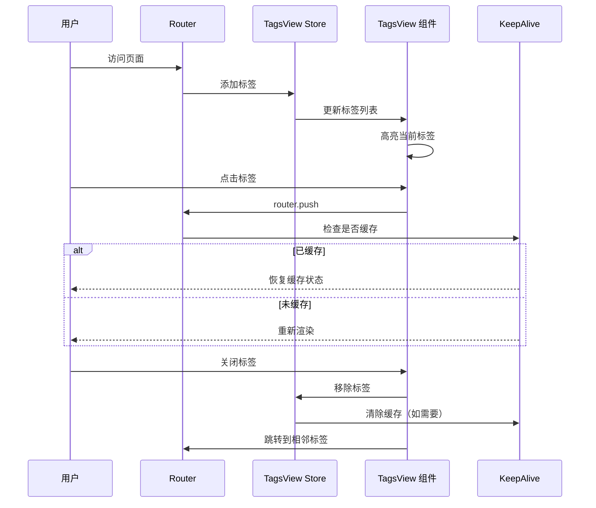
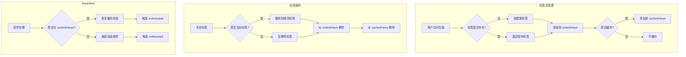

# 标签页与路由缓存设计

## 📋 概述

标签页（TagsView）和路由缓存（KeepAlive）是后台管理系统的常见功能：
- **标签页**：多页签切换，类似浏览器的标签页
- **路由缓存**：页面状态保持，切换时不重新加载

---

## 🔄 功能流程



---

## 📁 文件结构

```
src/
├── stores/
│   └── tagsView/
│       ├── index.ts           # TagsView Store
│       └── types.ts           # 类型定义
├── components/
│   └── common/
│       └── TagsView/
│           ├── index.vue      # 标签页组件
│           └── TabItem.vue    # 单个标签项
├── layouts/
│   └── home.vue               # 主布局（集成 TagsView）
└── composables/
    └── useKeepAlive.ts        # KeepAlive 组合式函数
```

---

## 1️⃣ 类型定义

**文件**: `src/stores/tagsView/types.ts`

```typescript
import type { RouteLocationNormalized } from 'vue-router'

/**
 * 标签页项
 */
export interface TagView {
  /** 路由路径 */
  path: string
  /** 路由名称 */
  name: string
  /** 页面标题 */
  title: string
  /** 路由完整路径（含参数） */
  fullPath: string
  /** 图标 */
  icon?: string
  /** 是否固定（不可关闭） */
  affix: boolean
  /** 是否缓存 */
  keepAlive: boolean
  /** 查询参数 */
  query?: Record<string, string>
}

/**
 * TagsView Store 状态
 */
export interface TagsViewState {
  /** 标签列表 */
  visitedViews: TagView[]
  /** 缓存的路由名称列表 */
  cachedViews: string[]
  /** 最大标签数量 */
  maxTags: number
}

/**
 * 标签操作类型
 */
export type TagAction = 'refresh' | 'close' | 'closeLeft' | 'closeRight' | 'closeOther' | 'closeAll'
```

---

## 2️⃣ TagsView Store

**文件**: `src/stores/tagsView/index.ts`

```typescript
import { defineStore } from 'pinia'
import { ref, computed, watch } from 'vue'
import type { RouteLocationNormalized } from 'vue-router'
import type { TagView, TagsViewState } from './types'

// 固定标签 Key
const AFFIX_TAGS_KEY = 'affix_tags'

export const useTagsViewStore = defineStore('tagsView', () => {
  // ==================== State ====================
  
  /** 访问过的标签 */
  const visitedViews = ref<TagView[]>([])
  
  /** 缓存的路由名称 */
  const cachedViews = ref<string[]>([])
  
  /** 最大标签数量 */
  const maxTags = ref(20)

  // ==================== Getters ====================
  
  /** 获取所有标签 */
  const getVisitedViews = computed(() => visitedViews.value)
  
  /** 获取缓存的路由 */
  const getCachedViews = computed(() => cachedViews.value)
  
  /** 是否有标签 */
  const hasTags = computed(() => visitedViews.value.length > 0)

  // ==================== Actions ====================
  
  /**
   * 初始化固定标签
   */
  function initAffixTags(routes: RouteLocationNormalized[]) {
    // 从路由配置中获取固定标签
    const affixTags: TagView[] = routes
      .filter(route => route.meta?.affix)
      .map(route => createTagView(route))
    
    visitedViews.value = affixTags
  }

  /**
   * 添加标签
   */
  function addView(view: RouteLocationNormalized): void {
    addVisitedView(view)
    addCachedView(view)
  }

  /**
   * 添加访问过的标签
   */
  function addVisitedView(view: RouteLocationNormalized): void {
    const path = view.path
    
    // 检查是否已存在
    if (visitedViews.value.some(v => v.path === path)) {
      return
    }
    
    // 检查是否超过最大数量
    if (visitedViews.value.length >= maxTags.value) {
      // 移除最早的非固定标签
      const firstNonAffixIndex = visitedViews.value.findIndex(v => !v.affix)
      if (firstNonAffixIndex > -1) {
        visitedViews.value.splice(firstNonAffixIndex, 1)
      }
    }
    
    // 添加新标签
    visitedViews.value.push(createTagView(view))
  }

  /**
   * 添加缓存的路由
   */
  function addCachedView(view: RouteLocationNormalized): void {
    const name = view.name as string
    
    if (!name) return
    if (cachedViews.value.includes(name)) return
    if (view.meta?.keepAlive === false) return
    
    cachedViews.value.push(name)
  }

  /**
   * 删除标签
   */
  function delView(view: TagView): TagView[] {
    delVisitedView(view)
    delCachedView(view)
    return visitedViews.value
  }

  /**
   * 删除访问过的标签
   */
  function delVisitedView(view: TagView): void {
    const index = visitedViews.value.findIndex(v => v.path === view.path)
    
    if (index > -1) {
      visitedViews.value.splice(index, 1)
    }
  }

  /**
   * 删除缓存的路由
   */
  function delCachedView(view: TagView): void {
    const index = cachedViews.value.indexOf(view.name)
    
    if (index > -1) {
      cachedViews.value.splice(index, 1)
    }
  }

  /**
   * 关闭其他标签
   */
  function delOthersViews(view: TagView): void {
    visitedViews.value = visitedViews.value.filter(v => v.affix || v.path === view.path)
    cachedViews.value = cachedViews.value.filter(name => name === view.name)
  }

  /**
   * 关闭左侧标签
   */
  function delLeftViews(view: TagView): void {
    const index = visitedViews.value.findIndex(v => v.path === view.path)
    
    if (index > -1) {
      visitedViews.value = visitedViews.value.filter((v, i) => v.affix || i >= index)
      cachedViews.value = cachedViews.value.filter(name => 
        visitedViews.value.some(v => v.name === name)
      )
    }
  }

  /**
   * 关闭右侧标签
   */
  function delRightViews(view: TagView): void {
    const index = visitedViews.value.findIndex(v => v.path === view.path)
    
    if (index > -1) {
      visitedViews.value = visitedViews.value.filter((v, i) => v.affix || i <= index)
      cachedViews.value = cachedViews.value.filter(name => 
        visitedViews.value.some(v => v.name === name)
      )
    }
  }

  /**
   * 关闭所有标签
   */
  function delAllViews(): void {
    visitedViews.value = visitedViews.value.filter(v => v.affix)
    cachedViews.value = []
  }

  /**
   * 更新标签标题
   */
  function updateViewTitle(view: RouteLocationNormalized, title: string): void {
    const tag = visitedViews.value.find(v => v.path === view.path)
    
    if (tag) {
      tag.title = title
    }
  }

  /**
   * 刷新当前标签（清除缓存）
   */
  function refreshView(view: TagView): void {
    const index = cachedViews.value.indexOf(view.name)
    
    if (index > -1) {
      cachedViews.value.splice(index, 1)
    }
    
    // 下次进入时重新缓存
    setTimeout(() => {
      if (!cachedViews.value.includes(view.name)) {
        cachedViews.value.push(view.name)
      }
    }, 100)
  }

  /**
   * 获取相邻标签
   */
  function getAdjacentTag(view: TagView): TagView | null {
    const index = visitedViews.value.findIndex(v => v.path === view.path)
    
    if (index === -1) return null
    
    // 优先返回右侧标签
    if (index < visitedViews.value.length - 1) {
      return visitedViews.value[index + 1]
    }
    
    // 其次返回左侧标签
    if (index > 0) {
      return visitedViews.value[index - 1]
    }
    
    return null
  }

  // ==================== Helper Functions ====================
  
  /**
   * 创建标签对象
   */
  function createTagView(route: RouteLocationNormalized): TagView {
    return {
      path: route.path,
      name: route.name as string,
      title: (route.meta?.title as string) || '未命名',
      fullPath: route.fullPath,
      icon: route.meta?.icon as string,
      affix: route.meta?.affix as boolean || false,
      keepAlive: route.meta?.keepAlive as boolean !== false,
      query: route.query as Record<string, string>
    }
  }

  return {
    // State
    visitedViews,
    cachedViews,
    maxTags,
    
    // Getters
    getVisitedViews,
    getCachedViews,
    hasTags,
    
    // Actions
    initAffixTags,
    addView,
    addVisitedView,
    addCachedView,
    delView,
    delVisitedView,
    delCachedView,
    delOthersViews,
    delLeftViews,
    delRightViews,
    delAllViews,
    updateViewTitle,
    refreshView,
    getAdjacentTag
  }
})
```

---

## 3️⃣ 标签页组件

### 3.1 主组件

**文件**: `src/components/common/TagsView/index.vue`

```vue
<template>
  <div class="tags-view-container">
    <!-- 标签列表 -->
    <div class="tags-view-wrapper" ref="scrollbarRef">
      <v-scroll-x-transition group tag="div" class="tags-view-inner">
        <tag-item
          v-for="tag in visitedViews"
          :key="tag.path"
          :tag="tag"
          :active="isActive(tag)"
          @close="handleClose(tag)"
          @click="handleClick(tag)"
          @contextmenu.prevent="openContextMenu($event, tag)"
        />
      </v-scroll-x-transition>
    </div>

    <!-- 右键菜单 -->
    <v-menu
      v-model="contextMenuVisible"
      :target="contextMenuTarget"
      location="bottom start"
    >
      <v-list density="compact">
        <v-list-item @click="refreshSelectedTag">
          <template #prepend>
            <v-icon>mdi-refresh</v-icon>
          </template>
          <v-list-item-title>刷新</v-list-item-title>
        </v-list-item>
        
        <v-divider v-if="!selectedTag?.affix" />
        
        <v-list-item
          v-if="!selectedTag?.affix"
          @click="closeSelectedTag"
        >
          <template #prepend>
            <v-icon>mdi-close</v-icon>
          </template>
          <v-list-item-title>关闭</v-list-item-title>
        </v-list-item>
        
        <v-list-item @click="closeOtherTags">
          <template #prepend>
            <v-icon>mdi-close-box-multiple</v-icon>
          </template>
          <v-list-item-title>关闭其他</v-list-item-title>
        </v-list-item>
        
        <v-list-item @click="closeLeftTags">
          <template #prepend>
            <v-icon>mdi-arrow-left-bold-box</v-icon>
          </template>
          <v-list-item-title>关闭左侧</v-list-item-title>
        </v-list-item>
        
        <v-list-item @click="closeRightTags">
          <template #prepend>
            <v-icon>mdi-arrow-right-bold-box</v-icon>
          </template>
          <v-list-item-title>关闭右侧</v-list-item-title>
        </v-list-item>
        
        <v-divider />
        
        <v-list-item @click="closeAllTags">
          <template #prepend>
            <v-icon>mdi-close-box</v-icon>
          </template>
          <v-list-item-title>关闭所有</v-list-item-title>
        </v-list-item>
      </v-list>
    </v-menu>
  </div>
</template>

<script lang="ts" setup>
import { ref, computed, watch, onMounted } from 'vue'
import { useRouter, useRoute } from 'vue-router'
import { useTagsViewStore } from '@/stores/tagsView'
import type { TagView } from '@/stores/tagsView/types'
import TagItem from './TabItem.vue'

const router = useRouter()
const route = useRoute()
const tagsViewStore = useTagsViewStore()

// 滚动容器引用
const scrollbarRef = ref<HTMLElement>()

// 右键菜单
const contextMenuVisible = ref(false)
const contextMenuTarget = ref<{ x: number; y: number }>({ x: 0, y: 0 })
const selectedTag = ref<TagView | null>(null)

// 访问过的标签
const visitedViews = computed(() => tagsViewStore.getVisitedViews)

// 判断是否当前标签
function isActive(tag: TagView): boolean {
  return tag.path === route.path
}

// 点击标签
function handleClick(tag: TagView): void {
  router.push(tag.fullPath)
}

// 关闭标签
async function handleClose(tag: TagView): Promise<void> {
  if (tag.affix) return
  
  const views = tagsViewStore.delView(tag)
  
  // 如果关闭的是当前标签，跳转到相邻标签
  if (isActive(tag)) {
    const adjacentTag = tagsViewStore.getAdjacentTag(tag)
    
    if (adjacentTag) {
      router.push(adjacentTag.fullPath)
    } else if (views.length > 0) {
      router.push(views[views.length - 1].fullPath)
    } else {
      router.push('/')
    }
  }
}

// 打开右键菜单
function openContextMenu(e: MouseEvent, tag: TagView): void {
  selectedTag.value = tag
  contextMenuTarget.value = { x: e.clientX, y: e.clientY }
  contextMenuVisible.value = true
}

// 刷新选中的标签
function refreshSelectedTag(): Promise<void> {
  if (!selectedTag.value) return Promise.resolve()
  
  tagsViewStore.refreshView(selectedTag.value)
  
  // 重新加载页面
  router.replace({ path: '/redirect' + selectedTag.value.fullPath })
  
  return Promise.resolve()
}

// 关闭选中的标签
async function closeSelectedTag(): Promise<void> {
  if (!selectedTag.value || selectedTag.value.affix) return
  
  await handleClose(selectedTag.value)
}

// 关闭其他标签
function closeOtherTags(): void {
  if (!selectedTag.value) return
  
  tagsViewStore.delOthersViews(selectedTag.value)
  
  if (!isActive(selectedTag.value)) {
    router.push(selectedTag.value.fullPath)
  }
}

// 关闭左侧标签
function closeLeftTags(): void {
  if (!selectedTag.value) return
  
  tagsViewStore.delLeftViews(selectedTag.value)
}

// 关闭右侧标签
function closeRightTags(): void {
  if (!selectedTag.value) return
  
  tagsViewStore.delRightViews(selectedTag.value)
}

// 关闭所有标签
function closeAllTags(): void {
  tagsViewStore.delAllViews()
  
  // 跳转到首页或第一个固定标签
  const firstAffix = visitedViews.value.find(v => v.affix)
  if (firstAffix) {
    router.push(firstAffix.fullPath)
  } else {
    router.push('/')
  }
}

// 监听路由变化，添加标签
watch(
  () => route.path,
  () => {
    tagsViewStore.addView(route)
  },
  { immediate: true }
)

// 初始化
onMounted(() => {
  tagsViewStore.addView(route)
})
</script>

<style lang="scss" scoped>
.tags-view-container {
  height: 40px;
  background: rgb(var(--v-theme-surface));
  border-bottom: 1px solid rgba(var(--v-border-color), var(--v-border-opacity));
  position: relative;
}

.tags-view-wrapper {
  height: 100%;
  overflow-x: auto;
  overflow-y: hidden;
  
  &::-webkit-scrollbar {
    height: 4px;
  }
  
  &::-webkit-scrollbar-thumb {
    background: rgba(var(--v-theme-primary), 0.3);
    border-radius: 2px;
  }
}

.tags-view-inner {
  display: flex;
  align-items: center;
  height: 100%;
  padding: 0 8px;
  white-space: nowrap;
}
</style>
```

### 3.2 标签项组件

**文件**: `src/components/common/TagsView/TabItem.vue`

```vue
<template>
  <div
    class="tag-item"
    :class="{ 'tag-item--active': active }"
    @click="$emit('click')"
    @contextmenu="$emit('contextmenu', $event)"
  >
    <!-- 图标 -->
    <v-icon v-if="tag.icon" :icon="tag.icon" size="small" class="mr-1" />
    
    <!-- 标题 -->
    <span class="tag-title">{{ tag.title }}</span>
    
    <!-- 关闭按钮 -->
    <v-icon
      v-if="!tag.affix"
      icon="mdi-close"
      size="x-small"
      class="tag-close ml-1"
      @click.stop="$emit('close')"
    />
  </div>
</template>

<script lang="ts" setup>
import type { TagView } from '@/stores/tagsView/types'

defineProps<{
  tag: TagView
  active: boolean
}>()

defineEmits<{
  click: []
  close: []
  contextmenu: [e: MouseEvent]
}>()
</script>

<style lang="scss" scoped>
.tag-item {
  display: inline-flex;
  align-items: center;
  height: 28px;
  padding: 0 10px;
  margin-right: 4px;
  font-size: 12px;
  border-radius: 4px;
  cursor: pointer;
  background: rgba(var(--v-theme-on-surface), 0.05);
  border: 1px solid transparent;
  transition: all 0.2s ease;
  
  &:hover {
    background: rgba(var(--v-theme-primary), 0.1);
    
    .tag-close {
      opacity: 1;
    }
  }
  
  &--active {
    color: rgb(var(--v-theme-primary));
    background: rgba(var(--v-theme-primary), 0.1);
    border-color: rgb(var(--v-theme-primary));
    
    &::before {
      content: '';
      position: absolute;
      left: 8px;
      width: 6px;
      height: 6px;
      border-radius: 50%;
      background: rgb(var(--v-theme-primary));
    }
  }
}

.tag-title {
  max-width: 120px;
  overflow: hidden;
  text-overflow: ellipsis;
  white-space: nowrap;
}

.tag-close {
  opacity: 0;
  transition: opacity 0.2s;
  
  &:hover {
    color: rgb(var(--v-theme-error));
  }
}
</style>
```

---

## 4️⃣ KeepAlive 集成

### 4.1 布局集成

**文件**: `src/layouts/home.vue`（更新版）

```vue
<template>
  <v-app>
    <!-- 侧边栏 -->
    <v-navigation-drawer v-model="drawer" :rail="rail" permanent>
      <!-- 侧边栏内容 -->
    </v-navigation-drawer>

    <!-- 顶部栏 -->
    <v-app-bar>
      <!-- 顶部栏内容 -->
    </v-app-bar>

    <!-- 标签页 -->
    <tags-view />

    <!-- 主内容区 -->
    <v-main>
      <router-view v-slot="{ Component, route }">
        <transition name="fade-transform" mode="out-in">
          <keep-alive :include="cachedViews">
            <component :is="Component" :key="route.fullPath" />
          </keep-alive>
        </transition>
      </router-view>
    </v-main>

    <!-- 页脚 -->
    <app-footer />
  </v-app>
</template>

<script lang="ts" setup>
import { computed } from 'vue'
import { useTagsViewStore } from '@/stores/tagsView'
import TagsView from '@/components/common/TagsView/index.vue'
import AppFooter from '@/components/AppFooter.vue'

const tagsViewStore = useTagsViewStore()

// 缓存的路由组件
const cachedViews = computed(() => tagsViewStore.getCachedViews)
</script>

<style lang="scss" scoped>
// 过渡动画
.fade-transform-enter-active,
.fade-transform-leave-active {
  transition: all 0.3s ease;
}

.fade-transform-enter-from {
  opacity: 0;
  transform: translateX(-20px);
}

.fade-transform-leave-to {
  opacity: 0;
  transform: translateX(20px);
}
</style>
```

### 4.2 KeepAlive 组合式函数

**文件**: `src/composables/useKeepAlive.ts`

```typescript
import { onActivated, onDeactivated, ref } from 'vue'

/**
 * KeepAlive 组合式函数
 * 用于在组件中处理缓存相关逻辑
 */
export function useKeepAlive() {
  /** 是否处于激活状态 */
  const isActivated = ref(false)
  
  /** 页面首次加载 */
  const isFirstLoad = ref(true)

  /**
   * 组件激活时
   */
  onActivated(() => {
    isActivated.value = true
    
    // 如果不是首次加载，可以在这里刷新数据
    if (!isFirstLoad.value) {
      onReactivated?.()
    }
  })

  /**
   * 组件停用时
   */
  onDeactivated(() => {
    isActivated.value = false
    isFirstLoad.value = false
  })

  /**
   * 重新激活时的回调（可被覆盖）
   */
  let onReactivated: (() => void) | undefined

  /**
   * 设置重新激活回调
   */
  function setReactivatedCallback(callback: () => void) {
    onReactivated = callback
  }

  return {
    isActivated,
    isFirstLoad,
    setReactivatedCallback
  }
}

/**
 * 页面刷新组合式函数
 * 用于处理页面刷新逻辑
 */
export function usePageRefresh() {
  const loading = ref(false)

  /**
   * 刷新页面数据
   */
  async function refresh(fetchFn: () => Promise<void>) {
    loading.value = true
    try {
      await fetchFn()
    } finally {
      loading.value = false
    }
  }

  return {
    loading,
    refresh
  }
}
```

---

## 5️⃣ 页面组件使用示例

**文件**: `src/pages/system/user/index.vue`（示例）

```vue
<template>
  <v-container fluid>
    <v-card>
      <v-card-title>用户管理</v-card-title>
      <v-card-text>
        <!-- 搜索表单 -->
        <v-form ref="searchFormRef">
          <v-row>
            <v-col cols="12" md="4">
              <v-text-field
                v-model="searchForm.username"
                label="用户名"
                clearable
              />
            </v-col>
            <v-col cols="12" md="4">
              <v-btn color="primary" @click="handleSearch">搜索</v-btn>
              <v-btn class="ml-2" @click="handleReset">重置</v-btn>
            </v-col>
          </v-row>
        </v-form>

        <!-- 数据表格 -->
        <v-data-table
          :headers="headers"
          :items="tableData"
          :loading="loading"
        />
      </v-card-text>
    </v-card>
  </v-container>
</template>

<script lang="ts" setup>
import { ref, reactive, onMounted } from 'vue'
import { useKeepAlive, usePageRefresh } from '@/composables/useKeepAlive'

// 定义路由元信息
definePage({
  meta: {
    title: '用户管理',
    icon: 'mdi-account',
    keepAlive: true  // 启用缓存
  }
})

// 使用 KeepAlive 组合式函数
const { setReactivatedCallback } = useKeepAlive()
const { loading, refresh } = usePageRefresh()

// 搜索表单
const searchFormRef = ref()
const searchForm = reactive({
  username: ''
})

// 表格数据
const tableData = ref([])
const headers = [
  { title: 'ID', key: 'id' },
  { title: '用户名', key: 'username' },
  { title: '昵称', key: 'nickname' },
  { title: '操作', key: 'actions', sortable: false }
]

// 获取数据
async function fetchData() {
  loading.value = true
  try {
    // const res = await getUserList(searchForm)
    // tableData.value = res.data
    console.log('获取数据', searchForm)
  } finally {
    loading.value = false
  }
}

// 搜索
function handleSearch() {
  fetchData()
}

// 重置
function handleReset() {
  searchFormRef.value?.reset()
  fetchData()
}

// 设置重新激活时的回调
// 当从其他标签页切换回来时，可以选择刷新数据
setReactivatedCallback(() => {
  // 如果需要每次切换都刷新数据，取消下面的注释
  // fetchData()
})

// 初始化
onMounted(() => {
  fetchData()
})
</script>
```

---

## 6️⃣ 重定向页面（用于刷新）

**文件**: `src/pages/redirect/[...path].vue`

```vue
<template>
  <div />
</template>

<script lang="ts" setup>
import { onBeforeMount } from 'vue'
import { useRoute, useRouter } from 'vue-router'

const route = useRoute()
const router = useRouter()

onBeforeMount(() => {
  const { params, query } = route
  const { path } = params
  
  // 构建目标路径
  const targetPath = Array.isArray(path) ? '/' + path.join('/') : path
  
  // 跳转回原页面
  router.replace({
    path: targetPath,
    query
  })
})
</script>
```

---

## 📊 完整流程图



---

## ✅ 验收清单

### 标签页功能
- [ ] 访问页面时自动创建标签
- [ ] 点击标签切换页面
- [ ] 关闭标签功能正常
- [ ] 固定标签不可关闭
- [ ] 右键菜单功能正常
- [ ] 关闭其他/左侧/右侧功能正常
- [ ] 标签数量限制正常

### 路由缓存功能
- [ ] 页面状态正确保持
- [ ] 表单数据不丢失
- [ ] 滚动位置保持
- [ ] 刷新功能正常
- [ ] onActivated/onDeactivated 正确触发

### 性能优化
- [ ] 标签数量限制
- [ ] 缓存组件数量控制
- [ ] 内存占用合理

---

*文档创建时间: 2026-02-18*
