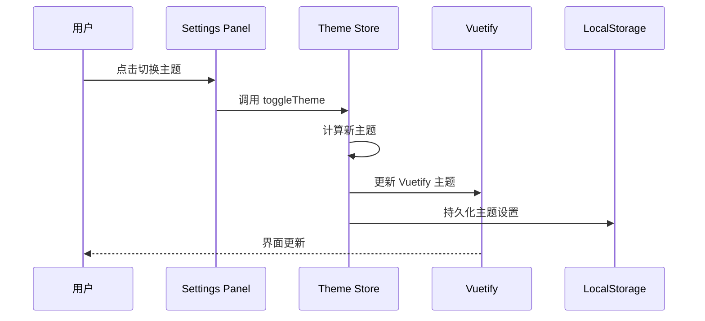
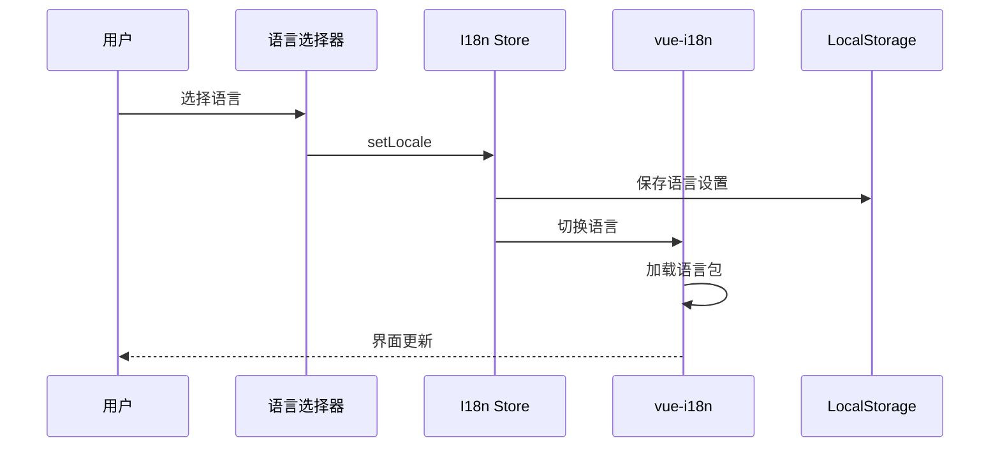
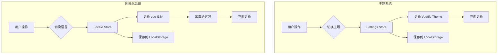

# 主题切换与国际化设计

## 📋 概述

本文档包含两个独立的系统设计：
1. **主题切换系统** - 支持亮色/暗色主题切换，自定义主题色
2. **国际化系统** - 支持多语言切换，基于 vue-i18n

---

# Part 1: 主题切换系统

## 🔄 主题切换流程



---

## 📁 文件结构

```
src/
├── stores/
│   └── settings/
│       ├── index.ts           # Settings Store
│       └── types.ts           # 类型定义
├── plugins/
│   └── vuetify/
│       ├── index.ts           # Vuetify 配置
│       └── theme.ts           # 主题配置
├── components/
│   └── common/
│       └── SettingsPanel/
│           └── index.vue      # 设置面板
└── composables/
    └── useTheme.ts            # 主题组合式函数
```

---

## 1️⃣ 类型定义

**文件**: `src/stores/settings/types.ts`

```typescript
/**
 * 主题模式
 */
export type ThemeMode = 'light' | 'dark' | 'system'

/**
 * 主题颜色配置
 */
export interface ThemeColors {
  primary: string
  secondary: string
  success: string
  info: string
  warning: string
  error: string
}

/**
 * 布局设置
 */
export interface LayoutSettings {
  /** 侧边栏折叠 */
  sidebarCollapsed: boolean
  /** 侧边栏 Rail 模式 */
  sidebarRail: boolean
  /** 显示标签页 */
  showTagsView: boolean
  /** 显示面包屑 */
  showBreadcrumb: boolean
  /** 显示页脚 */
  showFooter: boolean
  /** 固定头部 */
  fixedHeader: boolean
}

/**
 * 设置状态
 */
export interface SettingsState {
  /** 主题模式 */
  themeMode: ThemeMode
  /** 主题颜色 */
  themeColors: ThemeColors
  /** 布局设置 */
  layout: LayoutSettings
  /** 是否显示设置面板 */
  showSettingsPanel: boolean
}

/**
 * 预设主题色
 */
export const PRESET_COLORS: ThemeColors[] = [
  { primary: '#007BFF', secondary: '#FF965D', success: '#28C76F', info: '#00CFE8', warning: '#FF9F43', error: '#EA5455' },
  { primary: '#7367F0', secondary: '#8A8D93', success: '#28C76F', info: '#00CFE8', warning: '#FF9F43', error: '#EA5455' },
  { primary: '#00A6E0', secondary: '#FF965D', success: '#28C76F', info: '#00CFE8', warning: '#FF9F43', error: '#EA5455' },
  { primary: '#FF6B6B', secondary: '#4ECDC4', success: '#28C76F', info: '#00CFE8', warning: '#FF9F43', error: '#EA5455' },
  { primary: '#2D3436', secondary: '#636E72', success: '#28C76F', info: '#00CFE8', warning: '#FF9F43', error: '#EA5455' }
]
```

---

## 2️⃣ Settings Store

**文件**: `src/stores/settings/index.ts`

```typescript
import { defineStore } from 'pinia'
import { ref, computed, watch } from 'vue'
import { useTheme } from 'vuetify'
import type { SettingsState, ThemeMode, ThemeColors, LayoutSettings } from './types'
import { PRESET_COLORS } from './types'

// 存储键
const STORAGE_KEY = 'app_settings'

// 默认设置
const defaultSettings: SettingsState = {
  themeMode: 'light',
  themeColors: PRESET_COLORS[0],
  layout: {
    sidebarCollapsed: false,
    sidebarRail: false,
    showTagsView: true,
    showBreadcrumb: true,
    showFooter: true,
    fixedHeader: true
  },
  showSettingsPanel: false
}

export const useSettingsStore = defineStore('settings', () => {
  // ==================== State ====================
  
  /** 从本地存储加载设置 */
  const loadSettings = (): SettingsState => {
    try {
      const stored = localStorage.getItem(STORAGE_KEY)
      if (stored) {
        return { ...defaultSettings, ...JSON.parse(stored) }
      }
    } catch (e) {
      console.warn('加载设置失败:', e)
    }
    return defaultSettings
  }

  /** 主题模式 */
  const themeMode = ref<ThemeMode>(loadSettings().themeMode)
  
  /** 主题颜色 */
  const themeColors = ref<ThemeColors>(loadSettings().themeColors)
  
  /** 布局设置 */
  const layout = ref<LayoutSettings>(loadSettings().layout)
  
  /** 设置面板显示状态 */
  const showSettingsPanel = ref(false)

  // ==================== Getters ====================
  
  /** 是否暗色模式 */
  const isDark = computed(() => {
    if (themeMode.value === 'system') {
      return window.matchMedia('(prefers-color-scheme: dark)').matches
    }
    return themeMode.value === 'dark'
  })
  
  /** 当前主题名称 */
  const currentTheme = computed(() => isDark.value ? 'dark' : 'light')
  
  /** 获取布局设置 */
  const layoutSettings = computed(() => layout.value)

  // ==================== Actions ====================
  
  /**
   * 设置主题模式
   */
  function setThemeMode(mode: ThemeMode): void {
    themeMode.value = mode
    applyTheme()
  }
  
  /**
   * 切换主题模式
   */
  function toggleTheme(): void {
    const modes: ThemeMode[] = ['light', 'dark', 'system']
    const currentIndex = modes.indexOf(themeMode.value)
    const nextIndex = (currentIndex + 1) % modes.length
    setThemeMode(modes[nextIndex])
  }
  
  /**
   * 设置主题颜色
   */
  function setThemeColors(colors: Partial<ThemeColors>): void {
    themeColors.value = { ...themeColors.value, ...colors }
    applyThemeColors()
  }
  
  /**
   * 使用预设主题
   */
  function usePresetTheme(preset: ThemeColors): void {
    themeColors.value = preset
    applyThemeColors()
  }
  
  /**
   * 更新布局设置
   */
  function updateLayout(settings: Partial<LayoutSettings>): void {
    layout.value = { ...layout.value, ...settings }
  }
  
  /**
   * 切换侧边栏
   */
  function toggleSidebar(): void {
    layout.value.sidebarRail = !layout.value.sidebarRail
  }
  
  /**
   * 打开设置面板
   */
  function openSettingsPanel(): void {
    showSettingsPanel.value = true
  }
  
  /**
   * 关闭设置面板
   */
  function closeSettingsPanel(): void {
    showSettingsPanel.value = false
  }
  
  /**
   * 重置设置
   */
  function resetSettings(): void {
    themeMode.value = defaultSettings.themeMode
    themeColors.value = defaultSettings.themeColors
    layout.value = defaultSettings.layout
    applyTheme()
    applyThemeColors()
  }

  // ==================== Helper Functions ====================
  
  /**
   * 应用主题
   */
  function applyTheme(): void {
    const theme = useTheme()
    theme.global.name.value = currentTheme.value
    
    // 更新 HTML class（用于 CSS 变量）
    document.documentElement.classList.remove('light', 'dark')
    document.documentElement.classList.add(currentTheme.value)
  }
  
  /**
   * 应用主题颜色
   */
  function applyThemeColors(): void {
    const theme = useTheme()
    
    // 更新 light 主题
    Object.entries(themeColors.value).forEach(([key, value]) => {
      theme.themes.value.light.colors[key] = value
    })
    
    // 更新 dark 主题
    Object.entries(themeColors.value).forEach(([key, value]) => {
      theme.themes.value.dark.colors[key] = value
    })
  }
  
  /**
   * 保存设置到本地存储
   */
  function saveSettings(): void {
    const settings: SettingsState = {
      themeMode: themeMode.value,
      themeColors: themeColors.value,
      layout: layout.value,
      showSettingsPanel: false
    }
    localStorage.setItem(STORAGE_KEY, JSON.stringify(settings))
  }

  // 监听系统主题变化
  const mediaQuery = window.matchMedia('(prefers-color-scheme: dark)')
  mediaQuery.addEventListener('change', () => {
    if (themeMode.value === 'system') {
      applyTheme()
    }
  })

  // 监听设置变化，自动保存
  watch([themeMode, themeColors, layout], saveSettings, { deep: true })

  // 初始化应用主题
  applyTheme()
  applyThemeColors()

  return {
    // State
    themeMode,
    themeColors,
    layout,
    showSettingsPanel,
    
    // Getters
    isDark,
    currentTheme,
    layoutSettings,
    
    // Actions
    setThemeMode,
    toggleTheme,
    setThemeColors,
    usePresetTheme,
    updateLayout,
    toggleSidebar,
    openSettingsPanel,
    closeSettingsPanel,
    resetSettings,
    
    // Constants
    PRESET_COLORS
  }
})
```

---

## 3️⃣ 主题组合式函数

**文件**: `src/composables/useTheme.ts`

```typescript
import { computed } from 'vue'
import { useTheme } from 'vuetify'
import { useSettingsStore } from '@/stores/settings'

/**
 * 主题组合式函数
 */
export function useAppTheme() {
  const vuetifyTheme = useTheme()
  const settingsStore = useSettingsStore()

  /** 是否暗色模式 */
  const isDark = computed(() => settingsStore.isDark)

  /** 当前主题名称 */
  const currentTheme = computed(() => settingsStore.currentTheme)

  /** 主题模式 */
  const themeMode = computed(() => settingsStore.themeMode)

  /**
   * 切换主题
   */
  function toggleTheme() {
    settingsStore.toggleTheme()
  }

  /**
   * 设置主题模式
   */
  function setTheme(mode: 'light' | 'dark' | 'system') {
    settingsStore.setThemeMode(mode)
  }

  /**
   * 设置主题颜色
   */
  function setPrimaryColor(color: string) {
    settingsStore.setThemeColors({ primary: color })
  }

  return {
    isDark,
    currentTheme,
    themeMode,
    toggleTheme,
    setTheme,
    setPrimaryColor
  }
}
```

---

## 4️⃣ 设置面板组件

**文件**: `src/components/common/SettingsPanel/index.vue`

```vue
<template>
  <v-navigation-drawer
    :model-value="modelValue"
    location="right"
    temporary
    width="320"
    @update:model-value="$emit('update:modelValue', $event)"
  >
    <v-card flat>
      <v-card-title class="d-flex align-center">
        <span>系统设置</span>
        <v-spacer />
        <v-btn icon="mdi-close" variant="text" @click="$emit('update:modelValue', false)" />
      </v-card-title>

      <v-divider />

      <v-card-text>
        <!-- 主题模式 -->
        <div class="mb-6">
          <h3 class="text-subtitle-1 mb-3">主题模式</h3>
          <v-btn-toggle v-model="themeMode" mandatory color="primary" divided>
            <v-btn value="light" prepend-icon="mdi-white-balance-sunny">
              亮色
            </v-btn>
            <v-btn value="dark" prepend-icon="mdi-moon-waning-crescent">
              暗色
            </v-btn>
            <v-btn value="system" prepend-icon="mdi-theme-light-dark">
              跟随系统
            </v-btn>
          </v-btn-toggle>
        </div>

        <!-- 主题颜色 -->
        <div class="mb-6">
          <h3 class="text-subtitle-1 mb-3">主题颜色</h3>
          <div class="d-flex flex-wrap ga-2">
            <v-avatar
              v-for="(preset, index) in PRESET_COLORS"
              :key="index"
              :color="preset.primary"
              size="32"
              class="cursor-pointer"
              :class="{ 'ring-2 ring-primary': currentPrimary === preset.primary }"
              @click="usePresetTheme(preset)"
            >
              <v-icon v-if="currentPrimary === preset.primary" icon="mdi-check" color="white" />
            </v-avatar>
          </div>
          
          <div class="mt-4">
            <label class="text-body-2 text-medium-emphasis">自定义主色</label>
            <v-color-picker
              :model-value="currentPrimary"
              hide-inputs
              show-swatches
              @update:model-value="setPrimaryColor"
            />
          </div>
        </div>

        <v-divider class="my-4" />

        <!-- 布局设置 -->
        <div class="mb-6">
          <h3 class="text-subtitle-1 mb-3">界面设置</h3>
          
          <v-list density="compact" class="pa-0">
            <v-list-item>
              <template #prepend>
                <v-icon>mdi-tab</v-icon>
              </template>
              <v-list-item-title>显示标签页</v-list-item-title>
              <template #append>
                <v-switch
                  v-model="layoutSettings.showTagsView"
                  color="primary"
                  hide-details
                  density="compact"
                />
              </template>
            </v-list-item>
            
            <v-list-item>
              <template #prepend>
                <v-icon>mdi-navigation-outline</v-icon>
              </template>
              <v-list-item-title>显示面包屑</v-list-item-title>
              <template #append>
                <v-switch
                  v-model="layoutSettings.showBreadcrumb"
                  color="primary"
                  hide-details
                  density="compact"
                />
              </template>
            </v-list-item>
            
            <v-list-item>
              <template #prepend>
                <v-icon>mdi-page-layout-footer</v-icon>
              </template>
              <v-list-item-title>显示页脚</v-list-item-title>
              <template #append>
                <v-switch
                  v-model="layoutSettings.showFooter"
                  color="primary"
                  hide-details
                  density="compact"
                />
              </template>
            </v-list-item>
            
            <v-list-item>
              <template #prepend>
                <v-icon>mdi-page-layout-header</v-icon>
              </template>
              <v-list-item-title>固定头部</v-list-item-title>
              <template #append>
                <v-switch
                  v-model="layoutSettings.fixedHeader"
                  color="primary"
                  hide-details
                  density="compact"
                />
              </template>
            </v-list-item>
          </v-list>
        </div>

        <v-divider class="my-4" />

        <!-- 重置按钮 -->
        <v-btn color="error" variant="outlined" block @click="handleReset">
          <v-icon start>mdi-refresh</v-icon>
          重置所有设置
        </v-btn>
      </v-card-text>
    </v-card>
  </v-navigation-drawer>
</template>

<script lang="ts" setup>
import { computed } from 'vue'
import { useSettingsStore, PRESET_COLORS } from '@/stores/settings'

const props = defineProps<{
  modelValue: boolean
}>()

const emit = defineEmits<{
  'update:modelValue': [value: boolean]
}>()

const settingsStore = useSettingsStore()

// 主题模式
const themeMode = computed({
  get: () => settingsStore.themeMode,
  set: (value) => settingsStore.setThemeMode(value as any)
})

// 当前主色
const currentPrimary = computed(() => settingsStore.themeColors.primary)

// 布局设置
const layoutSettings = computed(() => settingsStore.layout)

// 使用预设主题
function usePresetTheme(preset: typeof PRESET_COLORS[0]) {
  settingsStore.usePresetTheme(preset)
}

// 设置主色
function setPrimaryColor(color: string) {
  settingsStore.setThemeColors({ primary: color })
}

// 重置设置
function handleReset() {
  settingsStore.resetSettings()
}
</script>

<style scoped>
.cursor-pointer {
  cursor: pointer;
}
</style>
```

---

# Part 2: 国际化系统

## 🔄 国际化流程



---

## 📁 文件结构

```
src/
├── locales/
│   ├── index.ts              # I18n 配置
│   ├── zh-CN.ts              # 简体中文
│   ├── en-US.ts              # 英文
│   └── modules/              # 模块化语言包
│       ├── common.ts         # 通用翻译
│       ├── menu.ts           # 菜单翻译
│       └── validation.ts     # 表单验证
├── stores/
│   └── locale/
│       ├── index.ts          # Locale Store
│       └── types.ts          # 类型定义
└── composables/
    └── useI18n.ts            # 国际化组合式函数
```

---

## 1️⃣ 安装依赖

```bash
npm install vue-i18n
```

---

## 2️⃣ 类型定义

**文件**: `src/locales/types.ts`

```typescript
/**
 * 支持的语言
 */
export type LocaleCode = 'zh-CN' | 'en-US'

/**
 * 语言配置
 */
export interface LocaleOption {
  code: LocaleCode
  name: string
  nativeName: string
  icon: string
}

/**
 * 支持的语言列表
 */
export const LOCALE_OPTIONS: LocaleOption[] = [
  { code: 'zh-CN', name: 'Chinese Simplified', nativeName: '简体中文', icon: '🇨🇳' },
  { code: 'en-US', name: 'English', nativeName: 'English', icon: '🇺🇸' }
]

/**
 * 语言包结构
 */
export interface LocaleMessages {
  common: {
    confirm: string
    cancel: string
    save: string
    delete: string
    edit: string
    add: string
    search: string
    reset: string
    export: string
    import: string
    loading: string
    success: string
    error: string
    warning: string
    info: string
    yes: string
    no: string
    all: string
    none: string
    required: string
    optional: string
  }
  menu: Record<string, string>
  validation: Record<string, string>
  page: Record<string, Record<string, string>>
}
```

---

## 3️⃣ 语言包

### 3.1 中文语言包

**文件**: `src/locales/zh-CN.ts`

```typescript
import type { LocaleMessages } from './types'

export default {
  common: {
    confirm: '确认',
    cancel: '取消',
    save: '保存',
    delete: '删除',
    edit: '编辑',
    add: '新增',
    search: '搜索',
    reset: '重置',
    export: '导出',
    import: '导入',
    loading: '加载中...',
    success: '成功',
    error: '错误',
    warning: '警告',
    info: '提示',
    yes: '是',
    no: '否',
    all: '全部',
    none: '无',
    required: '必填',
    optional: '选填'
  },
  menu: {
    dashboard: '仪表盘',
    system: '系统管理',
    'system:user': '用户管理',
    'system:role': '角色管理',
    'system:permission': '权限管理',
    'system:menu': '菜单管理',
    monitor: '系统监控',
    'monitor:online': '在线用户',
    'monitor:log': '操作日志',
    settings: '系统设置'
  },
  validation: {
    required: '此字段为必填项',
    email: '请输入有效的邮箱地址',
    phone: '请输入有效的手机号码',
    minLength: '最少需要 {min} 个字符',
    maxLength: '最多允许 {max} 个字符',
    range: '长度必须在 {min} 到 {max} 个字符之间',
    numeric: '请输入数字',
    integer: '请输入整数',
    positive: '请输入正数',
    url: '请输入有效的 URL',
    date: '请输入有效的日期',
    password: '密码必须包含字母和数字，至少 6 位',
    confirmPassword: '两次输入的密码不一致'
  },
  page: {
    login: {
      title: '登录',
      username: '用户名',
      password: '密码',
      captcha: '验证码',
      rememberMe: '记住我',
      forgotPassword: '忘记密码？',
      loginButton: '登录',
      register: '注册账号',
      loginSuccess: '登录成功',
      loginFailed: '登录失败，请检查用户名和密码'
    },
    dashboard: {
      title: '仪表盘',
      welcome: '欢迎回来',
      todayVisit: '今日访问',
      totalUser: '用户总数',
      totalOrder: '订单总数',
      totalSales: '销售总额'
    },
    user: {
      title: '用户管理',
      username: '用户名',
      nickname: '昵称',
      email: '邮箱',
      phone: '手机号',
      status: '状态',
      role: '角色',
      createTime: '创建时间',
      actions: '操作',
      addUser: '新增用户',
      editUser: '编辑用户',
      deleteUser: '删除用户',
      deleteUserConfirm: '确定要删除该用户吗？'
    }
  }
} satisfies LocaleMessages
```

### 3.2 英文语言包

**文件**: `src/locales/en-US.ts`

```typescript
import type { LocaleMessages } from './types'

export default {
  common: {
    confirm: 'Confirm',
    cancel: 'Cancel',
    save: 'Save',
    delete: 'Delete',
    edit: 'Edit',
    add: 'Add',
    search: 'Search',
    reset: 'Reset',
    export: 'Export',
    import: 'Import',
    loading: 'Loading...',
    success: 'Success',
    error: 'Error',
    warning: 'Warning',
    info: 'Info',
    yes: 'Yes',
    no: 'No',
    all: 'All',
    none: 'None',
    required: 'Required',
    optional: 'Optional'
  },
  menu: {
    dashboard: 'Dashboard',
    system: 'System',
    'system:user': 'Users',
    'system:role': 'Roles',
    'system:permission': 'Permissions',
    'system:menu': 'Menus',
    monitor: 'Monitor',
    'monitor:online': 'Online Users',
    'monitor:log': 'Operation Logs',
    settings: 'Settings'
  },
  validation: {
    required: 'This field is required',
    email: 'Please enter a valid email address',
    phone: 'Please enter a valid phone number',
    minLength: 'Minimum {min} characters required',
    maxLength: 'Maximum {max} characters allowed',
    range: 'Length must be between {min} and {max} characters',
    numeric: 'Please enter a number',
    integer: 'Please enter an integer',
    positive: 'Please enter a positive number',
    url: 'Please enter a valid URL',
    date: 'Please enter a valid date',
    password: 'Password must contain letters and numbers, at least 6 characters',
    confirmPassword: 'Passwords do not match'
  },
  page: {
    login: {
      title: 'Login',
      username: 'Username',
      password: 'Password',
      captcha: 'Captcha',
      rememberMe: 'Remember me',
      forgotPassword: 'Forgot password?',
      loginButton: 'Login',
      register: 'Register',
      loginSuccess: 'Login successful',
      loginFailed: 'Login failed, please check your username and password'
    },
    dashboard: {
      title: 'Dashboard',
      welcome: 'Welcome back',
      todayVisit: 'Today Visits',
      totalUser: 'Total Users',
      totalOrder: 'Total Orders',
      totalSales: 'Total Sales'
    },
    user: {
      title: 'User Management',
      username: 'Username',
      nickname: 'Nickname',
      email: 'Email',
      phone: 'Phone',
      status: 'Status',
      role: 'Role',
      createTime: 'Create Time',
      actions: 'Actions',
      addUser: 'Add User',
      editUser: 'Edit User',
      deleteUser: 'Delete User',
      deleteUserConfirm: 'Are you sure you want to delete this user?'
    }
  }
} satisfies LocaleMessages
```

---

## 4️⃣ I18n 配置

**文件**: `src/locales/index.ts`

```typescript
import { createI18n } from 'vue-i18n'
import type { LocaleCode, LocaleMessages } from './types'
import zhCN from './zh-CN'
import enUS from './en-US'

// 获取存储的语言或浏览器语言
function getDefaultLocale(): LocaleCode {
  const stored = localStorage.getItem('locale') as LocaleCode
  if (stored) return stored
  
  const browserLang = navigator.language
  if (browserLang.startsWith('zh')) return 'zh-CN'
  return 'en-US'
}

// 创建 I18n 实例
const i18n = createI18n<[LocaleMessages], LocaleCode>({
  legacy: false, // 使用 Composition API 模式
  globalInjection: true, // 全局注入 $t
  locale: getDefaultLocale(),
  fallbackLocale: 'en-US',
  messages: {
    'zh-CN': zhCN,
    'en-US': enUS
  }
})

export default i18n

// 导出工具函数
export const $t = i18n.global.t
export const $te = i18n.global.te
```

---

## 5️⃣ Locale Store

**文件**: `src/stores/locale/index.ts`

```typescript
import { defineStore } from 'pinia'
import { ref, computed } from 'vue'
import { useI18n } from 'vue-i18n'
import type { LocaleCode, LocaleOption } from '@/locales/types'
import { LOCALE_OPTIONS } from '@/locales/types'

const STORAGE_KEY = 'locale'

export const useLocaleStore = defineStore('locale', () => {
  const { locale } = useI18n()

  // ==================== State ====================
  
  /** 当前语言 */
  const currentLocale = ref<LocaleCode>(
    (localStorage.getItem(STORAGE_KEY) as LocaleCode) || 'zh-CN'
  )

  // ==================== Getters ====================
  
  /** 获取当前语言配置 */
  const currentLocaleOption = computed<LocaleOption | undefined>(() => 
    LOCALE_OPTIONS.find(item => item.code === currentLocale.value)
  )
  
  /** 获取所有语言选项 */
  const localeOptions = computed(() => LOCALE_OPTIONS)

  // ==================== Actions ====================
  
  /**
   * 设置语言
   */
  function setLocale(code: LocaleCode): void {
    currentLocale.value = code
    locale.value = code
    localStorage.setItem(STORAGE_KEY, code)
    
    // 更新 HTML lang 属性
    document.documentElement.lang = code
    
    // 更新 Vuetify 语言（如果需要）
    // const vuetify = useVuetify()
    // vuetify.locale.current = code
  }
  
  /**
   * 切换语言
   */
  function toggleLocale(): void {
    const currentIndex = LOCALE_OPTIONS.findIndex(item => item.code === currentLocale.value)
    const nextIndex = (currentIndex + 1) % LOCALE_OPTIONS.length
    setLocale(LOCALE_OPTIONS[nextIndex].code)
  }

  return {
    currentLocale,
    currentLocaleOption,
    localeOptions,
    setLocale,
    toggleLocale
  }
})
```

---

## 6️⃣ 国际化组合式函数

**文件**: `src/composables/useI18n.ts`

```typescript
import { useI18n as useVueI18n } from 'vue-i18n'
import { useLocaleStore } from '@/stores/locale'

/**
 * 国际化组合式函数
 * 封装 vue-i18n，提供更便捷的使用方式
 */
export function useAppI18n() {
  const { t, te, tm, rt, d, n, locale } = useVueI18n()
  const localeStore = useLocaleStore()

  /**
   * 翻译文本
   */
  function translate(key: string, params?: Record<string, any>): string {
    if (!te(key)) {
      console.warn(`Translation not found: ${key}`)
      return key
    }
    return t(key, params)
  }

  /**
   * 翻译菜单
   */
  function translateMenu(key: string): string {
    return translate(`menu.${key}`)
  }

  /**
   * 翻译页面
   */
  function translatePage(page: string, key: string): string {
    return translate(`page.${page}.${key}`)
  }

  /**
   * 翻译验证消息
   */
  function translateValidation(key: string, params?: Record<string, any>): string {
    return translate(`validation.${key}`, params)
  }

  return {
    t: translate,
    te,
    tm,
    rt,
    d,
    n,
    locale,
    currentLocale: localeStore.currentLocale,
    localeOptions: localeStore.localeOptions,
    setLocale: localeStore.setLocale,
    translateMenu,
    translatePage,
    translateValidation
  }
}
```

---

## 7️⃣ 语言选择器组件

**文件**: `src/components/common/LocaleSelector/index.vue`

```vue
<template>
  <v-menu>
    <template #activator="{ props }">
      <v-btn v-bind="props" variant="text" size="small">
        <span class="mr-1">{{ currentLocale?.icon }}</span>
        <span class="d-none d-sm-inline">{{ currentLocale?.nativeName }}</span>
        <v-icon end>mdi-chevron-down</v-icon>
      </v-btn>
    </template>

    <v-list density="compact">
      <v-list-item
        v-for="item in localeOptions"
        :key="item.code"
        :active="item.code === currentLocale?.code"
        @click="setLocale(item.code)"
      >
        <template #prepend>
          <span class="mr-2">{{ item.icon }}</span>
        </template>
        <v-list-item-title>{{ item.nativeName }}</v-list-item-title>
        <v-list-item-subtitle class="text-caption">
          {{ item.name }}
        </v-list-item-subtitle>
      </v-list-item>
    </v-list>
  </v-menu>
</template>

<script lang="ts" setup>
import { computed } from 'vue'
import { useLocaleStore } from '@/stores/locale'

const localeStore = useLocaleStore()

const currentLocale = computed(() => localeStore.currentLocaleOption)
const localeOptions = computed(() => localeStore.localeOptions)

function setLocale(code: string) {
  localeStore.setLocale(code as any)
}
</script>
```

---

## 8️⃣ 注册 I18n 插件

**文件**: `src/plugins/index.ts`（更新）

```typescript
import type { App } from 'vue'
import router from '../router'
import pinia from '../stores'
import vuetify from './vuetify'
import i18n from '@/locales' // 添加

export function registerPlugins(app: App) {
  app
    .use(vuetify)
    .use(router)
    .use(pinia)
    .use(i18n) // 添加
}
```

---

## 9️⃣ 使用示例

### 在组件中使用

```vue
<template>
  <v-card>
    <v-card-title>{{ t('page.user.title') }}</v-card-title>
    <v-card-text>
      <v-btn @click="handleAdd">{{ t('common.add') }}</v-btn>
      <v-btn @click="handleEdit">{{ t('common.edit') }}</v-btn>
    </v-card-text>
  </v-card>
</template>

<script lang="ts" setup>
import { useAppI18n } from '@/composables/useI18n'

const { t } = useAppI18n()

function handleAdd() {
  // ...
}

function handleEdit() {
  // ...
}
</script>
```

### 在表单验证中使用

```typescript
import { useAppI18n } from '@/composables/useI18n'

const { translateValidation } = useAppI18n()

const rules = {
  required: (v: any) => !!v || translateValidation('required'),
  email: (v: string) => /.+@.+\..+/.test(v) || translateValidation('email'),
  minLength: (v: string) => v.length >= 6 || translateValidation('minLength', { min: 6 })
}
```

---

## 📊 完整流程图



---

## ✅ 验收清单

### 主题系统
- [ ] 亮色/暗色主题切换正常
- [ ] 跟随系统主题正常
- [ ] 主题颜色自定义正常
- [ ] 预设主题切换正常
- [ ] 设置持久化正常
- [ ] 布局设置生效正常

### 国际化系统
- [ ] 语言切换正常
- [ ] 语言包加载正确
- [ ] 翻译文本显示正确
- [ ] 语言设置持久化
- [ ] 日期/数字格式化正确
- [ ] 表单验证消息国际化

---

*文档创建时间: 2026-02-18*
