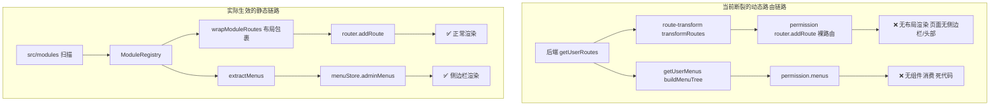
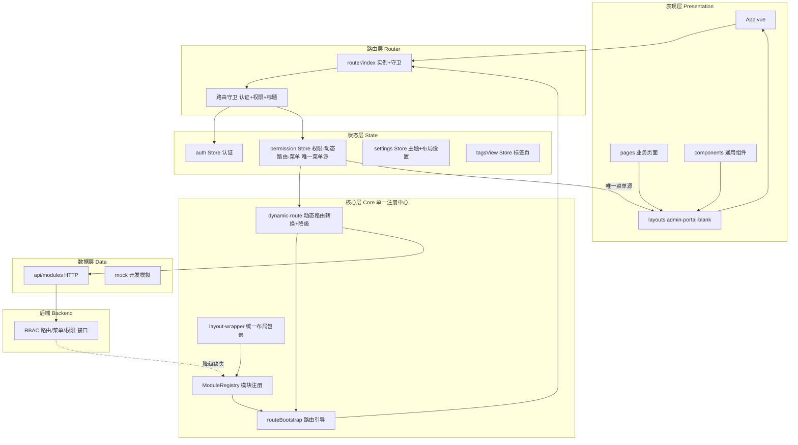
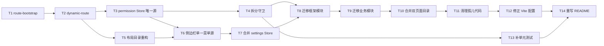

# 企业信息化管理平台 —— 架构诊断报告与重构整改方案

> **文档定位**：本文档是对当前项目 `study-vuetify-pro` 的**架构级诊断**与**可执行重构方案**。
> **核心结论**：当前项目存在**双重路由系统并存且互相冲突、动态路由菜单与渲染层断裂、状态管理职责重叠、目录体系碎片化、声明依赖与实际安装不符**等系统性缺陷，已无法支撑企业信息化管理平台的可持续开发。需采用**新建规范化骨架 + 业务模块逐个并行迁移 + 最终切换**的方式完成整改。
> **适用读者**：技术负责人、架构师、前端开发工程师
> **输出日期**：2026-06-20｜**版本**：v1.0

---

## 📑 目录

- [一、执行摘要](#一执行摘要)
- [二、现状诊断报告](#二现状诊断报告)
  - [2.1 架构层面致命缺陷（P0）](#21-架构层面致命缺陷p0)
  - [2.2 目录结构问题（P1）](#22-目录结构问题p1)
  - [2.3 状态管理问题（P1）](#23-状态管理问题p1)
  - [2.4 配置与依赖问题（P1）](#24-配置与依赖问题p1)
  - [2.5 工程规范问题（P2）](#25-工程规范问题p2)
  - [2.6 问题严重度矩阵](#26-问题严重度矩阵)
- [三、目标架构设计](#三目标架构设计)
  - [3.1 架构原则](#31-架构原则)
  - [3.2 目标分层架构图](#32-目标分层架构图)
  - [3.3 目标目录结构](#33-目标目录结构)
  - [3.4 混合路由方案设计](#34-混合路由方案设计)
  - [3.5 状态管理重新划分](#35-状态管理重新划分)
  - [3.6 布局与菜单统一机制](#36-布局与菜单统一机制)
- [四、技术选型依据](#四技术选型依据)
- [五、分阶段重构任务清单](#五分阶段重构任务清单)
  - [5.1 阶段划分与里程碑](#51-阶段划分与里程碑)
  - [5.2 任务拆解清单](#52-任务拆解清单)
  - [5.3 任务依赖关系图](#53-任务依赖关系图)
- [六、风险评估与应对策略](#六风险评估与应对策略)
- [七、验收标准](#七验收标准)
- [附录 A：废弃代码清理清单](#附录-a废弃代码清理清单)
- [附录 B：术语表](#附录-b术语表)

---

## 一、执行摘要

当前项目虽在 [`README.md`](README.md) 中描绘了一套清晰的"模块化架构 + 动态路由 + RBAC 权限"的企业级蓝图（共 1405 行），但**代码实际状态与文档存在系统性偏差**，主要体现在三处"半截子工程"：

1. **动态路由系统只做了一半**：后端返回的路由在 [`permission.initPermission()`](src/stores/permission/index.ts:80) 中被注册，但代码注释明确写着 _"完整的布局包裹将在模块注册中心阶段三中实现"_ —— **至今未实现**。这意味着任何后端下发的业务路由都会以**无布局（无侧边栏、无头部）的裸页面**形式渲染。
2. **动态菜单从未被消费**：[`SidebarMenu.vue`](src/layouts/admin/sidebar/SidebarMenu.vue:6) 只读取 [`menuStore.adminMenus`](src/stores/menu.ts:24)（来自静态 `ModuleRegistry`），而 [`permission.menus`](src/stores/permission/index.ts:95)（从后端 [`getUserMenus()`](src/api/modules/permission.ts:91) 拉取）**没有任何组件引用**，属于死代码。
3. **两套菜单/路由各管各的**：静态系统（ModuleRegistry）负责布局包裹与渲染，动态系统（permission store）负责注册路由但不包裹布局、不渲染菜单。两套系统加载同一批 `src/pages/**/*.vue` 组件，存在**路由名冲突与重复注册风险**。

叠加**侧边栏状态被拆散在两个 Store**（[`framework/theme`](src/stores/framework/theme.ts:12) 与 [`settings`](src/stores/settings/index.ts:25) 各管一份 `sidebarCollapsed/Rail`）、**双页面目录**（`src/pages/` + `src/platform/pages/`）、**布局文件与文件夹同名**（`layouts/admin.vue` ↔ `layouts/admin/`）、**声明依赖未安装**（`unplugin-vue-router`/`vite-plugin-vue-layouts-next` 不在 [`package.json`](package.json) 中）等问题，项目已处于"改一处坏一片"的脆弱状态。

**整改策略**：采用**新建规范化骨架 + 逐模块并行迁移 + 最终切换**（用户已确认）。先在 `src-v2/`（或新分支）搭建符合混合路由模式的纯净骨架，将 `core/`、`layouts/`、`stores/`、`router/` 重写为单一数据源；再逐个迁移 `modules/` 与 `pages/`；最后整体替换、删除旧代码。

---

## 二、现状诊断报告

> 严重度标记：🔴P0 阻断（功能错误/数据冲突）｜🟠P1 严重（维护困难/隐患）｜🟡P2 一般（规范/清理）

### 2.1 架构层面致命缺陷（P0）

#### 🔴 缺陷 A1：双重路由系统并存且职责冲突

项目中存在**两套互不相容的路由注册机制**，二者加载相同的页面组件却采用不同的注册路径与包裹方式：

| 维度 | 系统 A：前端静态路由 | 系统 B：后端动态路由 |
|------|----------------------|----------------------|
| 入口 | [`moduleRegistry.registerRoutes()`](src/router/index.ts:56) | [`permission.initPermission()`](src/stores/permission/index.ts:80) |
| 触发时机 | 应用启动（router 创建时） | 导航守卫第 9 步（首次登录后） |
| 数据来源 | [`src/modules/*/index.ts`](src/modules/dashboard/index.ts:1) 扫描 | 后端 [`getUserRoutes()`](src/api/modules/permission.ts:84) |
| 布局包裹 | ✅ [`wrapModuleRoutes()`](src/core/layout-wrapper.ts:95) 包裹 admin/portal/blank | ❌ **未包裹**（裸 `router.addRoute`） |
| 菜单提取 | ✅ [`extractMenus()`](src/core/module-registry.ts:135) | ❌ 菜单存入 `permission.menus` 但无人消费 |

**直接后果**：后端下发的业务路由会**失去布局**，页面渲染时无 `<AppSidebar>`、`<AppHeader>`，用户体验断裂。同时静态路由与动态路由可能注册**同名路由**（如都叫 `module-dashboard`），导致 `router.addRoute` 静默覆盖。

#### 🔴 缺陷 A2：动态菜单数据源断裂（死代码）

渲染链路证据：

```
SidebarMenu.vue
  └─ menuStore.adminMenus                         ← 实际使用（静态）
       └─ moduleRegistry.getMenuByLayout('admin') ← 来自 ModuleRegistry
  ✗ permission.menus                              ← 从后端拉取，但无组件引用
       └─ getUserMenus() → buildMenuTree()         ← 死代码
```

- [`SidebarMenu.vue:6`](src/layouts/admin/sidebar/SidebarMenu.vue:6)：`v-for="item in menuStore.adminMenus"`
- [`menu.ts:24`](src/stores/menu.ts:24)：`adminMenus` 来自 [`moduleRegistry.getMenuByLayout('admin')`](src/core/module-registry.ts:181)
- [`permission/index.ts:95`](src/stores/permission/index.ts:95)：`generateMenus()` 写入 `menus.value`，**全局无引用**

> ⚠️ 这意味着所谓的"RBAC 动态菜单"在企业场景下**根本不生效**——菜单始终是前端硬编码的静态树。

#### 🔴 缺陷 A3：动态路由无布局包裹（渲染缺陷）

[`permission/index.ts:90`](src/stores/permission/index.ts:90) 注释原话：
> _"此处暂不包裹布局组件，完整的布局包裹将在模块注册中心（阶段三）中实现"_

而 [`route-transform.ts`](src/utils/route-transform.ts:10) 的 `transformRoutes()` 生成的 `RouteRecordRaw` **没有 `component` 之外的结构层**，直接 `router.addRoute(route)` 注册为顶级裸路由。这与静态系统的 [`wrapRouteWithLayout()`](src/core/layout-wrapper.ts:95) 行为完全不一致。

#### 🔴 缺陷 A4：组件加载范围不一致

[`route-transform.ts:5`](src/utils/route-transform.ts:5)：
```ts
const modules = import.meta.glob('../pages/**/*.vue');
```
仅扫描 `src/pages/`，**不包含** `src/platform/pages/`。若后端动态路由的 `component` 字段指向 `platform/pages/portal/index.vue`，[`loadComponent()`](src/utils/route-transform.ts:60) 会输出"组件不存在"警告并返回 `undefined`。



### 2.2 目录结构问题（P1）

#### 🟠 缺陷 B1：双页面目录体系（语义重复）

| 目录 | 用途 | 引用方 |
|------|------|--------|
| [`src/pages/`](src/pages/index.vue) | 通用页面（dashboard/system/test/login/error 等） | 静态路由 + 动态 glob |
| [`src/platform/pages/`](src/platform/pages/portal/index.vue) | portal 页面 + platform catch-all | 仅 `modules/portal`、`modules/error` |

两者边界模糊：portal 为何要单独放在 `platform/pages/`？`system` 为何不放？缺乏统一规则。更糟的是 [`modules/error/router/index.ts`](src/modules/error/router/index.ts:60) 同时引用了 `@/pages/[...path].vue` 和 `@/platform/pages/[...path].vue` **两个 catch-all**，路由优先级难以预测。

#### 🟠 缺陷 B2：布局文件与同名文件夹共存

- [`src/layouts/admin.vue`](src/layouts/admin.vue)（布局入口文件）
- [`src/layouts/admin/`](src/layouts/admin/AppHeader.vue)（布局子组件目录：AppHeader/AppSidebar/AppMain/AppFooter + header/ + sidebar/）

`admin.vue` 内部 import `admin/` 子组件，文件系统上 `admin` 同名节点（`.vue` 文件 vs 目录）容易造成人脑与工具混淆，且 [`components.d.ts`](src/components.d.ts) 自动注册可能误解析。

#### 🟠 缺陷 B3：孤儿布局目录与重复组件

- [`src/layouts/default/Nav.vue`](src/layouts/default/Nav.vue)：仅含一个空 `<v-navigation-drawer>`，**全局无引用**，且 `default` 布局不在 [`LayoutName`](src/core/types.ts:10)（仅 `'admin'|'portal'|'blank'`）中。
- **重复 AppFooter**：[`src/layouts/admin/AppFooter.vue`](src/layouts/admin/AppFooter.vue) 与 [`src/components/AppFooter.vue`](src/components/AppFooter.vue) 同名共存。
- [`src/components/HelloWorld.vue`](src/components/HelloWorld.vue)、[`src/components/README.md`](src/components/README.md)：Vuetify 模板脚手架残留。

#### 🟠 缺陷 B4：拼写错误与可疑文件

- [`src/platform/pages/farmework/`](src/platform/pages/farmework/icon/index.vue)：`farmework` 应为 `framework`。
- 根目录 [`xxx.json`](xxx.json)、[`dynamic.icon.scan.ts`](dynamic.icon.scan.ts)：用途不明，疑似临时产物。

#### 🟠 缺陷 B5：components/components.d.ts 与 layouts 职责交叉

`src/components/`（通用组件）与 `src/layouts/admin/`（布局内部组件）都放 Vue 组件，但 `AppFooter` 同时出现在两处，违反单一职责。

### 2.3 状态管理问题（P1）

#### 🟠 缺陷 C1：侧边栏状态被拆散到两个 Store

| Store | 字段 | 文件 |
|-------|------|------|
| [`useThemeStore`](src/stores/framework/theme.ts:12) | `asideMenuFolded`、`rail` | `stores/framework/theme.ts` |
| [`useSettingsStore`](src/stores/settings/index.ts:25) | `layout.sidebarCollapsed`、`layout.sidebarRail` | `stores/settings/index.ts` |

[`admin.vue:6`](src/layouts/admin.vue:6) 实际使用的是 `theme`（themeStore 的 `rail`/`asideMenuFolded`），而 `settings.layout.sidebarCollapsed/Rail` **同样存在却未被 sidebar 使用**——同一概念两份状态，极易产生不一致。

#### 🟠 缺陷 C2：Store 命名与职责严重错位

- `stores/framework/theme.ts` 命名为 **theme**，实际只管**侧边栏折叠**，与 [`plugins/vuetify/theme.ts`](src/plugins/vuetify/theme.ts)（真正的主题色板）和 [`useSettingsStore`](src/stores/settings/index.ts:8)（`ThemeMode`/`ThemeColors`）三处都叫 theme，职责彻底混乱。
- [`stores/app.ts`](src/stores/app.ts:4)：`state: () => ({})` 空壳 Store。
- `stores/menu.ts` 职责正确，但 `stores/permission/` 又另存一份 `menus`，菜单数据有**两个权威源**。

#### 🟡 缺陷 C3：Store 组织结构不统一

混用两种风格：扁平文件（[`app.ts`](src/stores/app.ts)、[`menu.ts`](src/stores/menu.ts)）与文件夹（[`auth/`](src/stores/auth/index.ts)、[`permission/`](src/stores/permission/index.ts)、[`settings/`](src/stores/settings/index.ts)、[`tagsView/`](src/stores/tagsView/index.ts)、[`framework/`](src/stores/framework/theme.ts)）。

### 2.4 配置与依赖问题（P1）

#### 🟠 缺陷 D1：规则声明的依赖未安装

项目规则（`.roo/rules`）强制锁定 `unplugin-vue-router 0.19.0` 与 `vite-plugin-vue-layouts-next 1.3.0`，但 [`package.json`](package.json:25) 中**均未安装**。佐证：
- [`plugins/index.ts:8`](src/plugins/index.ts:8)：`// import { DataLoaderPlugin } from 'unplugin-vue-router/data-loaders';`（注释掉的废弃导入）
- [`vite.config.mts`](vite.config.mts:1) 的 plugins 数组中**没有** VueRouter/Layouts 插件配置
- [`src/pages/[...path].vue`](src/pages/[...path].vue)、[`src/platform/pages/[...path].vue`](src/platform/pages/[...path].vue) 是 `unplugin-vue-router` 的 catch-all 约定文件，却用**手动 import** 方式塞进 `modules/error/router`

#### 🟠 缺陷 D2：Vite 构建配置存在隐患

- [`vite.config.mts:156`](vite.config.mts:156)：`define: { 'process.env': {} }` —— 定义空对象，部分库读取 `process.env.NODE_ENV` 会得到 `undefined`。
- [`vite.config.mts:168`](vite.config.mts:168)：`server.watch.usePolling: true` —— 轮询监听在 Windows 上高 CPU 占用，生产应关闭。
- `manualChunks` 手动分块但未处理 vendor 版本变更的缓存失效策略。

### 2.5 工程规范问题（P2）

#### 🟡 缺陷 E1：文档严重过度且与代码不符

[`README.md`](README.md) 长达 **1405 行**，描述了高度完善的架构，但实际代码存在上述大量半成品。文档不可信比没有文档更危险——新人会按文档假设系统能工作。

#### 🟡 缺陷 E2：测试目录缺失

[`vite.config.mts:199`](vite.config.mts:199)：`test.include: ['test/**/*.test.ts']` 指向 `test/` 目录，但项目根**没有 `test/` 目录**，Vitest 实际无可执行测试。规则要求"业务组件/工具函数测试覆盖率 ≥ 80%"完全未达标。

#### 🟡 缺陷 E3：Mock 模块命名与目录约定混用

[`src/mock/modules/`](src/mock/modules/auth.ts) 内既有 `system-user.ts`（kebab-case）又对应 `system/user` 模块，命名映射关系靠口口相传。

### 2.6 问题严重度矩阵

| 编号 | 问题 | 严重度 | 影响范围 | 阻断企业化 |
|------|------|--------|----------|-----------|
| A1 | 双重路由系统并存冲突 | 🔴P0 | 全局 | ✅ 是 |
| A2 | 动态菜单数据源断裂 | 🔴P0 | 侧边栏 | ✅ 是 |
| A3 | 动态路由无布局包裹 | 🔴P0 | 业务页面渲染 | ✅ 是 |
| A4 | 组件加载范围不一致 | 🔴P0 | portal 动态路由 | ✅ 是 |
| B1 | 双页面目录 | 🟠P1 | 维护心智 | 部分 |
| B2 | 布局文件/文件夹同名 | 🟠P1 | 自动注册 | 部分 |
| B3 | 孤儿布局/重复组件 | 🟠P1 | 维护 | 否 |
| B4 | 拼写错误/可疑文件 | 🟠P1 | 专业度 | 否 |
| C1 | 侧边栏状态双 Store | 🟠P1 | 状态一致性 | 部分 |
| C2 | Store 命名职责错位 | 🟠P1 | 可维护性 | 部分 |
| C3 | Store 结构不统一 | 🟡P2 | 规范 | 否 |
| D1 | 声明依赖未安装 | 🟠P1 | 构建可靠性 | 部分 |
| D2 | Vite 配置隐患 | 🟠P1 | 性能/环境 | 部分 |
| E1 | 文档过度且不符 | 🟡P2 | 协作 | 否 |
| E2 | 测试目录缺失 | 🟡P2 | 质量 | 否 |
| E3 | Mock 命名混用 | 🟡P2 | 规范 | 否 |

---

## 三、目标架构设计

### 3.1 架构原则

1. **单一数据源（Single Source of Truth）**：菜单与路由无论静态/动态，最终汇入**唯一**的注册中心与**唯一**的菜单 Store，渲染层只认这一个出口。
2. **混合路由分层**：框架路由（login/404/403/redirect）走静态；业务模块路由与菜单走后端动态；后端不可用时**降级**为静态模块清单。
3. **统一布局包裹**：所有路由（静态/动态）在注册时**强制**经过布局包裹层，杜绝"裸路由"。
4. **状态职责单一**：一个 Store 只负责一个领域，消除同名字段跨 Store 重复。
5. **目录即语义**：`pages/` 唯一页面目录；`layouts/` 唯一布局目录；`modules/` 唯一业务模块目录；消除 `platform/` 与重复命名。

### 3.2 目标分层架构图



### 3.3 目标目录结构

```text
src/
├── App.vue
├── main.ts
├── core/                      # 核心层：唯一注册中心与路由引导
│   ├── module-registry.ts     # 静态模块扫描（框架路由 + 降级路由）
│   ├── route-bootstrap.ts     # 【新增】统一路由引导：静态注册 + 动态注入
│   ├── dynamic-route.ts       # 【新增】后端路由转换 + 布局包裹 + 静态降级
│   ├── layout-wrapper.ts      # 统一布局包裹（静态/动态共用）
│   └── types.ts
├── router/
│   ├── index.ts               # 仅创建实例 + 守卫，不注册业务路由
│   └── guards/                # 【新增】守卫拆分：auth / permission / title / tags
├── stores/                    # 状态层：统一文件夹风格
│   ├── auth/index.ts
│   ├── permission/index.ts    # 唯一动态菜单 + 动态路由源
│   ├── settings/index.ts      # 主题 + 布局设置（合并原 framework/theme）
│   ├── tagsView/index.ts
│   └── menu.ts                # 【删除】职责并入 permission
├── layouts/                   # 布局层：唯一入口
│   ├── admin/                 # admin 布局（入口 index.vue + 子组件）
│   │   ├── index.vue
│   │   ├── AppHeader.vue
│   │   ├── AppSidebar.vue
│   │   ├── AppMain.vue
│   │   └── ...
│   ├── portal/index.vue
│   └── blank/index.vue
├── pages/                     # 唯一页面目录（删除 src/platform/pages）
│   ├── login/
│   ├── dashboard/
│   ├── system/{user,role,permission}/
│   ├── portal/                # 原 platform/pages/portal 迁入
│   └── error/{403,404}.vue
├── modules/                   # 业务模块（静态注册 + 降级清单）
│   ├── auth/
│   ├── dashboard/
│   ├── system/
│   └── portal/
├── components/common/         # 通用组件（删除根级重复 AppFooter/HelloWorld）
├── api/modules/
├── mock/modules/
├── plugins/{vuetify,grid}/
├── composables/
├── utils/
└── styles/
```

### 3.4 混合路由方案设计

**核心机制**：路由引导器 `routeBootstrap` 在应用启动时执行静态注册；登录成功后由 `permission` store 拉取后端路由，经 `dynamicRoute` 转换并**强制布局包裹**后注入；后端缺失时，降级使用 `ModuleRegistry` 的静态模块清单。

```mermaid
flowchart LR
    Start[应用启动] --> S1[routeBootstrap 注册框架静态路由 login-404-redirect]
    S1 --> S2[ModuleRegistry 预扫描静态模块清单作为降级源]
    S2 --> Ready[路由就绪 等待导航]
    Ready --> Guard{导航守卫}
    Guard -->|未登录| Login[登录页]
    Login --> FetchUser[fetchUserInfo]
    FetchUser --> Dynamic{拉取后端路由}
    Dynamic -->|成功| Transform[dynamicRoute 转换]
    Transform --> Wrap[layout-wrapper 强制布局包裹]
    Wrap --> Inject[router.addRoute 动态注入]
    Inject --> Menu[permission.menus 唯一菜单源]
    Menu --> ReNav[replace 重新导航]
    Dynamic -->|失败/空| Fallback[降级 ModuleRegistry 静态清单]
    Fallback --> Wrap2[同样布局包裹]
    Wrap2 --> Inject
    ReNav --> Render[布局内渲染]
```



**关键约束**：
- **唯一菜单出口**：`permission.menus` 成为侧边栏**唯一**数据源（修复 A2）。静态降级时，将 `ModuleRegistry` 清单写入 `permission.menus`，渲染层无感知。
- **强制布局包裹**：`dynamicRoute.transform()` 内部统一调用 `wrapRouteWithLayout()`（修复 A3）。
- **路由命名隔离**：静态路由前缀 `static-`，动态路由前缀 `dyn-`，避免 `addRoute` 覆盖（修复 A1）。
- **组件加载统一**：`import.meta.glob` 同时覆盖 `pages/**/*.vue`（修复 A4）。

### 3.5 状态管理重新划分

| Store | 唯一职责 | 吸收/删除 |
|-------|---------|----------|
| `auth` | Token、用户信息、角色权限列表 | 不变 |
| `permission` | 动态路由、**唯一菜单源**、权限加载状态 | **吸收** `menu.ts` 全部职责 |
| `settings` | 主题模式、主题色板、**布局设置（含侧边栏折叠）** | **吸收** `framework/theme.ts` 的 `asideMenuFolded/rail` |
| `tagsView` | 多标签页 | 不变 |
| ~~`menu`~~ | — | **删除**（并入 permission） |
| ~~`framework/theme`~~ | — | **删除**（侧边栏字段并入 settings） |
| ~~`app`~~ | — | **删除**（空壳） |

侧边栏组件改读 `settings.layout.sidebarCollapsed`（修复 C1），消除 `theme` Store 的歧义命名（修复 C2）。

### 3.6 布局与菜单统一机制

- 侧边栏 `SidebarMenu.vue` 改为读取 `permissionStore.menus`（动态/降级统一），删除对 `menuStore.adminMenus` 的依赖。
- 布局目录统一为 `layouts/{admin,portal,blank}/index.vue`，消除 `admin.vue` 文件与 `admin/` 目录同名（修复 B2）。
- 删除 `layouts/default/` 孤儿目录与重复 `AppFooter.vue`（修复 B3）。

---

## 四、技术选型依据

### 4.1 路由方案对比

| 方案 | 灵活性 | 开发效率 | 多角色支持 | 维护成本 | 结论 |
|------|--------|---------|-----------|---------|------|
| 纯前端静态（ModuleRegistry） | ❌ 菜单硬编码 | ✅ 高 | ❌ 弱 | ✅ 低 | 不满足企业 RBAC |
| 纯后端动态 | ✅ 高 | ❌ 低（强依赖后端） | ✅ 强 | 🟠 中 | 后端故障即瘫痪 |
| **混合 + 降级（本方案）** | ✅ 高 | ✅ 高 | ✅ 强 | 🟠 中 | ✅ **选定** |

**选定理由**：企业信息化平台存在大量角色（超管/部门管理员/普通用户/访客），菜单必须按角色下发；但框架路由（登录/错误页）必须稳定可用，不能因后端故障导致系统不可进入。混合模式 + 静态降级兼顾两者，且降级路径保证了**后端联调期可独立开发**。

### 4.2 核心组件/API 选择

| 需求 | 选型 | 理由 |
|------|------|------|
| 布局包裹 | 自研 `layout-wrapper.ts` | 比第三方 `vite-plugin-vue-layouts` 更可控，避免 D1 的依赖安装问题 |
| 动态路由转换 | 自研 `dynamic-route.ts` | 需嵌入布局包裹逻辑，第三方插件无法定制 |
| 路由守卫拆分 | `router/guards/*.ts` | 当前 `beforeEach` 承担 13 步逻辑，拆分提升可测试性 |
| 模块扫描 | `import.meta.glob`（已用） | Vite 原生，零依赖，保留 |
| 状态管理 | Pinia Composition API（已用） | 保留，仅重新划分职责 |

> ⚠️ **红色警告项**：当前依赖 `unplugin-vue-router` 的 catch-all 约定（`[...path].vue`）与 `vite-plugin-vue-layouts`，但**两者均未安装**。本方案**不引入**这两个依赖，而是用自研 `core/` 层实现等价能力，避免引入未经验证的新依赖。替代方案对比：若坚持文件路由，可改用 `unplugin-vue-router`，但需额外承担类型生成与 layout 集成成本，不推荐。

---

## 五、分阶段重构任务清单

> 执行方式：**新建骨架并行迁移**（用户确认）。以下任务在前 3 阶段于隔离环境（新分支 `refactor/skeleton`）进行，不影响主干。

### 5.1 阶段划分与里程碑

| 阶段 | 目标 | 里程碑产出 |
|------|------|-----------|
| **阶段 0：冻结与基线** | 锁定现状，建立回归基线 | 可运行的旧版本快照 + 缺陷清单 |
| **阶段 1：核心骨架** | 搭建规范化 `core/` + `router/` + `stores/` | 单一路由系统跑通框架页 |
| **阶段 2：布局与菜单统一** | 布局重命名 + 菜单单一源 | 侧边栏读 permission.menus |
| **阶段 3：模块迁移** | 逐个迁移 modules/ + pages/ | 全部业务模块在新骨架可用 |
| **阶段 4：清理与切换** | 删除旧代码、合并双页面目录 | 单一目录、零死代码 |
| **阶段 5：质量收尾** | 测试、文档、构建校验 | 覆盖率达标、README 重写 |

### 5.2 任务拆解清单

> 每个任务标注依赖（前置任务）、严重度关联、验收点。

#### 阶段 1：核心骨架（修复 A1/A2/A3/A4）

- [ ] **T1 搭建 `core/route-bootstrap.ts` 路由引导器**
  - 依赖：无 ｜ 关联缺陷：A1 ｜ 验收：框架静态路由（login/404/403/redirect）启动即注册，可访问
- [ ] **T2 实现 `core/dynamic-route.ts` 动态路由转换 + 布局包裹 + 降级**
  - 依赖：T1 ｜ 关联缺陷：A1/A3/A4 ｜ 验收：后端路由经转换后带布局；后端返回空时降级到 ModuleRegistry
- [ ] **T3 重构 `permission` Store 为唯一菜单/动态路由源**
  - 依赖：T2 ｜ 关联缺陷：A2 ｜ 验收：`permission.menus` 成为侧边栏唯一数据源；删除 `menu.ts`
- [ ] **T4 拆分 `router/guards/` 守卫（auth/permission/title/tags）**
  - 依赖：T3 ｜ 关联缺陷：可测试性 ｜ 验收：原 `beforeEach` 13 步逻辑拆为独立可测模块

#### 阶段 2：布局与菜单统一（修复 B2/B3/C1）

- [ ] **T5 布局目录重构：`layouts/{admin,portal,blank}/index.vue`**
  - 依赖：T2 ｜ 关联缺陷：B2 ｜ 验收：无 `admin.vue` 文件与 `admin/` 同名；`LayoutName` 类型不变
- [ ] **T6 侧边栏改读 `permission.menus`，删除 `menuStore` 依赖**
  - 依赖：T3/T5 ｜ 关联缺陷：B3/C1 ｜ 验收：侧边栏菜单来自动态/降级单一源
- [ ] **T7 合并 `settings` Store：吸收 `framework/theme` 的侧边栏字段**
  - 依赖：T6 ｜ 关联缺陷：C1/C2 ｜ 验收：侧边栏折叠只读 `settings.layout`；删除 `framework/theme.ts`

#### 阶段 3：模块迁移

- [ ] **T8 迁移框架模块（auth/error/home）至新骨架**
  - 依赖：T1-T7 ｜ 验收：登录、错误页、首页重定向在新骨架正常工作
- [ ] **T9 迁移业务模块（dashboard/system/portal）**
  - 依赖：T8 ｜ 验收：dashboard、system（user/role/permission）、portal 在新骨架正常工作
- [ ] **T10 合并双页面目录：`platform/pages/*` 迁入 `pages/`**
  - 依赖：T9 ｜ 关联缺陷：B1/B4 ｜ 验收：`src/platform/` 删除；修正 `farmework` 拼写

#### 阶段 4：清理与切换

- [ ] **T11 清理孤儿/重复代码**
  - 依赖：T10 ｜ 关联缺陷：B3/E3 ｜ 验收：删除 `layouts/default/`、重复 `AppFooter`、`HelloWorld`、空壳 `app.ts`
- [ ] **T12 修正 Vite 配置隐患**
  - 依赖：T11 ｜ 关联缺陷：D2 ｜ 验收：移除 `process.env:{}`、生产关闭 `usePolling`

#### 阶段 5：质量收尾

- [ ] **T13 补齐核心工具函数/守卫单元测试**
  - 依赖：T4 ｜ 关联缺陷：E2 ｜ 验收：`test/` 目录建立，`route-transform`/guards 覆盖率 ≥ 80%
- [ ] **T14 重写 README，建立精简可信文档体系**
  - 依赖：全部 ｜ 关联缺陷：E1 ｜ 验收：README ≤ 300 行，与代码一致，含目录树与快速开始

### 5.3 任务依赖关系图



---

## 六、风险评估与应对策略

| # | 风险 | 概率 | 影响 | 应对策略 | 预案 |
|---|------|------|------|---------|------|
| R1 | **静态/动态路由迁移期菜单不一致**：新旧系统切换时菜单可能重复或丢失 | 中 | 高 | 阶段 1-3 在隔离分支进行；T3 强制单一数据源；迁移期用特性开关控制 | 保留 `menu.ts` 直至 T6 完成再删除，可快速回滚 |
| R2 | **后端 RBAC 接口未就绪**：动态路由方案强依赖 `/system/permission/routes` 等接口 | 高 | 高 | T2 内置静态降级；Mock 层提供契约模拟（[`mock/modules/permission.ts`](src/mock/modules/permission.ts) 已存在） | 降级到 ModuleRegistry 静态清单，前端可独立开发 |
| R3 | **布局包裹重构导致页面白屏**：`layout-wrapper` 改造影响所有路由渲染 | 中 | 高 | T5 后立即回归测试 admin/portal/blank 三布局；保留旧 `layout-wrapper.ts` 作对照 | 若新包裹器异常，临时回退到旧实现并隔离问题 |
| R4 | **路由命名冲突静默覆盖**：`addRoute` 同名不报错 | 中 | 中 | T2 引入 `static-`/`dyn-` 前缀隔离；启动时扫描检测重名并告警 | 重名告警阻断 dev 启动，强制开发者修复 |
| R5 | **Pinia Store 合并引发响应式丢失**：吸收字段后组件未及时更新引用 | 中 | 中 | T7 全局搜索旧字段引用；迁移后逐组件验证 | 保留旧 Store 薄封装代理转发，渐进替换 |
| R6 | **双页面目录合并引发 import 路径大面积失效** | 中 | 中 | T10 用脚本批量替换 `@/platform/pages` → `@/pages`；先 alias 兼容再物理迁移 | 维持 alias `@platform` 指向新位置过渡 |

---

## 七、验收标准

> 全部任务完成须满足以下**可量化**标准，每项需提供证据（截图/报告/命令输出）。

### 7.1 功能验收

| 编号 | 验收项 | 量化标准 | 验证方式 |
|------|--------|---------|---------|
| F1 | 单一路由系统 | 全局仅 1 处路由注册入口，无双重系统 | grep `registerRoutes\|addRoute` 仅命中 `core/` |
| F2 | 动态路由带布局 | 后端下发路由渲染含侧边栏+头部 | 手动触发 mock 动态路由，截图验证 |
| F3 | 菜单单一源 | 侧边栏仅读 `permission.menus` | grep `menuStore.adminMenus` 无命中 |
| F4 | 后端降级 | 断开后端时菜单/路由仍可用 | 关闭 mock，验证降级到静态清单 |
| F5 | 单页面目录 | `src/platform/` 不存在 | 目录树检查 |
| F6 | 侧边栏单一状态 | 侧边栏折叠仅读 `settings.layout` | grep `asideMenuFolded\|theme.rail` 无业务命中 |

### 7.2 质量验收

| 编号 | 验收项 | 量化标准 | 验证方式 |
|------|--------|---------|---------|
| Q1 | 类型检查 | `vue-tsc --noEmit` 零错误 | CI 命令 |
| Q2 | 构建 | `npm run build` 零错误零警告 | CI 命令 |
| Q3 | 开发服务 | `npm run dev` 正常启动 4000 端口 | 手动启动 |
| Q4 | 单元测试覆盖 | 守卫 + 路由转换 + 工具函数 ≥ 80% | `npm run coverage` 报告 |
| Q5 | 代码规范 | ESLint/Prettier 零违规 | `npm run lint` |

### 7.3 工程验收

| 编号 | 验收项 | 量化标准 |
|------|--------|---------|
| E1 | 死代码清除 | 附录 A 清单全部删除，grep 无残留 |
| E2 | 文档一致性 | README ≤ 300 行且与目录结构一一对应 |
| E3 | 依赖一致性 | 规则声明的依赖与 `package.json` 完全一致 |
| E4 | Store 统一 | 全部 Store 采用文件夹风格（`stores/<name>/index.ts`） |

---

## 附录 A：废弃代码清理清单

| 文件/目录 | 类型 | 处理 | 关联任务 |
|-----------|------|------|---------|
| [`src/stores/menu.ts`](src/stores/menu.ts) | 重复菜单源 | 删除（并入 permission） | T3 |
| [`src/stores/framework/theme.ts`](src/stores/framework/theme.ts) | 重复侧边栏状态 | 删除（并入 settings） | T7 |
| [`src/stores/app.ts`](src/stores/app.ts) | 空壳 | 删除 | T11 |
| [`src/layouts/default/`](src/layouts/default/Nav.vue) | 孤儿布局 | 删除 | T11 |
| [`src/layouts/admin.vue`](src/layouts/admin.vue) | 文件/目录同名 | 改为 `layouts/admin/index.vue` | T5 |
| [`src/components/AppFooter.vue`](src/components/AppFooter.vue) | 重复 AppFooter | 删除 | T11 |
| [`src/components/HelloWorld.vue`](src/components/HelloWorld.vue) | 脚手架残留 | 删除 | T11 |
| [`src/platform/`](src/platform/pages/portal/index.vue) | 双页面目录 | 迁入 `src/pages/` 后删除 | T10 |
| `src/platform/pages/farmework/` | 拼写错误 | 迁移时更名为 `framework` | T10 |
| [`plugins/index.ts`](src/plugins/index.ts) 中 DataLoaderPlugin 注释 | 废弃导入 | 删除注释 | T11 |
| [`src/pages/[...path].vue`](src/pages/[...path].vue)、[`src/platform/pages/[...path].vue`](src/platform/pages/[...path].vue) | catch-all 约定（依赖未装插件） | 改为显式 error 路由 | T8 |

---

## 附录 B：术语表

| 术语 | 说明 |
|------|------|
| ModuleRegistry | 模块注册中心，扫描 `src/modules/` 自动注册静态路由与菜单 |
| 布局包裹 | 用 admin/portal/blank 布局组件包裹路由，使页面渲染在框架内 |
| 动态路由 | 登录后从后端 RBAC 接口拉取的路由配置 |
| 静态降级 | 后端不可用时，回退使用前端 ModuleRegistry 的模块清单 |
| 单一数据源 | 同一概念全局只允许一个权威数据出口 |
| RBAC | 基于角色的访问控制，菜单/路由/按钮按角色与权限下发 |
| catch-all | 通配路由，匹配所有未命中路径（如 `[...path].vue`） |

---

> **下一步**：请逐条审查本方案。确认无误后，我将请求切换至 **💻 Code 模式**，按 T1→T14 顺序在隔离分支实施。任何任务需调整粒度或顺序，请直接标注。
